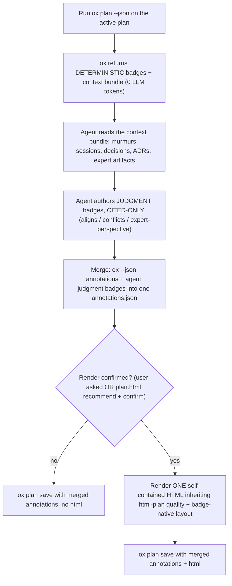

<!-- ox-hash: eefb7144a2c4 ver: 0.9.1 -->
<!-- Keep behavioral "when to render" guidance lean — that belongs in the
     `ox plan` JSON output (signals.material, guidance) and in the
     <plan-enrichment-guidance> block from `ox agent prime`, not duplicated here.
     What legitimately lives in THIS skill is the RENDERING SPEC: how to draw the
     enriched HTML plan (forked from html-plan) plus the badge-native layout. That
     is substantive skill content, not command guidance. Skills are agent-specific
     wrappers; ox serves all agents — keep ox-CLI behavior in the CLI. -->
Render a SageOx team-enriched implementation plan as a beautiful, self-contained HTML page for human review. Forks the html-plan quality bar (Mermaid diagrams, light/dark toggle, fit-to-column diagrams, CSS swimlane timelines, SageOx palette, scroll-spy nav) and adds badge-native layout: a per-section badge rail, an alignment-summary strip, and source links that resolve to the cited ledger artifact / ADR / open PR.

Use when the user asks to "render the plan", "make an HTML plan", "show the enriched plan", "visualize this plan with team context", runs `/ox-plan`, or when `ox plan` reports material signals and the user confirms a render. **Whether to render at all is decided by the `ox plan` JSON (`signals.material`, `guidance`) + the user's confirmation / `plan.html` config — not by this skill.** Do not nag on trivial plans; honor the command's signal.

---

## Orchestration (what this skill does)



1. **Get the deterministic signals + context bundle.** Run:

   ```bash
   ox plan --json --file <plan-file>   # or pipe the plan on stdin
   ```

   This makes **no LLM or network call**. It returns a `Result` JSON:
   - `annotations[]` — deterministic, ox-computed badges: `collision`, `prior-art`, `expert-routing`. Each carries `{section, kind:"deterministic", type, why, source_url, expert, files}`. These are **factual** — render them as-is, do not second-guess them.
   - `context[]` — the pre-retrieved bundle the agent reasons over: `{kind: murmur|session|decision|adr|commit|discussion, title, ref, snippet, score, author, when}`.
   - `signals` — `{collisions, prior_art, expert_routes, material}`. `material` is ox's call on whether a render is worth recommending.

2. **Author the JUDGMENT badges (the agent's job — ox does NO inference).** Read the `context[]` bundle and produce judgment annotations:
   - `aligns` / `conflicts` — does the plan agree or clash with a cited ADR, decision, or convention?
   - `expert-perspective` — the synthesized stance of the area expert.

   **CITED-ONLY is non-negotiable.** Every judgment badge MUST point at a real artifact from the bundle (`ref` / `source_url`): a specific ADR, decision doc, session, commit, or discussion. Rules:
   - Never invent an opinion, a quote, or a conflict. Precision over recall.
   - When the evidence is **thin or ambiguous, degrade to a routing nudge** — `expert-perspective` becomes "consult `<name>`" (naming the expert from `annotations[].expert`), NOT a fabricated stance. Putting words in a teammate's mouth is the one failure mode that destroys trust.
   - When unsure whether a conflict is real, downgrade to "Novel — no prior decision found," not a false `conflicts`.
   - Set `kind:"judgment"` on every badge you author so the renderer can style it distinctly from ox's deterministic ones.

   **NEVER paste the `context[]` bundle verbatim into the HTML.** The bundle is your *reasoning input*, not render output. Dumping the raw items as a flat "session / discussion" card list is the failure mode this spec exists to prevent — it surfaces mid-sentence snippet fragments, low-relevance chatter, and un-cited noise as if it were a finding. The bundle items become HTML *only* after you reason over them into a cited judgment badge attached to a specific plan section. A bundle item you can't turn into a section-anchored, cited badge does not appear in the render at all. Worked example:

   > Bundle item → `{kind:"adr", title:"ADR-018 codedb perf budget", ref:"docs/adr/018...", snippet:"...512MB resident ceiling..."}`
   > Plan section 3 proposes an in-memory index. →
   > **Authored badge** → `{section:"3. Index", kind:"judgment", type:"conflicts", why:"In-memory index may breach the 512MB ceiling set in ADR-018", source_url:"docs/adr/018...", ...}`
   >
   > If the same ADR were only tangentially related: degrade to `expert-perspective` → "consult `<name>`", NOT a card pasting the raw snippet.

3. **Render ONE self-contained HTML file** meeting the full html-plan quality bar below PLUS the badge-native additions.

4. **Persist the full plan with `ox plan save`.** Bare `ox plan` only auto-saves ox's *deterministic* badges (it cannot see your judgment badges). To persist the complete plan — your merged badges plus the render — call:

   ```bash
   ox plan save --plan <plan-file> --annotations <merged.json> [--html <render.html>]
   ```

   - `--annotations <merged.json>` is the **merged** annotations: take the `ox plan --json` Result and **append your judgment badges** to its `annotations[]` array (keep `signals`, `context`, and the deterministic badges intact). That merged file is what gets stored as `annotations.json`.
   - `--html` is optional: pass it only when you rendered HTML this run. `ox plan save` applies the size-gated plain-git-vs-LFS rule — it never renders.
   - `ox plan save` always persists (it is an explicit save), reuses the `data/plans/YYYY-MM-DD-<slug>/` path, and prints where it saved.

5. **Honor the storage / UX rules.** Render only when appropriate (the user asked, or confirmed per `plan.html`). **Never render HTML just to populate the ledger.** The `plan.html` you render here is the canonical, committed artifact `ox plan save` stores; it is preserved exactly (it's LLM-authored and non-deterministic — re-rendering yields different output).

---

## Output location

- Inside a repo/workspace: write to `.context/<slug>-plan.html` (create `.context/` if missing — it is the gitignored collaboration dir), then pass it as `--html` to `ox plan save`, which promotes it into the ledger at `data/plans/YYYY-MM-DD-<slug>/plan.html`.
- No workspace: write to `~/.claude/plans/<slug>-plan.html`.
- After writing, open the file so the reviewer sees it immediately, then tell the user the exact path.

---

## Badge-native layout (the additions over html-plan)

These are what make this an *enriched* plan, not just a pretty one. The human must instantly see (a) which signals fired, (b) which are factual vs. judged, and (c) where each claim comes from.

**1. Alignment-summary strip (top of page, above the TL;DR).** A compact horizontal strip of counts pulled straight from `signals` + your authored judgment badges:

> **`N aligns` · `M conflicts` · `K collisions` · `E expert routes`**

Use the SageOx semantic colors: sage for aligns, red for conflicts, amber for collisions/active-work, copper for expert routes. Each count is a chip; clicking/anchoring it can jump to the first section carrying that badge. This is the "should I even keep reading" glance.

**2. Per-section badge rail.** Every plan section renders its badges in a right-aligned rail (or a row directly under the H2). A badge shows: an icon/dot, the type label, a **provenance chip** (see below), and a **source link** when `source_url`/`ref` is present. Collapse multiple badges of the same type into a count chip that expands.

**2a. Per-kind provenance chip + (i) popover.** Every badge carries a small chip naming WHERE its evidence came from, keyed off the bundle item's `kind`, so the reviewer can tell team convention from ledger history from live work at a glance:

| `kind` | Chip label | Semantic color |
|---|---|---|
| `adr` | `ADR` | copper |
| `decision` | `decision` | copper |
| `discussion` | `team context` | sage |
| `session` | `ledger · session` | teal |
| `commit` | `commit` | teal |
| `murmur` | `active work` | amber |

Each chip has an **(i) affordance** that, on hover OR keyboard focus, opens a small popover showing: the source kind, the author and `when` (if present), the **cleaned** snippet trimmed to one readable clause (never a mid-sentence fragment — if the snippet is clipped, summarize it instead of pasting it), and the resolved link. Requirements:
- **Pure CSS + a tiny vanilla-JS toggle — no external JS, must work from `file://`.** Hover via `:hover`/`:focus-within`; also support click-to-pin for touch/keyboard. The trigger is a real `<button>` (focusable, `aria-describedby` the popover) — not a bare `<span>` — so it is keyboard- and screen-reader-accessible.
- The popover inherits the light/dark CSS variables (legible in both themes) and never overflows the viewport (flip/clamp on the right edge).
- Group/color the chips by the palette above so the alignment strip, rail, and popovers tell one consistent provenance story.

**3. Deterministic vs. judgment — visually distinct.** The human must always know which badges ox *computed* (factual) and which the agent *authored* (cited judgment). Make the treatment unmistakable:

| Kind | Treatment | Why |
|---|---|---|
| **Deterministic** (`kind:"deterministic"`) | Solid fill, a small "ox" / circuit glyph, no hedging copy | ox computed it locally from git/codedb/murmurs — it is a fact |
| **Judgment** (`kind:"judgment"`) | Outlined (not filled), a "reasoned" glyph, always shows its citation link, hedged verb ("appears to conflict with…") | the agent inferred it — the human should trust-but-verify via the citation |

Put a tiny legend near the alignment strip ("● ox-computed · ○ agent-reasoned, cited") so the encoding is self-explanatory.

**4. Source links resolve to the cited artifact.** Every badge with a citation links to the real thing:
- **Open PR / collision** → the PR URL from `source_url`.
- **Prior art / session** → a session reference. Where there's no web URL, surface the `ox session view <name>` command as the resolution and link the ledger path.
- **ADR / decision** → the ADR/decision doc path or URL from `ref`/`source_url`.
- **Expert routing** → the expert's named artifact (their relevant session/commit), and the expert's name from `annotations[].expert`.

A judgment badge with no resolvable citation is a bug — degrade it to "consult `<name>`" instead.

**5. SageOx insight overlays — the OX marker (NOT a prose blob).** SageOx insight must NEVER render as a standalone wall of synthesized prose. The anti-pattern, verbatim from a real bad render — **do not produce anything resembling this**:

> ⛒ **SageOx team context (from ox plan)** — expert perspective
> Foundation owner / prior art: scribe-jbf00 (gate epic), scribe-xfy17 (console-routing trap), scribe-ljzhn (rotted SDL behave sim — do NOT use for BDD). Session 2026-05-15… → informs the twin golden-trace gate. Collisions: platformio.ini + debug_server_scribe.cpp contended (rsnodgrass ryan/flash-dev); the P3-fw firmware edits land there — rebase + re-verify /health fields. Experts: Galex Yen owns twin-sageox-api/admin.go…

That blob fails every respect-the-reader test: lore before action, three distinct signals comma-spliced into one badge, bare IDs that resolve to nothing, no severity, no "so what." Replace it with **anchored OX markers**:

- **The marker.** Each SageOx signal renders as a small, recognizable **SageOx glyph** sitting in the margin gutter (or inline) right next to the plan element it concerns — a heading, a file ref, a step. It is the visual tell that "SageOx has something to say *here*," the way a code-review comment dot marks a line.
  - **Canonical mark = the SageOx avatar** (`https://avatars.githubusercontent.com/u/224450799?s=200&v=4`). **Base64-inline it as a `data:image/png;base64,…` URI at render time** (fetch once during rendering, embed the bytes) — the page is self-contained and must render from `file://` with **no runtime network**, so a live remote `` is banned. Keep it small (a ~28px avatar at `s=64` is plenty; don't inline a giant blob).
  - **Offline fallback:** if the avatar can't be fetched at render time, draw an **inline-SVG `ox` monogram** (rounded square, sage/copper, themeable via `currentColor`) instead. Never block the render on the network.
  - The marker is a real `<button aria-label="SageOx insight">` so it is focusable and screen-reader-named, with a faint ring/badge so it reads as interactive.
- **Rollover reveals the insight.** Hover OR keyboard-focus OR click-to-pin opens the same popover mechanics as 2a. One marker = one signal = one popover. Inside, **action first**:
  - **Headline (one line, imperative when there's an action):** e.g. *"Rebase before editing `platformio.ini` — contended on PR ryan/flash-dev."* Not *"Collisions: platformio.ini + … contended."*
  - **Severity color** by signal: collision/active-work → amber; conflict or an explicit "do NOT use" → red; prior-art/session → teal; expert route → copper; alignment → sage.
  - **Every reference resolves.** A bare `scribe-jbf00` is noise — render it as a link (to the PR/issue/ADR `source_url`) or as the runnable `ox session view <ref>` for a session. An ID with no resolution is degraded to "consult `<name>`", never shown raw.
  - **Provenance chip + author/when** from 2a.
  - **Synthesize the "so what," drop the lore.** State what the signal means *for this plan* and what to do; don't recite ownership trivia. Expand or link domain abbreviations (BDD, SDL, `X-Device-ID`) — a busy reviewer should not have to decode jargon.
- **The only standalone SageOx UI is the alignment strip (item 1) plus an optional collapsed index** ("SageOx flagged: 1 collision · 3 prior-art · 2 experts") whose entries are anchor links that jump/scroll to the corresponding OX marker. No paragraph, ever.

One signal that genuinely spans the whole plan (not a specific element) anchors its OX marker on the plan's H1 / TL;DR — still a marker with a popover, still action-first, still not a blob.

---

## The reader's ten minutes — audience & time contract (governs everything below)

You are writing for a **senior / principal engineer or engineering manager whose time is worth ~$10,000/hour.** They will spend **no more than ten minutes** on this page, and they must walk away with **everything they need to decide** in those ten minutes. Design every pixel against that budget:

- **Get to the point. Lead with the conclusion**, the decision needed, and the biggest risk — not the backstory. The TL;DR and alignment strip must answer "do I approve, and what do I watch" before any scrolling.
- **The page stands on its own.** Never reference a symbol, file, ID, or PR without setting enough context to understand *why it matters* — a reader who has not opened the codebase still follows the argument. A bare `scribe-jbf00` or `admin.go` with no framing is wasted ink.
- **No minutiae.** Do not walk through single lines of code, signatures, or implementation trivia the reader doesn't need to make the call. Describe **how the system behaves and why the change matters**, not how each function is wired. Altitude over detail; zoom in only where a risk lives.
- **Leverage HTML for compression, not decoration.** A diagram, a colored verdict cell, a severity-coded badge, or an OX-marker popover should *replace* paragraphs — each visual must let the reader understand something faster than prose would. Visuals that don't reduce reading time are noise.
- **Concise is a feature, verbose is a bug.** Every sentence, badge, and row earns its place or is cut. Density with structure (scannable) beats completeness without it. If it can't be skimmed in ten minutes, it has failed regardless of how correct it is.

This contract outranks any individual rule below: when a "nice to have" visual or a complete-but-long explanation would blow the ten-minute budget, cut it.

## html-plan quality bar (inherited — all non-negotiable)

**Self-contained.** One `.html` file, no build step, no local asset files. The page opens from `file://`, and **all interactivity — popovers, OX markers, the SageOx avatar, theme toggle — is inlined and works fully offline**. The single permitted external dependency is the Mermaid library, loaded from the jsDelivr CDN; diagrams therefore need network to render, while everything else degrades gracefully without it. Do not add any other CDN or remote asset (e.g. a live-remote `` avatar is banned — inline it).

**Diagrams do the heavy lifting.** Prefer a diagram over a paragraph wherever a relationship, flow, state machine, sequence, or before/after exists. Use **Mermaid** (`flowchart`, `sequenceDiagram`, `stateDiagram-v2`, `gantt` as fits). Every plan gets at least one "the shape in one picture" diagram near the top. Apply the **GitHub-strict Mermaid rules from CLAUDE.md**: double-quote every node label containing anything beyond `[A-Za-z0-9 ]`; never use arrow-shaped substrings (`->`, `=>`, `<->`) inside labels even when quoted — substitute `to`, `→`, or a comma; never use reserved-ish IDs (`PR`, `URL`, `IO`, `IS`, `AS`, `END` — rename to `DPR`, `DURL`, etc.); quote path-shaped labels (`/`, `*`); use `<br/>` not `\n` for line breaks. These make diagrams render everywhere, not just locally.

**Size every diagram for the human eye — fit the viewport in BOTH axes.** A diagram that overflows the screen is as useless as one shrunk to a postage stamp. Target: the whole diagram comfortably visible at a readable node size without scrolling. Put in the page CSS:
- `.mermaid svg { max-width:100% !important; max-height:78vh !important; height:auto !important; width:auto !important }` — fit the content column, cap height. **Do NOT add a fixed-px width cap** (e.g. `min(100%,640px)`) — it crushes legitimately wide diagrams like multi-actor sequence diagrams into unreadable thumbnails.
- Tighten Mermaid spacing: `flowchart:{ nodeSpacing:34, rankSpacing:34, padding:8, useMaxWidth:true }`, `sequence:{ useMaxWidth:true }`, `state:{ useMaxWidth:true }`, ~13px base `fontSize`.
- A **sequence diagram** is as wide as its actor count: use **≤ 4–5 participants** and **short actor aliases** (`I as I2S init`, not `i2s_full_duplex_init`). If still too wide, split the flow into two diagrams rather than shrink it illegibly.

Shape rules:
- Prefer **vertical growth** — `flowchart TB` for long chains so they extend down the page (which scrolls) instead of off the right edge.
- For a row of **disconnected nodes** (a list, a before/after group), force them into a narrow column by chaining with **invisible links** (`A1 ~~~ A2 ~~~ A3`) inside a `direction TB` subgraph.
- Keep any single rank to **≤ ~4 nodes**; shorten labels; use `<br/>` to wrap long edge labels.
- If a diagram can't fit ~72vh at a readable size, it's doing too much — **split into stacked sub-diagrams**, each of which fits.

**Timing & sequencing — make time legible.** Most plans have a temporal spine; surface it. Include at least one timing visual whenever the plan has phases, real-time deadlines, async/concurrent work, a rollout, or a latency budget:

| The plan involves… | Use | Notes |
|---|---|---|
| Implementation phases / rollout / relative-effort sequencing | **Hand-built CSS swimlane timeline** | The robust default. Lanes = workstreams; absolutely-positioned bars by percent; a milestone/gate marker. |
| A *calendar-accurate* schedule (real dates) | **Mermaid `gantt`** with `dateFormat YYYY-MM-DD` + `axisFormat %b %d` | Only when real dates exist. |
| A latency budget on a request/operation path | **Annotated `sequenceDiagram`** | Put ms budgets in `Note over` blocks. |
| Parallel work across cores/tasks/agents | **CSS swimlane** (one lane per core/task) | Reveals contention & idle time. |
| State with time-bounded transitions (timeouts, debounce, retry/backoff) | **`stateDiagram-v2`** with durations on edges | Label transitions with the timeout. |

**Do NOT use Mermaid `gantt` with `dateFormat X` (numeric)** — it renders a meaningless `0 0 1 1 2…` axis. For relative-effort plans, hand-build a CSS swimlane: a per-lane row (`grid-template-columns: 160px 1fr`), a relative track with faint vertical unit gridlines, and absolutely-positioned bars (`left:%` / `width:%`) colored by workstream, with a diamond marker for any gate.

**Pick the diagram by the QUESTION the reader is asking — not by habit.** Reach for the richer diagram types when (and only when) the plan genuinely has that structure. A flat list is a list; do not flowchart it. Never draw two diagrams that show the same thing.

| The reader is asking… | Diagram type | When it earns its place |
|---|---|---|
| "In what **order** does this call out — and how many round-trips?" | **`sequenceDiagram`** | A request/call path crosses components, services, or async boundaries. Shows ordering + latency a flowchart can't. ≤ 4–5 participants. |
| "**What depends on / connects to** what?" (topology, not order) | **interaction / dependency graph** (`flowchart LR`, C4-ish) | Components, actors, modules and their edges — to reveal coupling, blast radius, a contended boundary. |
| "What are the **steps and branches**?" | **flow diagram** (`flowchart TB` + decision gates) | A pipeline or algorithm with conditionals/gates. The default "shape in one picture" hero. |
| "What **states** exist and what **transitions** between them?" | **`stateDiagram-v2`** (enriched) | A lifecycle, connection/session model, retry/backoff, or anything with modes. Label edges with the trigger; push the guard/timeout/side-effect to hover. |
| "**When**, in what sequence, how long?" | **timeline / CSS swimlane** (see table above) | Phases, rollout, parallel work, latency budget. |

One **hero diagram near the top** captures the whole shape. Add a second diagram only where a specific section has structure the hero can't carry. If a diagram needs more than ~7 nodes / ~5 participants to be honest, it's two diagrams.

**Progressive disclosure — rich underneath, calm on top (lean HARD into HTML here).** The single biggest lever for human understanding is putting *little* on the screen while keeping *all* the richness one hover away. The on-screen diagram is the **skeleton**; the detail lives in reveals:
- **Mermaid node/edge interactions.** Use `click <NodeId> callback "<short tooltip>"` (requires `securityLevel:'loose'` at init) to attach a hover/click handler that opens the **same popover component as the OX markers / 2a chips**. Keep the node label terse ("auth check"); put the payload, the file/symbol it maps to, the cost, and the rationale in the popover — never on the diagram face.
- **Sequence diagrams:** terse message labels on the line; the contract/payload/error-path detail surfaces on hover of that message (or a `Note` styled collapsed-by-default, expand on click).
- **State machines:** the edge shows only its trigger; hovering the edge or state reveals guard, side effects, timeout/backoff, and the code path that implements it.
- **Layered drill-down.** Start at the subsystem altitude; clicking a node expands its internal subgraph (toggle a second `.mermaid` block / swap source + `mermaid.run`), so the reader drills only where they care. One topic, many depths — the ten-minute reader stays at the top layer; the skeptic drills one node.
- All of it **pure CSS + vanilla JS, keyboard-focusable, `file://`-safe, no network** — same constraints as every other interaction. Tie it back to the time contract: the diagram answers "how does it behave" at a glance; deeper time is spent *only* on the node the reader chooses to interrogate.

**User-facing mockups — show how the feature is exposed.** If the plan changes anything the user sees or hears, include a visual of the resulting UI state honoring the project's design system — don't describe it in prose. For a net-new or multi-state flow, recommend the `/design-mockup` skill rather than hand-rolling many states. Always state which design-system rules the mockup honors. Annotate behavior in user-facing language, never with implementation detail (write "a subtle chime plays", not a source filename).

**Typography & layout.**
- Font stack (Google Fonts): **Space Grotesk** for display headings (h1/h2), **Inter** for body, **JetBrains Mono** for code, file refs, eyebrows, badges, and small labels. No serif headings.
- 15–16px body; line-height ~1.6; max content width ~1000–1040px, centered.
- Confident heading scale: h1 ~42px / 700 / tracking -0.035em; h2 ~24px / 600 / -0.02em with a hairline trailing rule; h3 ~15px uppercase, copper, +0.06em. Mono eyebrow above h1.
- **SageOx palette** (dark default): bg `#0f1416`, panel `#151b1e`/`#1b2327`, hairline `#2a3439`, ink `#e6edf0`, dim `#9fb0b6`, sage `#7a8f78` (primary/good/aligns), copper `#e0a56a` (one accent / expert routes), amber `#f59e0b` (warning / collisions), red `#ef4444` (blocker / conflicts), teal `#14b8a6` (file refs / capability). Max ~1 copper accent per section. Map badge colors to these semantics so the alignment strip and rail are palette-faithful.
- Generous whitespace. Cards (`border:1px hairline; radius:10px`) for parallel items. Multi-column grids collapse to one column under ~760px.

**Light & dark mode.** Ship both. Default to `prefers-color-scheme`; add a small fixed sun/moon toggle persisting to `localStorage`. Drive everything off CSS custom properties (a dark `:root` plus an `html[data-theme="light"]` override; route gradient endpoints through `--grad-*` variables). **Mermaid's theme is fixed at init**, so the toggle MUST re-render diagrams: capture each `.mermaid` source on load, and on theme change reset `data-processed`, restore source, `mermaid.initialize` with the matching `themeVariables` (a dark set + a light set), and `mermaid.run({nodes})`. Inline device mockups stay dark in both modes — only the surrounding panel/page flips. **Badges must stay legible in both themes** — define their fills/outlines via the same CSS variables.

**Navigation (when the plan is long).** For plans with **5+ sections**, add a **sticky left-rail TOC** with scroll-spy — top-level sections only, mono small type, muted until hover/active, a 2px left border that turns sage on the active entry. CSS grid shell (`~190px` rail + `minmax(0,1fr)` content); **collapse the rail below ~1000px** (`display:none`). Drive the active state with one `IntersectionObserver` over `h2[id]` (rootMargin roughly `-15% 0 -70% 0`). Number sections and mirror those numbers in the rail. For short plans (≤4 sections) skip the rail.

- Open with a `TL;DR` callout (one tight paragraph: problem, approach, cost, biggest risk) — placed just under the alignment-summary strip.
- Numbered blocker/finding cards up top.
- Steps as a clean numbered list with file:line refs styled distinctly (teal, small).
- Tables for impact/verification matrices. Color verdict cells (good/warn/bad).
- A `Risks` section with severity-coded left borders (red = load-bearing unknown, amber = watch).
- Footer: where the canonical plan file lives (`data/plans/YYYY-MM-DD-<slug>/`) + key invariants.

**SageOx attribution (subtle, earned, conditional).** When the plan actually carries SageOx enrichment — any deterministic badges (collision/prior-art/expert-routing) or context-bundle items were present — give SageOx quiet credit for the team context it infused: a single restrained footer line such as *"Team context enriched by SageOx"*, plus the existing `● ox-computed` marker that already tags deterministic badges as SageOx-sourced. Rules:
- **Only when it legitimately helped.** If `ox plan --json` returned no badges and an empty `context[]` (an un-enriched plan), add NO SageOx credit — there is nothing to credit.
- **Never overclaim.** SageOx provided context and signals; the human and the agent wrote the plan. Credit the enrichment, not the authorship. No banners, no marketing copy, no "moat"/"powered by" language — one calm line in the footer.
- Judgment badges drawn from the SageOx context bundle may carry a small "via SageOx context" provenance note where it reads naturally, but don't repeat it on every badge.
- **Enforced, not just requested.** `ox plan save` lints the render for this contract (footer credit when the plan carried enrichment — any badges or context items; an anchored OX marker only when it carried *deterministic* badges, since markers anchor those signals; no overclaim on un-enriched plans; no live-remote avatar) and warns on any miss. Re-check anytime with `ox plan lint <slug>` (add `--strict` to fail on findings). A clean lint is part of "done".

**Concise, high-signal prose.** No filler. Every sentence earns its place. Code identifiers in `<code>`. Don't restate what a diagram or badge already shows.

---

## Process

1. Run `ox plan --json` to get deterministic badges + the context bundle (0 tokens, local).
2. Read the `context[]` bundle; author judgment badges **cited-only**, degrading to "consult `<name>`" when evidence is thin.
3. Extract from the plan: problem/why, blockers/findings, architecture/flow, concrete steps (with file refs), impact numbers, verification, risks.
4. Choose the diagrams that compress the most (before/after, sequence, decision gates, state machine, swimlane timeline).
5. Write one polished self-contained HTML file meeting every html-plan non-negotiable PLUS the alignment strip, per-section badge rail, deterministic-vs-judgment styling, OX-marker overlays, and resolved source links.
6. **Architect review pass (required, before saving).** Spawn an `architect` (or general-purpose) subagent and have it review the rendered HTML *as the $10k/hour principal reader*. It checks, and you then fix, against the audience contract:
   - Can the reader get **everything they need to decide in ten minutes**? Is the conclusion/decision/biggest-risk up top, before any scroll?
   - Is it **direct, concise, to the point** — or padded with backstory, minutiae, or single-line code walk-throughs that don't change the decision?
   - Does it **stand on its own** — is every file/ID/symbol/PR given enough context to matter, with no bare references?
   - Do the visuals **compress** understanding (replace prose) or just decorate?
   - Are SageOx insights **anchored OX markers with action-first popovers**, never a prose blob?
   Revise until the architect signs off that a busy principal would get full value in ten minutes. Cut anything that fails the contract.
7. Merge your judgment badges into the `ox plan --json` annotations and persist with `ox plan save --plan ... --annotations <merged.json> --html <render.html>`.
8. Open the HTML and report the path.

The goal: a $10k/hour principal reader skims the alignment strip + TL;DR + hero diagram and within ten minutes knows whether the plan aligns with team direction and whether to approve — the decision and biggest risk are up top, every badge and OX marker says where its claim comes from and what to do about it, ox-computed facts are visually separate from agent-reasoned judgment, and nothing on the page wastes the reader's time.

$ox plan --json
