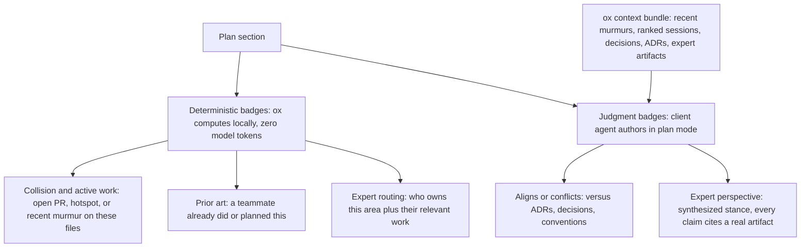

# ADR-021: `ox plan` — ox Provides Context, the Client Does Inference

**Status**: Draft (Proposed) — **awaiting Ryan's review** on the storage path (§3) and config/env namespace (§4), both of which are Required-Review per `CLAUDE.md`.
**Date**: 2026-06-03
**Deciders**: SageOx Engineering (path + env-var decisions owned by Ryan)

> **DRAFT.** This ADR records the intended decisions for the `ox plan` feature so Ryan can review the two Required-Review items before any code lands. Nothing here is built yet. The companion design write-up lives at `~/.claude/plans/system-instruction-you-are-working-enchanted-pearl.md`.

## Context

Plans today are generated **blind to team direction**. An agent in plan mode reasons from code plus the user's prompt. It cannot see whether the team already decided against the approach, whether it violates a convention, whether a teammate shipped it last week, whether a file in the plan sits in someone's open PR *right now*, or **who the expert** in that area is. SageOx holds every one of those signals in the Ledger and Team Context. No other planning tool does.

The temptation is to make this a cloud feature: ship the plan to a hosted LLM "judge" that scores it against team context and returns verdicts. We are rejecting that. The agent is *already in plan mode*, already spending tokens to produce a good plan, and the user already expects to pay for inference there. ox's durable advantage is not another inference call — it is **privileged access to the team's data**. So the architecture splits cleanly: ox is the best *context provider* for planning; the client agent does the reasoning.

This decision is the load-bearing one. Everything else (command surface, storage, config, agent support) follows from it.

## Decision

**ox provides context; the client does inference. ox never makes an LLM or network-judge call in the plan path.**

### 1. The deterministic / judgment split

Every plan signal is a **badge** attached to a plan section. Badges come in two kinds, and the kind determines who computes it.



| Badge | Kind | Produced by | Source data (all exists today) |
|-------|------|-------------|--------------------------------|
| **Collision / active work** | Deterministic | ox (local) | `codedb` open-PR / contention plus recent murmur scan (`metadata["files"]` / topic match, recency-weighted). Murmurs catch contention *before* any commit or PR exists. |
| **Prior art** | Deterministic | ox (local) | Local-first: `codedb` FTS plus `ledgersearch` over sessions and captured plans; cloud `ox query` only as fallback. |
| **Expert routing** | Deterministic | ox (local) | `codedb.commits` to `file_revs` author-per-path, murmur `principal_id` / topic, `glance.GroupByAuthor()`. |
| **Aligns / conflicts** | Judgment | **client agent** | ox hands it Team Context, rules, and ADRs via the context bundle; the agent reasons. |
| **Expert perspective** | Judgment | **client agent** | ox hands it the expert's sessions and discussions; the agent synthesizes a *grounded, cited* stance. |

Deterministic badges are pure local SQL and keyword retrieval. They are free, always-on, and safe to fire ambiently on every plan from a hook. Judgment badges are authored by the plan-mode agent reasoning over ox's retrieved bundle, in the agent's own context window, where the user already expects token spend.

**Expert fabrication is the one failure mode that kills trust.** Routing is deterministic and cited ("Ajit owns `internal/auth/`, N commits, last touched May; his session *token-refresh-race* is relevant"). Perspective is judgment, and *every claim must cite a real artifact* — a commit, a session, a discussion. When evidence is thin, the agent degrades to "consult [name]," never a fabricated quote.

### 2. Command surface — porcelain versus plumbing

Git-style split. `enrich` is plumbing humans never type; enrichment is simply what `ox plan` *is*.

| Command | Audience | What it does | ox-side model tokens |
|---------|----------|--------------|----------------------|
| `ox plan` | human (skill-orchestrated) | active plan → pull signals + context bundle → *agent* authors judgment badges → render → auto-save | **0** (inference is the client's) |
| `ox plan --json` | hook / agent | emit deterministic badges + retrieved context bundle as JSON | **0** — pure local SQL / keyword + retrieval |
| `ox plan list` | human | browse saved Ledger plans (parallels `ox session list`) | 0 |
| `ox plan view <slug>` | human | open a saved plan (parallels `ox session view`) | 0 |

The `--json` primitive returns both the deterministic badges *and* a `context[]` array (ranked refs plus loaded snippets), so the agent gets everything in one local call. The plan-exit hook consumes just the badges; the skill additionally feeds the context to the agent for judgment badges.

### 3. Plan storage in the Ledger — **Required-Review (Ryan owns this)**

Grounded in the current layout: sessions live at `<ledger>/sessions/<name>/`, and **murmurs already use `<ledger>/data/murmurs/YYYY-MM-DD/HH/`**. The dated `data/` pattern is precedented, so finalized plans mirror it:

```
<ledger>/data/plans/YYYY-MM-DD-<2-4-word-slug>/
  ├── plan.md           # enriched markdown source (badges inline / frontmatter)
  ├── annotations.json  # structured badges {section, badge, why, source_url, expert} — searchable
  ├── meta.json         # {topic, authors[], created_at, reviewed_by, approved}
  └── plan.html         # rendered beauty — COMMITTED, but ONLY if already rendered
```

- **Auto-save is default-on** (`plan.save=true`). Plans are sanitized *output*, far less sensitive than session recordings (which expose raw human thinking), so always-save is an easy default. This makes plans first-class Ledger artifacts: searchable, attributable, reusable — the flywheel where team #2's plans are better because of team #1's recorded work.
- **Commit the rendered HTML when it exists.** The Mermaid diagrams, device mockups, and swimlane timelines are **LLM-authored and non-deterministic** — regenerating means re-running a model and getting *different* output, at real cost. So `plan.html` is canonical alongside `plan.md`, preserving the exact artifact the human approved. (Contrast `session.md`'s web view, which is a deterministic render and need not be committed.)
- **Never render HTML solely to populate the Ledger.** Auto-save persists *what the user actually produced*: always `plan.md` + `annotations.json` + `meta.json`; add `plan.html` **only if one was already rendered**. Burning client tokens on a render the human never asked to see, just to fill the Ledger, is the wrong trade.
- **LFS for large inline imagery.** If a `plan.html` embeds large base64 imagery, it stores via LFS (like `raw.jsonl`) through `internal/lfs/` — never the `git-lfs` binary, per `.claude/rules/lfs-no-git-lfs-binary.md`. Otherwise git-track directly.

Path construction goes through a new `paths.LedgerPlansDir()` helper, not hand-joined strings.

### 4. Config and env namespace — **Required-Review (Ryan owns this)**

| Key | Default | Purpose |
|-----|---------|---------|
| `plan.save` | `true` | Persist finalized plans to `data/plans/`. |
| `plan.html` | `recommend` | Enriched-HTML render mode, tri-state: `off` (never render, never nudge), `recommend` (prime nudges, render on confirm), `always` (auto-render). |
| `SAGEOX_PLAN_HTML` | unset | Direct env override for `plan.html` — must be `off`, `recommend`, or `always`. |

**`SAGEOX_*` is canonical for customer-facing identity; a customer-facing `OX_*` env var is an anti-pattern** (sageox-mono ADR-047, `docs/human/adr/047-customer-facing-env-var-namespace.md`). The env var is therefore `SAGEOX_PLAN_HTML`, not `OX_PLAN_HTML`.

### 5. Agent-agnostic support, graduated by tier

The CLI/JSON contract is the baseline and works for **every** coding agent: any agent can call `ox plan --json`, read the badges and context, and act on them. Polish is layered on top, not gated all-or-nothing.

| Tier | Mechanism | Agents |
|------|-----------|--------|
| Baseline | `ox plan` / `ox plan --json` CLI contract | all coding agents |
| Polished | Claude Code skill + plan-exit hook (shipped by `ox init`); Codex plugin | first-class targets |
| Adapter | `ox-adapter-*` capability bridges the contract to other agents | everyone else |

This follows ADR-009 (`ox-adapter-*` naming) and ADR-008 (external adapter binaries): the durable value stays in ox's data access, and the adapter layer exposes it to agents we do not ship a native integration for. Support is graduated, not binary.

### 6. Prime integration

Most users never type a plan command — they use the agent's built-in plan mode, which silently writes a markdown plan file. ox gets in the loop three ways, all mirroring mechanisms ox already uses:

1. **`<plan-enrichment-guidance>` block in `ox agent prime`** (parallel to the existing `<rule-promotion-guidance>`): when the agent produces a plan for non-trivial work (multi-file, architectural, touches a hotspot or open PR, or roughly ≥5 steps), it recommends an enriched render. Silenceable via `plan.html=off`; kept from nagging on one-line plans by the heuristic.
2. **A new `IntentCommand`** mapping intent "render / enrich a plan" to `ox plan`.
3. **A plan-exit hook** (shipped by `ox init`, like the prime hook): on plan-file write it runs `ox plan --json` locally (0 tokens); if badges are material, the agent surfaces a one-line nudge ("Plan touches 2 files in open PRs and conflicts with 1 ADR — render enriched plan?").

The HTML render is **opt-in / confirm by default**: fast badges compute silently; the *recommendation* appears only when the plan is complex or badges are material; the render waits for confirm unless the user opted in via `plan.html=always` or `SAGEOX_PLAN_HTML=always`.

## Consequences

### Positive

- **The durable value is data access, not an inference call.** Any model can score a plan; the team's Ledger is what ox uniquely brings. Keeping inference client-side keeps ox's value in the data and context it provides.
- **ox spends zero LLM tokens in the plan path.** Every `ox plan` operation is deterministic local work, so the plan-exit hook can fire ambiently on every plan and the deterministic badges can always be on.
- **No cloud judge service to build, run, secure, or scale.** Simpler architecture, fewer trust boundaries, no per-plan cloud round-trip on a latency-sensitive path.
- **Plans become first-class Ledger artifacts** — searchable, attributable, reusable across teams.
- **Inference cost lands where the user already expects it** — in plan mode, in the agent's own context window.
- **Works on day one for cold-start teams** via collision + expert-routing (pure local SQL over git/`codedb`), with no recorded discussions required.

### Negative / risks

- **Cold start for judgment badges.** Empty teams get no aligns/prior-art until they have recorded work. Mitigation: lead with collision + expert-routing, which work from git/`codedb` immediately.
- **Expert fabrication.** A synthesized stance that invents an opinion would destroy trust. Mitigation: cite-or-degrade — every perspective claim cites a real artifact, or downgrades to "consult [name]."
- **False conflicts.** A judgment badge that flags a non-existent conflict erodes confidence. Mitigation: precision over recall; downgrade to "Novel" when unsure.
- **Latency on plan exit.** The fast tier must be local and sub-second; it must never block plan-exit on a cloud call. Enforced by the zero-network rule.
- **Renderer drift.** The ox renderer forks `html-plan` and will diverge over time. Accept, or periodically reconcile.
- **Retrieval ceiling.** v1 rides keyword retrieval (`ledgersearch` whole-document TF, `codedb` Bleve FTS) — there is no semantic/vector index or sub-document chunking yet. Good enough for prior-art recall; a chunked/semantic plan index is a fast-follow refreshed by the daemon's existing `BuildLedgerIndex()` path.

## Alternatives considered

- **Cloud LLM judge (rejected).** Ship the plan to a hosted model that scores it against team context and returns verdicts. Rejected because it puts ox's value in the wrong place (inference is a commodity; data access is not), adds a cloud service to build/run/secure, introduces a per-plan network round-trip on a latency-sensitive path, and bills the user for inference twice (once in plan mode, again in the cloud). `ox plan deep` and any cloud-judge variant are dropped.
- **`enrich` as a user-facing verb (rejected).** An `ox plan enrich` command that humans type. Rejected because enrichment is not a separate step — it is what `ox plan` *is*. `enrich` is plumbing; exposing it as porcelain adds a verb with no distinct user intent. The plumbing surface is `ox plan --json`.
- **HTML render on every save (rejected).** Always render `plan.html` so the Ledger is uniformly rich. Rejected as token-wasteful: rendering an artifact the human never asked to see, purely to populate the Ledger, burns client tokens for no human benefit. HTML is committed-when-it-exists, not generated-on-save.

## References

- `~/.claude/plans/system-instruction-you-are-working-enchanted-pearl.md` — full `ox plan` design write-up this ADR distills.
- ADR-008: External Adapter Binaries — the adapter model §5 builds on.
- ADR-009: Naming Convention `ox-adapter-*` — the `ox-adapter-*` exposure tier in §5.
- ADR-016: Session Summarization Delegation — prior art for "calling agent does the LLM work, ox does not," the same client-side-inference principle applied to summaries.
- sageox-mono ADR-047 (`docs/human/adr/047-customer-facing-env-var-namespace.md`) — the `SAGEOX_*` canonical / customer-facing `OX_*` anti-pattern rule that fixes §4's env var name.
- `.claude/rules/lfs-no-git-lfs-binary.md` — why large `plan.html` imagery goes through `internal/lfs/`, never the `git-lfs` binary.
