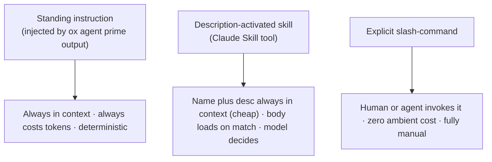
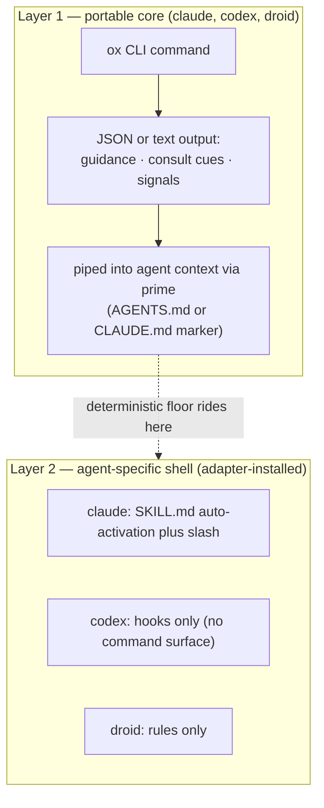
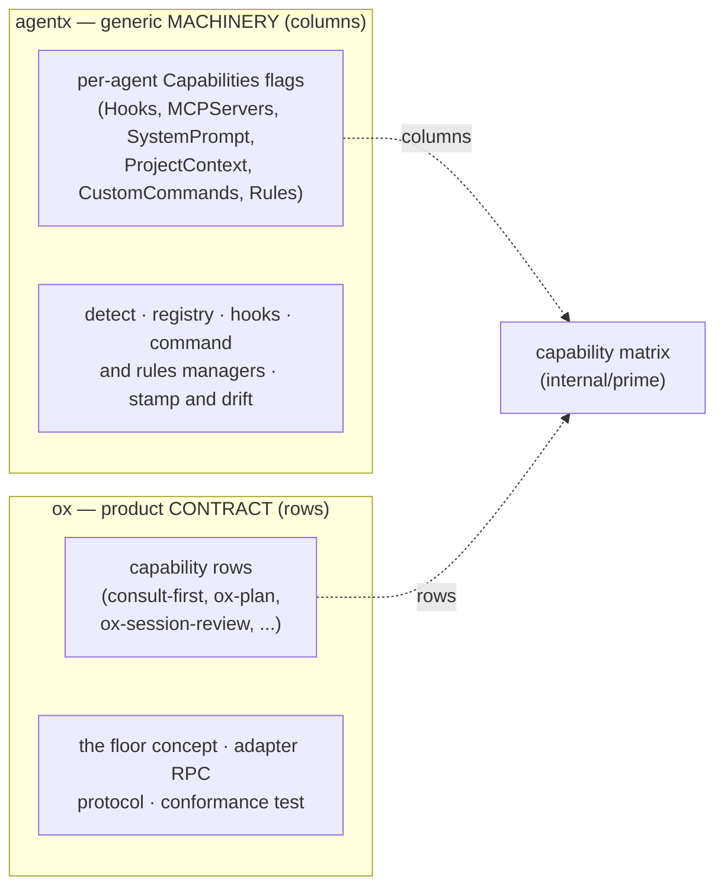

# ADR-023: Skill/Command Injection — The Two-Layer Model

**Status**: Draft (Proposed) — **awaiting Ryan's review** as brand / data-ergonomics owner. No Required-Review gate is tripped (no new `SAGEOX_*`/`OX_*` env var, no data-path or API-source-of-truth change), so this lands for review and flips to Accepted on approval. **The implementation (epic `ox-fvjh`, all 10 tasks) has already landed in PR #663 ahead of formal acceptance** — the model is load-bearing in code (`internal/prime/capability_table.go`, `internal/prime/conformance_test.go`); flipping this to Accepted is Ryan's sign-off.
**Date**: 2026-06-14
**Deciders**: SageOx Engineering (brand / data-ergonomics sign-off owned by Ryan)

> **DRAFT.** This ADR distills a discussion-capture design note into a committed decision so every later workstream in epic `ox-fvjh` (capability-table, conformance-test, floor-audit, freshness-hardening, thin/thick convention) cites one source of truth. The source note lives at `~/.claude/plans/system-instruction-you-are-working-wobbly-fox.md`; this ADR **supersedes** it as the committed record (the ADR-021 pattern). The note is retained, not deleted.

## Context

ox's value prop is "every session starts with the full picture, not from zero." Delivering it means *injecting* ox's capabilities — prime, consult-first retrieval, plan enrichment, session review, cart lifecycle — into whatever coding agent a coworker uses. Today that injection happens three ad-hoc ways, the choice between them is unprincipled, and one consequence is invisible: **most of the surface only reaches Claude Code.**

### What ships today

- **Three adapters with radically different Layer-2 surfaces.**
  - `cmd/ox-adapter-claude-code` declares `CapHookInstaller` + `CapRulesInstaller` + `CapCommandsInstaller` (`main.go:78-80`) and installs the 16 `extensions/claude/commands/*.md` command files (embedded, stamped with `ox-hash` + version).
  - `cmd/ox-adapter-codex` declares **hooks only** — no commands, no rules.
  - `cmd/ox-adapter-droid` declares hooks + rules, but **no commands** (`main.go:57-58`).
- **Portable priming works everywhere.** `ox init` injects the `<!-- ox:prime-check -->` / `<!-- ox:prime -->` markers into `AGENTS.md` / `CLAUDE.md` (`cmd/ox/prime_marker.go`); the agent self-invokes `ox agent prime`, whose output — including the `<consult-first>` standing instructions — is piped into context.
- **A shared abstraction exists but is coarse.** `pkg/adapterprotocol/types.go` capability constants encode "does this adapter install commands *at all*" (`CapCommandsInstaller` at line 47), not "which ox capabilities are reachable per adapter." **No parity / conformance test exists.**

Net: the ox-* command/skill surface is **Claude-only**. Codex and Droid users get only the Layer-1 floor, and nothing catches the divergence.

### The three injection mechanisms



These are not interchangeable, and only some exist on each agent. A standing instruction is deterministic but always costs tokens; a description-activated skill is cheap-until-fired but the model decides whether to fire it; a slash-command is free until someone invokes it but never fires on its own.

## Decision

### The two-layer model



- **Layer 1 — portable core.** The `ox` CLI command and its JSON/text output, piped into agent context via the prime marker. Reaches every agent that can run `ox` and pipe output into context. Carries the **deterministic floor**. Assembled by `outputAgentPrimeXML` (`cmd/ox/agent_prime_xml.go`), with the intent→command floor table built by `BuildGuidance` (`internal/prime/guidance.go`).
- **Layer 2 — agent-specific shell.** Adapter-installed surfaces: Claude skills/commands, Codex hooks, Droid rules. Strictly **additive** ergonomics where the agent supports them; absent gracefully where it doesn't.

### Governing rule

> **The deterministic floor lives in Layer 1 (CLI output). Agent-specific mechanisms are strictly additive enhancements on top — never load-bearing.**

Said the other way, for the conformance test that downstream tasks build: **the deterministic floor lives in Layer 1; agent-specific mechanisms are additive, never load-bearing.** A Codex or Droid user loses ergonomics but never loses the floor.

### The unification — one boundary, three names

The thin-relay convention ("behavioral guidance goes in CLI JSON, not the skill body") and the cross-agent story are the **same boundary**. Therefore:

> **A thin-relay violation IS a cross-agent gap.** Any behavioral guidance authored only in a Claude command/skill body (Layer 2) is, by construction, invisible to Codex and Droid — because those adapters install no commands.

The thin/thick rule is not a style preference. It is simultaneously:

1. the **cross-agent conformance rule** (Layer-2-only guidance never reaches Codex/Droid), and
2. the **staleness-safety rule** (Layer 1 is always the live binary; installed Layer-2 files stamped with `ox-hash` can drift).

Three names, one rule.

### Per-mechanism decisions captured in discussion

- **Consult-first reflex (query / team-ctx):** **hybrid.** Keep a *lean* standing reminder in Layer 1 as the guaranteed floor (the `<consult-first>` block in `cmd/ox/agent_prime_xml.go`), and let Claude *additionally* auto-fire a skill on stronger cues. The reminder must be **self-sufficient** (no "see the X skill" phrasing) so it stands alone on Codex/Droid. Under-activation of the core reflex is the failure ox exists to prevent, so it must never depend on description matching alone.
- **Prime:** stays deterministic (marker + `ox agent prime`). Never a fuzzy-activated skill.
- **Fat playbooks (`ox-plan`, `ox-session-review`):** the best candidates to become true Claude **skills** — heavy, occasional, so progressive disclosure is a real token win, and their descriptions are strong activation signals. They are inherently Layer-2 (Claude-specific orchestration); acceptable **as long as no *floor* behavior is trapped only inside them.**
- **Lifecycle / diagnostic (`status`, `doctor`, session start/stop, cart):** stay explicit commands.

### Verdict on the "capability manifest"

- **Rejected framing — "declare once, render everywhere" (DRY content store).** It overreaches. Activation descriptions are agent-tuned and not portable, and fat bodies are inherently Layer-2 blobs. A manifest holding them just becomes a **content store**, and you never escape per-adapter authoring of the tuned string and the Claude body.
- **Accepted framing — conformance contract.** With three real adapters and no parity test, the present, concrete risk is a **two-tier product** (rich on Claude, silently thin on Codex/Droid). A small declarative table is justified *now* because the divergence is already real, not hypothetical.

#### The minimal shape (the version that survives the pressure test)

A small declarative table — bodies and descriptions stay in their files, referenced by `id`, so it is **not** a content store:

```
{ id, mechanism_class: floor | skill | command, supports: { slash, autoActivate }, consult_cue? }
```

It drives **exactly two things — no framework:**

1. **Layer-1 reminder assembly.** Entries flagged `floor` compose the lean standing reminder, so the reminder and any Claude auto-skill cannot drift apart (this resolves the consult double-fire coordination problem between the `<consult-first>` floor and an auto-activated skill).
2. **An adapter conformance test.** Every `id` either resolves to a surface on every adapter *or* is explicitly marked unsupported there. The catch that matters: **any `floor`-class capability whose guidance exists only in a Layer-2 body FAILS the test**, because it has no Layer-1 representation reaching Codex/Droid.

This sits **on top of** the existing coarse `adapterprotocol` capability registry (`pkg/adapterprotocol/types.go`), which only knows "installs commands: yes/no" via `CapHookInstaller` (line 40), `CapRulesInstaller` (line 46), and `CapCommandsInstaller` (line 47). The table adds the per-capability grain that registry lacks; it does not replace it.

### Governed code surfaces

This ADR governs the following surfaces. Downstream tasks modify them against this decision:

| Concept | Surface |
|---------|---------|
| Layer-1 reminder assembly | `outputAgentPrimeXML` (`cmd/ox/agent_prime_xml.go`, line 92) |
| Consult-first floor (lean standing reminder) | `<consult-first>` block (`cmd/ox/agent_prime_xml.go`, lines 124-133) |
| Rule-promotion nudge | `<rule-promotion-guidance>` block (`cmd/ox/agent_prime_xml.go`, lines 138-141) |
| Plan-enrichment nudge | `writePlanEnrichmentGuidance` / `<plan-enrichment-guidance>` (`cmd/ox/agent_prime_xml.go`, lines 549-578) |
| Intent→command floor table | `BuildGuidance` (`internal/prime/guidance.go`, line 27) |
| Coarse "installs commands?" registry | `Cap*` constants (`pkg/adapterprotocol/types.go`, lines 40/46/47) |
| Prime marker injection | `cmd/ox/prime_marker.go` (`<!-- ox:prime -->` / `<!-- ox:prime-check -->`) |
| Claude-only Layer-2 surface | the 16 `extensions/claude/commands/*.md` command files |

## Consequences

- **Single committed source of truth.** Every later workstream in epic `ox-fvjh` cites this ADR for the two-layer model and the capability-table schema, instead of an un-committed design note.
- **The two-tier-product risk is now a recorded, defendable decision** rather than an invisible divergence. The team has agreed to defend it via a conformance test.
- **The conformance test becomes buildable.** The `floor | skill | command` mechanism class plus the "every floor capability needs a Layer-1 representation" invariant give the test a concrete failure condition that catches floor behavior trapped in a Layer-2 body.
- **The consult double-fire coordination problem has a fix.** Driving both the Layer-1 reminder and the Claude auto-skill from the same `floor`-class table rows keeps them from drifting apart.
- **Cost: a new declarative table to author and keep in sync.** This is accepted: per-adapter authoring of the agent-tuned activation string and the Claude skill body is **not** eliminated by this decision (that was the rejected content-store framing). The table carries structure, not content.
- **Next work (separately tracked under epic `ox-fvjh`).** Audit the 16 command files for floor behavior trapped in Layer 2 (`ox-cart-start`'s claim/start guidance and `ox-session-stop`'s sync/async branching are known suspects), move trapped floor into CLI JSON, prototype the table + conformance test, and codify the thin/thick rule into the AI-editable spec. The floor audit's per-command findings live in the companion appendix: [ADR-023 Appendix A — Floor Audit](./ADR-023-appendix-A-floor-audit.md).

## The ox / agentx boundary

A natural question once the capability table existed: should the cross-agent capability matrix live in the shared `agentx` library (`github.com/sageox/agentx`) instead of ox? The answer is a clean seam, and naming it prevents future drift in *both* directions (ox re-implementing agentx machinery; agentx growing product-specific knowledge it has no business holding).

The matrix is a **join of two halves** — generic columns owned by agentx, product-specific rows owned by ox.



- **agentx is the generic multi-agent machinery.** It supports ~17 agents (`agents/*.go` — claudecode, codex, droid, cursor, copilot, gemini, …) plus orchestrators (`orchestrators/` — openclaw, conductor, gascity), and provides: detection/registry (`agentx.CurrentAgent` in `registry.go`, the `Detector` interface in `agent.go`), lifecycle/hooks (`HookManager`, `EventPhaseMap` in `agent.go`), command/rule managers (`CommandManager`, `RulesManager` in `agent.go`), content stamping (`StampedContent`, `ContentHash`, `CompareVersions`, `DefaultStampPrefix = "agentx"` in `agent.go`), and a per-agent `Capabilities` struct of bool flags (`Hooks`, `MCPServers`, `SystemPrompt`, `ProjectContext`, `CustomCommands`, `Rules` — `agent.go:287`). So agentx **already owns the per-agent "columns"** (which surface types each agent supports) and the install/stamp/drift mechanics.
- **ox owns the product-specific "rows" plus the conformance contract.** The table's actual entries (`consult-first`, `ox-plan`, `ox-session-review`, … in `internal/prime/capability_table.go:OxCapabilities`), the **floor** concept (Layer 1 = `ox agent prime` output, ox-branded, assembled in `cmd/ox/agent_prime_xml.go`), the adapter RPC protocol (`pkg/adapterprotocol`), and the conformance test asserting ox's surfaces map to ox's floor (`internal/prime/conformance_test.go`, `internal/prime/capability_table_test.go`). agentx knows nothing about "the floor" or "consult-first", so these correctly live in ox.
- **The matrix is the join: ox rows × agentx columns.** The generic half (columns + mechanism) is agentx's; the product half (rows + floor + conformance) is ox's. This is why the capability table lives in `internal/prime`, not agentx.

### One piece should be upstreamed

`internal/adapterstamp` (`ExtractStampAnywhere` / `AppendFrontmatterStale` / `RemoveTamperedRules`) is a **workaround for an agentx limitation, not a permanent ox concern.** agentx's `ExtractCommandHash` / `ExtractStampVersion` read only the FIRST line of a file (`firstLine()` in agentx `agent.go:833`), but ox stamps rules and skills *after* YAML frontmatter — the frontmatter must be the first bytes so Claude can parse `name`/`description` — so the stamp is never on line 1 and staleness was structurally invisible. ox's own code says so: `cmd/ox-adapter-claude-code/rules.go:84` ("Drop this block when agentx fixes the first-line limitation upstream") and the same comment in `cmd/ox-adapter-droid/rules.go:69`.

**Tech debt to upstream:** teach agentx's stamp extractors to be frontmatter-aware (scan for the stamp on any line, as `ExtractStampAnywhere` already does). After that lands upstream, `internal/adapterstamp` can be deleted and both adapters collapse back to calling agentx directly.

## Implementation notes (lessons from ox-fvjh)

Non-obvious nuances surfaced while implementing the model. Each is load-bearing — getting it wrong silently degrades the cross-agent guarantee rather than failing loudly.

- **Doctor checks must be CALLED, not just registered.** `RegisterDoctorCheck` (`cmd/ox/doctor_types.go:60`) in a check's `init()` only populates `DoctorCheckRegistry` with metadata and the `shouldFix` lookup — it does NOT schedule execution. Execution requires an explicit call in `runDoctorChecks` (e.g. `checkAdapterRules(opts.shouldFix(...))` at `cmd/ox/doctor.go:695`). *Why it matters:* the rules/skills drift checks were initially dead — registered but never invoked — so drift went unreported.
- **Rules-drift must iterate ALL rules-installing adapters, not just the first.** Both claude-code and droid declare `CapRulesInstaller` (`main.go:82` / `main.go:58`), unlike commands (claude-only). `findRulesAdapters` selects *every* such adapter and `checkAdapterRules` (`cmd/ox/doctor_rules.go:18`) runs UNCONDITIONALLY — not gated on Claude-Code detection. *Why it matters:* a droid-only repo is still covered; gating on Claude would have left droid drift invisible.
- **Skills stamp AFTER the closing `---`.** YAML frontmatter (`name`/`description`) must be the first bytes so Claude can parse it; the `ox-hash` stamp goes on the line after the closing fence (`stampedSkillContent` / `splitFrontmatter` in `cmd/ox-adapter-claude-code/skills.go:99`). *Why it matters:* this is the *same* constraint that defeated agentx's line-1 staleness check — the workaround and the layout are two sides of one fact.
- **Conformance is bidirectional.** table→disk (every table id resolves to a real file: `TestOxCapabilitiesIDResolves`) AND disk→table (every installed surface is a table row OR in the documented `additiveSkills` allowlist: `TestEveryOnDiskSurfaceIsAccounted`) — both in `internal/prime/capability_table_test.go`, against `OxCapabilities()` / `additiveSkills` in `internal/prime/capability_table.go`. `ox-consult` is the one allowlisted additive skill (its floor is the `consult-first` row's `ConsultRoutes`). *Why it matters:* a one-directional test lets a future un-accounted skill silently escape the contract.
- **Honest no-op reporting.** `ox init` distinguishes "already up to date" from a false "Installed" by gating on `len(result.FilesWritten) > 0` (`cmd/ox/init.go:1919` for commands, `:1940` for skills); the install handlers populate `FilesWritten` with only the files actually written. *Why it matters:* re-running `ox init` no longer lies about having reinstalled unchanged files.
- **Lifecycle symmetry plus self-cleanup.** `ox uninstall` removes skills (`UninstallSkills`, called at `cmd/ox/uninstall.go:695`); installing skills prunes ox-stamped legacy command files for migrated playbooks (`cleanupLegacyCommandFilesForSkills` in `cmd/ox-adapter-claude-code/skills.go:214`) — only ox-stamped files (`ExtractStampAnywhere` hash present), never user-authored ones. *Why it matters:* migrating a playbook from command to skill leaves no orphaned duplicate, and never deletes a coworker's own command file.
- **Floor remediation pattern.** Portable intent goes in CLI JSON `guidance` (reaches all agents via Layer 1); the host-specific *mechanism* stays a Layer-2 note in the command body. Example: `cartStartGuidance` (`cmd/ox/carts.go:24`) carries the portable "name this work unit after the cart title" intent, while Claude's `/rename` is documented only in the command body. *Why it matters:* the floor reaches Codex/Droid; the Claude-only mechanism never becomes load-bearing.

## References

- `~/.claude/plans/system-instruction-you-are-working-wobbly-fox.md` — the source design note this ADR distills and supersedes (retained, not deleted).
- [ADR-023 Appendix A — Floor Audit](./ADR-023-appendix-A-floor-audit.md) — per-command audit of floor behavior trapped in Layer-2 bodies.
- ADR-021 (`ox plan` — ox provides context, the client does inference) — the client-side-inference / Layer-1-floor precedent, and the Draft-then-Accept review pattern this ADR follows.
- ADR-022 (Adapter Security Posture) — the trust posture of the adapter binaries that install Layer-2 surfaces.
- ADR-008 (External Adapter Binaries), ADR-009 (`ox-adapter-*` naming), ADR-010 (IPC mechanism), ADR-013 (distribution & registry) — the adapter architecture the two-layer model rides on.
- Epic `ox-fvjh` and task `ox-fvjh.1` — the work this ADR roots.
