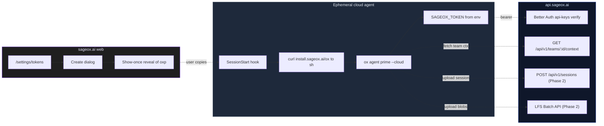

# ADR: Ephemeral Mode

- **Status:** Accepted
- **Date:** 2026-05-27
- **Deciders:** Ryan Snodgrass, SageOx Team
- **Relates to:** sageox-mono [ADR-047: Customer-Facing Env Var Namespace](https://github.com/sageox/sageox-mono/blob/main/docs/human/adr/047-customer-facing-env-var-namespace.md), [Ledger Architecture](adr-ledger-architecture.md), [Session LFS Storage](adr-session-lfs-storage.md), [Whisper & Murmur Architecture](adr-whisper-murmur-architecture.md)

## Context

ox is built around a long-running daemon that owns git operations, a local ledger clone, and on-disk caches (CodeDB Bleve index, LFS hydration cache, KB sync). That architecture is the right choice for a developer workstation: the daemon amortizes git fetch cost, the ledger clone provides offline access, and CodeDB indexing pays back over many sessions.

Ephemeral mode (for Claude Code Cloud, Devin, OpenClaw, GitHub Actions, and any environment without persistent ox state) is the answer for the opposite case: short-lived containers, no warm caches, no daemon to amortize against. The mode is called "ephemeral" because the *behavior* is ephemeral — no daemon, no local ledger clone, HTTP-only reads. The venue might still be cloud, CI, or even a developer laptop with the preference set explicitly.

In ephemeral cloud coding agents, none of the workstation assumptions hold:

- **Claude Code Cloud** runs per-session containers with no filesystem persistence across sessions. A daemon started during `SessionStart` has nothing to amortize against — it dies with the container.
- **Devin 2.0** machines use snapshots: install once, persist forever. The daemon model technically works, but the cold-start indexer cost is wasted because Devin's machine lifetime rarely matches the daemon's intended sync rhythm.
- **OpenClaw + headless CI runners** (GitHub Actions, GitLab CI) live for minutes. Cloning a multi-gigabyte ledger over a slow network to read three team-context markdown files is hostile to both the user and our infrastructure.
- **Network egress is often allowlisted.** Claude Cloud's `limited` mode requires explicit per-host allowlist; a daemon that opportunistically tries to clone arbitrary git hosts will fail in confusing ways.

Today, ox has scattered per-subsystem escape hatches (`SAGEOX_DAEMON=false`, `OX_KB_DISABLE=1`, `OX_NO_INTERACTIVE=1`, `OX_USER_CONFIG`, the `OX_SESSION_RECORDING` modes). Each one solves a slice of the problem, none of them compose into a coherent "this is an ephemeral environment" predicate, and the auto-detection heuristics (CI variables) are duplicated across packages.

We need a clean carveout that preserves CLI ergonomics — `ox agent prime`, `ox query`, `ox session` — while disabling everything that doesn't make sense for a 60-second container.

## Decision

Introduce a unified ephemeral-mode predicate and an HTTP-first read path. When the predicate is true, the daemon does not start, the ledger clone never happens, and reads route to `api.sageox.ai` over HTTP.

### Unified predicate

A single helper `internal/ephemeral/mode.go:IsEphemeral()` returns `true` when:

| Source | Behavior |
|--------|----------|
| `OX_EPHEMERAL=1` | Explicit opt-in (always wins) |
| `CLAUDE_CODE_REMOTE` set | Claude Code Cloud auto-detection |
| `DEVIN_TASK_ID` set | Devin auto-detection |
| `CODESPACES=true` | GitHub Codespaces auto-detection |
| Existing `isCI()` heuristics | `CI`, `GITHUB_ACTIONS`, `GITLAB_CI`, `JENKINS_URL`, `BUILDKITE`, `CODEBUILD_BUILD_ID` |

The predicate is checked once at process start and cached. Subsystems consult `ephemeral.IsEphemeral()` rather than re-reading env vars themselves — this keeps detection logic in one place and prevents drift.

### Subsystem behavior when ephemeral

| Subsystem | Workstation mode | Ephemeral mode |
|-----------|------------------|----------------|
| **Daemon** | Started on demand, persistent | Not started; CLI runs daemonless |
| **Ledger clone** | Local git clone, daemon-pulled | Skipped; HTTP fetch via `GET /api/v1/teams/:id/context` writes team-ctx docs directly to canonical paths |
| **CodeDB Bleve index** | Built and kept warm | Not initialized |
| **KB sync** | Periodic from team context | Skipped (same effect as `OX_KB_DISABLE=1`) |
| **Session recording** | Records to ledger cache | Defaults to `auto` writing to `$TMPDIR`; uploads via HTTP + LFS Batch API (Phase 2 of GH #102) |
| **LFS hydration cache** | On-disk under ledger cache | In-memory only, capped 64 MB |
| **`ox doctor`** | Full daemon + clone checks | Shrinks to cloud self-test (token reachability, API health) |

### Auth

Ephemeral mode uses a user-issued personal access token, not the device-flow OAuth credentials that workstation `ox login` stores on disk:

- **`SAGEOX_TOKEN`** is the only customer-facing env var for PAT auth.
- **`SAGEOX_ENDPOINT`** selects the target SageOx deployment. Tokens are bound client-side to this explicit endpoint selection surface, or production by default when unset.
- Tokens are created via the sageox.ai web app at `/settings/tokens`, prefixed `oxp_`, with a show-once reveal.
- Token verification happens server-side via Better Auth's `apiKey` plugin against `api.sageox.ai`.

The CLI **never** writes the token to disk in ephemeral mode — it reads it from the environment per process and forgets it.

### Customer-facing env-var naming

The customer-facing env-var namespace rule (`SAGEOX_*` for product/auth/network identity, `OX_*` reserved for CLI-local behavior flags) is documented in sageox-mono [ADR-047: Customer-Facing Env Var Namespace](https://github.com/sageox/sageox-mono/blob/main/docs/human/adr/047-customer-facing-env-var-namespace.md). The PAT work introduced `SAGEOX_TOKEN` to follow that rule; the rule itself is canonical there.

### Architecture

## Interaction with existing rules

### `.claude/rules/daemon-git.md` — Daemon-CLI git operations split

The rule documents that the daemon owns pull-direction git operations (clone, fetch, pull) and the CLI owns write-direction operations (add, commit, push). In ephemeral mode, **no daemon exists** — the split degenerates. The CLI does HTTP reads instead of relying on daemon pulls. Writes (session uploads) move to HTTP + the LFS Batch API in Phase 2.

An "Ephemeral-mode exception" section is appended to that rule pointing at this ADR for the full rationale.

### `.claude/rules/lfs-no-git-lfs-binary.md` — No `git-lfs` binary dependency

Unchanged. `internal/lfs/client.go` is already a pure-Go HTTP client for the LFS Batch API and works in ephemeral mode without modification. The ban on shelling out to `git-lfs` is the reason ephemeral session upload is even possible.

### `.claude/rules/cache-only-design.md` — Cache vs source-of-truth

Unchanged for read paths. Session recording in ephemeral mode writes to `$TMPDIR`, not the ledger cache, because no ledger cache exists. The recording is transient by design — it is uploaded to LFS and discarded with the container.

## Rollout phases

Matches the rollout in GH #102.

| Phase | Scope | Status |
|-------|-------|--------|
| **1 (this PR)** | Read-only team-ctx over HTTP. `--ephemeral` flag on `ox agent prime` sets `OX_EPHEMERAL=1` for the current process. `ephemeral.IsEphemeral()` predicate, subsystem opt-outs wired. | Proposed |
| **2** | Session upload over HTTP + LFS Batch API. No daemon, no local ledger clone in the write path. | Planned |
| **3** | Static binary distribution at `install.sageox.ai/ox`. `ox cloud bootstrap` UX for one-shot setup inside cloud agents. | Planned |
| **4** | OpenClaw + headless-CI session capture adapters. Full parity with workstation session lifecycle. | Future |

Each phase is independently shippable. Phase 1 is read-only; nothing the cloud agent does can corrupt user state.

## Alternatives Considered

### Alternative 1: Keep the per-subsystem escape hatches, document them as the cloud recipe

Document a recipe like "in cloud agents, set `SAGEOX_DAEMON=false`, `OX_KB_DISABLE=1`, `OX_SESSION_RECORDING=auto`, `OX_NO_INTERACTIVE=1`."

**Pros:** Zero new code. Already works for some configurations.

**Cons:** Six env vars to remember. No way to add a new subsystem-disable without updating every cloud-agent template. Auto-detection logic is duplicated across packages and drifts. Users hit confusing failures when one env var is missed.

### Alternative 2: Detect ephemeral mode and force-set the existing escape-hatch env vars

Have `IsEphemeral()` mutate `os.Setenv` for the legacy vars at process start.

**Pros:** Backward compatible with code that already reads the legacy vars.

**Cons:** Process-wide env mutation is a footgun (subprocesses inherit it; ordering matters; tests have to undo it). The clean answer is to migrate the callers to `ephemeral.IsEphemeral()`.

### Alternative 3: Build a "thin-client" binary separate from `ox`

Ship `ox-cloud` as a different binary with no daemon code linked in.

**Pros:** Smaller binary; less surface area for cloud accidents.

**Cons:** Two binaries to maintain, two sets of docs, two `install.sageox.ai` URLs. The Go binary is already small enough that the cost of carrying daemon code into ephemeral mode is negligible compared to the maintenance cost of forking the CLI.

## Consequences

### Positive

- **One predicate.** Subsystems consult `ephemeral.IsEphemeral()` once. New subsystems opt in or out explicitly.
- **No daemon footprint** in environments where it cannot pay back its cost.
- **HTTP-first reads** sidestep the entire "clone a multi-gigabyte repo to read three markdown files" problem.
- **Pure-Go LFS** (existing) means session uploads work without `git-lfs` installed on the cloud agent.
- **Composable with workstation mode.** A developer running `OX_EPHEMERAL=1 ox query "..."` on their laptop gets the same fast-path the cloud agent gets, useful for testing.

### Negative

- **Two read paths to maintain.** The HTTP team-ctx fetcher and the daemon-pulled ledger clone both need to stay in sync with the team-context document format.
- **No offline support in ephemeral mode.** If `api.sageox.ai` is unreachable, the cloud agent has nothing. This is acceptable — ephemeral agents are network-bound by definition.
- **Cache-warming asymmetry.** Workstation users get CodeDB and KB index warm-up; cloud users do not. Cloud queries pay full latency every time. Mitigated by the fact that cloud session lifetime is short — a warm index would be discarded immediately anyway.

### Risks

- **Allowlisted egress.** Claude Cloud `limited` mode and corporate proxies need `api.sageox.ai`, `install.sageox.ai`, and the team-context git host on the allowlist. We document this in `/docs/cli/ephemeral-mode`; we do not auto-detect, because failure to reach the API is indistinguishable from a network outage.
- **Legacy `OX_TOKEN` migration.** Older CI configs or shell profiles may still export the legacy `OX_TOKEN` name, which is now ignored. Mitigated by documenting `SAGEOX_TOKEN` as the only supported customer-facing auth variable per sageox-mono [ADR-047](https://github.com/sageox/sageox-mono/blob/main/docs/human/adr/047-customer-facing-env-var-namespace.md), and treating stale legacy names as a migration error, not a second auth path.
- **Daemon mid-startup race.** If a workstation user sets `OX_EPHEMERAL=1` while the daemon is mid-startup, `IsEphemeral()` may run before the daemon is fully up and we fall back to HTTP. Acceptable — the HTTP path is idempotent and returns the same data the daemon would have served.
- **Token leakage in shell history / CI logs.** A user pasting `SAGEOX_TOKEN=oxp_...` into a terminal leaves it in `.bash_history`. Mitigated by encouraging `.env` files and the GitHub Secret Scanning partner-program integration (tracked separately).

## References

- GH #102 — Ephemeral mode rollout
- GH #103 — Non-interactive auth (PAT) for cloud agents
- `.claude/rules/daemon-git.md` — Daemon-CLI git operations split
- `.claude/rules/lfs-no-git-lfs-binary.md` — Pure-Go LFS, no `git-lfs` shell-out
- `internal/ephemeral/mode.go` — `IsEphemeral()` predicate (sibling agent)
- `cmd/ox/agent_prime.go` — `--ephemeral` flag wiring (sibling agent)
- `internal/auth/` — `SAGEOX_TOKEN` env-var auth (sibling agent)
