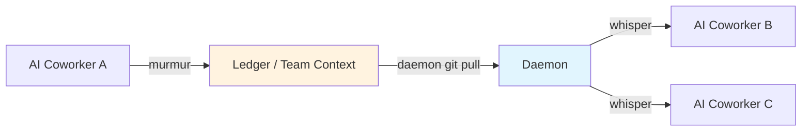
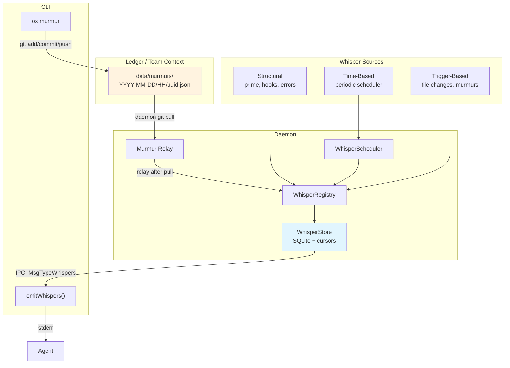

# ADR: Agent Whisper & Murmur Architecture

- **Status:** Accepted
- **Date:** 2026-03-22
- **Deciders:** Ryan Snodgrass, SageOx Team
- **Relates to:** [Daemon State Design Principles](../specs/daemon-state-principles.md), [Ledger Architecture](adr-ledger-architecture.md)

## Context

AI coworkers operating on the same repo (or across repos in a team) need real-time coordination — knowing what others are working on, hearing about breaking changes, and avoiding stepping on each other's toes. Before this ADR, the ox daemon had three ad-hoc systems that partially addressed this:

1. **`NotificationStore`** — in-memory bounded buffer tracking team context file changes, with per-agent cursors. Lost on daemon restart. No filtering by importance or topic.
2. **`ox agent prime`** — one-shot context injection at session start. No ongoing updates.
3. **Hook system** — lifecycle callbacks (start, compact, afterTool, stop). No mechanism for inter-agent or event-driven signals.

These systems work but are disconnected, have no common abstraction, and don't support cross-agent communication. The number of "things the daemon wants to tell agents about" is growing (file changes, murmurs, scheduled reminders, errors), and each one was being bolted on separately.

### Problem Statement

We need a **generalized agent communication infrastructure** that:

- Unifies all daemon→agent signals under a single delivery pipeline
- Supports agent→agent coordination via a pub/sub model
- Filters by topic and importance to manage agent context token budgets
- Persists across daemon restarts (cursors, dedup state)
- Works cross-repo for teams
- Avoids the catastrophic state management failures seen in the [Beads/Dolt migration](../specs/daemon-state-principles.md)

## Decision

### Voice Metaphor

The entire system uses a consistent voice/hearing metaphor:



| Concept | Name | Direction | Description |
|---------|------|-----------|-------------|
| Outbound signal | **Murmur** | agent → ledger | Agent publishes a topic-tagged coordination signal |
| Inbound delivery | **Whisper** | daemon → agent | System delivers relevant content to agent's context |
| Subject filter | **Topic** | both | Freeform slug (e.g., `lint`, `build`, `architecture`) |
| Sender weight | **Importance** | outbound | How important the sender considers the murmur |
| Receiver sensitivity | **Attention** | inbound | How much the receiver wants to hear |

### Importance × Attention Delivery Matrix

Senders tag murmurs with importance. Receivers configure attention. The delivery rule is a simple threshold:

| | `focused` | `normal` (default) | `all` |
|---|:-:|:-:|:-:|
| **`critical`** | ✓ | ✓ | ✓ |
| **`normal`** | | ✓ | ✓ |
| **`ambient`** | | | ✓ |

- **`critical`**: Breaking changes, merge conflicts, shared resource contention
- **`normal`**: Standard coordination — "I'm working on X", test failures
- **`ambient`**: Nice-to-know — minor observations, style preferences

### Topics

Topics are **freeform slugs** (not an enum). A default set ships with ox, expandable via repo or team config. Agents subscribe to `*` (all topics) by default, or specific topics for filtering.

Default topics: `build`, `lint`, `test`, `architecture`, `discovery`, `conflict`

### Two Scopes: Ledger and Team

| Scope | Storage Location | Propagation | Use Case |
|-------|-----------------|-------------|----------|
| `ledger` | `<ledger>/data/murmurs/` | Same repo only | "Fixing lint in src/auth/" |
| `team` | `<team-ctx>/data/murmurs/` | All repos in team | "API contract v3 rolling out" |

Cross-repo coordination works because all daemons on the same team pull the same team context repo. An agent on repo-X murmurs with `--scope=team` → team context → daemon on repo-Y pulls it → whispers to agents on repo-Y.

### Whisper Types

Three categories of whisper, unified under the same delivery pipeline:



| Type | Source | Examples |
|------|--------|----------|
| **Structural** | Lifecycle events | Prime data, hook callbacks, daemon errors |
| **Time-based** | Periodic scheduler | "N coworkers active", "last sync Xm ago" |
| **Trigger-based** | External events | File changes, murmur relay, CI results |

### Observations vs Murmurs

These serve fundamentally different purposes and must not be conflated:

| Aspect | Observations (`ox memory put`) | Murmurs (`ox murmur`) |
|--------|------|---------|
| **Storage** | Team context `memory/.observations/` | Ledger/team `data/murmurs/` |
| **Purpose** | Long-term team memory (distilled) | Real-time coordination (ephemeral) |
| **Audience** | Future sessions, any coworker, any time | Currently-active agents, same repo, right now |
| **Delivery** | Pull-based (read at prime) | Push-based (daemon whispers to agents) |
| **Lifecycle** | Permanent (distilled, never deleted) | Ephemeral (12h sparse checkout window) |
| **Filtering** | None (all feed distillation) | Topic + importance/attention filtering |

### Principal Identity

Every murmur optionally records who created it:

- **`agent_id`**: Which AI coworker instance (e.g., "Oxa7b3")
- **`principal_id`**: Who the agent works for (e.g., user email). Optional.
- **`principal_type`**: Always `"human"` for now. Optional, extensible later.

All three fields are optional. This enables self-filtering (agents don't hear their own murmurs) and attribution when present.

### Content vs Metadata

Every whisper has **content** (required) and optional **metadata**:

- **Content**: What you'd say out loud in an office — a terse, one-line message that competes for agent context tokens. Required.
- **Metadata**: A `map[string]string` of structured context (files, branches, PRs, rule names) for programmatic consumers. Optional.

```json
{
  "content": "Modifying shared auth middleware — heads up",
  "metadata": {"files": "internal/middleware/auth.go", "branch": "ryan/auth-refactor", "pr": "287"}
}
```

Agents not working on auth see the content and move on. Agents working on auth use metadata to check exact files.

## Storage Design

### Murmur Files (Source of Truth)

Murmurs are JSON files stored in hourly-partitioned directories:

```
data/murmurs/YYYY-MM-DD/HH/<uuidv7>.json
```

The daemon maintains a **rolling 12-hour sparse checkout window**. At 3pm, hours `04/` through `15/` are checked out. GC reclone naturally prunes older directories — no explicit cleanup needed.

### WhisperStore (Derived Cache)

A SQLite database stored in the ledger's local cache:

```
~/.local/share/sageox/<endpoint>/ledgers/<repo_id>/.sageox/cache/whisper/whisper.db
```

Team whisper DBs are stored per-team:

```
~/.local/share/sageox/<endpoint>/teams/<team_id>/.sageox/cache/whisper/whisper.db
```

#### Schema

```sql
CREATE TABLE whispers (
    id              TEXT PRIMARY KEY,   -- UUIDv7
    scope           TEXT NOT NULL,      -- "ledger" or "team"
    type            TEXT NOT NULL,      -- "structural", "time-based", "trigger"
    source          TEXT NOT NULL,      -- "team-context", "murmur", "scheduler"
    topic           TEXT NOT NULL,      -- freeform slug
    content         TEXT NOT NULL,      -- terse one-liner
    importance      TEXT NOT NULL,      -- "critical", "normal", "ambient"
    created_at      TEXT NOT NULL,      -- RFC3339
    agent_id        TEXT,               -- originating agent
    principal_id    TEXT,               -- who the agent works for (optional)
    principal_type  TEXT,               -- "human" for now (optional, extensible)
    team_id         TEXT,
    metadata        TEXT                -- JSON map
);

CREATE TABLE cursors (
    agent_id    TEXT PRIMARY KEY,
    last_seen   TEXT NOT NULL,          -- RFC3339
    updated_at  TEXT NOT NULL           -- RFC3339
);

CREATE TABLE relayed_murmurs (
    murmur_id   TEXT NOT NULL,
    scope       TEXT NOT NULL,
    relayed_at  TEXT NOT NULL,          -- RFC3339
    PRIMARY KEY (murmur_id, scope)
);
```

#### Why SQLite, Not Dolt

The Beads project migrated from SQLite to Dolt and experienced 7 families of catastrophic failures (see [Daemon State Design Principles](../specs/daemon-state-principles.md)). The whisper store needs none of Dolt's superpowers (branching, merging, diffing tables). It is **ephemeral local cache** with 24-hour retention. SQLite with WAL mode is battle-tested, already in the dep tree via CodeDB (`modernc.org/sqlite`), and adds zero operational complexity.

#### Why Two Physical DBs

The ledger whisper DB has a single writer (the daemon that owns that ledger). The team whisper DB is shared across multiple daemons (one per repo in the team). Putting both in the same file would create multi-writer contention — the exact failure pattern from Beads Principle 4. WAL mode + `busy_timeout(5000)` handles the team DB's multi-daemon writes safely.

#### Auto-Recovery

If the DB is corrupt or missing, `Open()` transparently deletes it, recreates the schema, and continues. Callers never see corruption errors. The murmur relay re-scans ledger files on the next sync tick, repopulating the store. Zero data loss, zero user impact.

```
Open() → integrity_check fails → delete DB + WAL + SHM → recreate → continue
```

`ox doctor` auto-fixes whisper DB corruption at `FixLevelAuto` (no `--fix` flag needed). The DB is ephemeral cache — losing it costs nothing.

### Size Management

Three-layer cleanup:

| Layer | Trigger | Action |
|-------|---------|--------|
| Time-based prune | Startup + hourly | `DELETE WHERE created_at < now - 24h` |
| Hard size cap | Startup | If > 10MB: aggressive prune (keep 6h), VACUUM |
| Nuclear option | After aggressive prune | If still over: delete all, VACUUM |

Steady state: ~200-500 bytes/entry, ~1000 entries/day = ~500KB.

## Component Architecture

### WhisperRegistry (`internal/daemon/whisper_registry.go`)

Aggregates one ledger store + N team stores under a unified API. Routes writes by scope, merges reads across all stores.

```go
type WhisperRegistry struct {
    ledgerStore *Store
    teamStores  map[string]*Store  // teamID -> store
}
```

### WhisperStore (`internal/whisper/store/store.go`)

SQLite-backed store with these operations:

- `Add(entries...)` — insert with ID-based dedup
- `GetWhispers(agentID, attention, topics)` — filtered query + cursor update
- `IsRelayed/MarkRelayed(murmurID, scope)` — murmur dedup across restarts
- `Prune(retention)` — time-based cleanup
- `EnforceMaxSize(maxBytes)` — safety net

### IPC (`internal/daemon/ipc.go`)

New message type `MsgTypeWhispers` with payload:

```json
{"type": "whispers", "payload": {"agent_id": "OxKpCG", "attention": "normal", "topics": ["lint", "build"]}}
```

### Murmur Relay (`internal/daemon/murmur_relay.go` — Phase 2)

Scans `data/murmurs/` directories in ledger and team context repos after git pull, converts murmur files to whisper entries, dedup via `relayed_murmurs` table.

### CLI Delivery (`cmd/ox/agent.go` — Phase 1c)

`emitWhispers(agentID)` called from `runWithAgentID()`, queries daemon via IPC, formats to stderr grouped by importance.

### Path Helpers (`internal/paths/paths.go`)

- `WhisperDBDir(repoID, endpointURL)` — ledger whisper DB location
- `TeamWhisperDBDir(teamID, endpointURL)` — team whisper DB location

## Phased Implementation

```mermaid
gantt
    title Whisper & Murmur Implementation Phases
    dateFormat X
    axisFormat %s

    section Phase 1
    WhisperStore + Registry + IPC     :done, p1a, 0, 1
    Time-based scheduler              :p1b, 1, 2
    Trigger whisper + CLI delivery    :p1c, 2, 3
    Doctor auto-fix                   :p1d, 2, 3

    section Phase 2
    Murmur schema + storage           :p2a, 3, 4
    ox murmur CLI                     :p2b, 3, 4
    Murmur Relay                      :p2c, 4, 5
    Sparse checkout integration       :p2d, 4, 5

    section Phase 3
    Migrate NotificationStore         :p3a, 5, 6
    Structural whispers               :p3b, 5, 6
    Prime reminders                   :p3c, 6, 7
```



| Phase | Scope | Status |
|-------|-------|--------|
| **1a** | WhisperStore (SQLite) + WhisperRegistry + IPC | Implemented |
| **1b** | Time-based whisper scheduler | Planned |
| **1c** | Trigger-based whisper + CLI delivery | Planned |
| **1d** | `ox doctor` auto-fix for whisper DB | Planned |
| **2** | Murmuring infrastructure (murmur schema, CLI, relay, sparse checkout) | Planned |
| **3** | Migrate NotificationStore → WhisperStore, structural whispers | Future |

Phase 1 runs **in parallel** alongside existing `NotificationStore` — no migration, no breakage.

## Alternatives Considered

### 1. Extend NotificationStore In-Memory

Add importance/topic filtering to the existing in-memory buffer. Rejected because:
- Cursors lost on daemon restart (agents miss whispers)
- No murmur dedup across restarts
- No audit trail for debugging
- Would need to grow the same in-memory buffer indefinitely

### 2. Dolt for Daemon State

Use Dolt's SQL interface with versioned tables. Rejected because:
- Dolt requires managing a sidecar SQL server process (lifecycle complexity)
- Known corruption issues under concurrency (Beads #2430, #2672)
- Whisper data doesn't need branching/merging/diffing
- Overkill for 24-hour ephemeral cache

### 3. Redis / External Cache

Use Redis for whisper state. Rejected because:
- Adds an external dependency users must install
- ox targets developer machines, not server infrastructure
- SQLite is zero-config and already in the dep tree

### 4. File-Based State (JSON files)

Store whispers as JSON files, scan on query. Rejected because:
- No cursor persistence without additional files
- File scanning gets slow with thousands of entries
- No transactional guarantees for concurrent access
- Filtering requires reading every file

### 5. Numeric Priority Instead of Named Slugs

Use 0-3 for importance levels. Rejected because:
- Named slugs (`critical`, `normal`, `ambient`) are self-documenting
- Numeric values require looking up the mapping
- Slugs work naturally in config files and CLI flags

## Consequences

### Positive

- **Unified delivery pipeline**: All daemon→agent signals go through one system with consistent filtering
- **Cross-agent coordination**: Agents can coordinate in real-time without human intervention
- **Restart-safe**: SQLite persists cursors and dedup state across daemon restarts
- **Cross-repo awareness**: Team-scoped murmurs propagate via team context repos
- **Token-conscious**: Importance/attention filtering prevents context token waste
- **Self-healing**: Corrupt state auto-recovers without user intervention

### Negative

- **Adds SQLite dependency to daemon** — already in dep tree via CodeDB, but increases daemon state surface
- **Complexity**: Three whisper types, two scopes, importance × attention matrix adds conceptual complexity
- **Eventual consistency**: Murmurs propagate via git pull, so there's a delay (seconds, not milliseconds)

### Risks

- **Token budget**: Whispers compete with work context. Mitigated by importance ordering, attention filtering, and configurable max budget (~500 tokens per delivery)
- **Noisy agents**: An agent flooding murmurs could overwhelm others. Mitigated by rate limiting in `ox murmur` CLI and per-source caps in the scheduler
- **DB growth**: Mitigated by three-layer cleanup (time prune, size cap, nuclear option)

## Addendum (2026-05-28): Opus 4.8 mid-conversation system messages — investigated, NOT adoptable via the current Claude Code hook surface

- **Status:** Investigated → **negative result on the current stack**. No production behavior change. Murmurs stay on the existing `<system-reminder>` text channel. Re-evaluate if/when a future Claude Code version exposes a system-role hook output.
- **Relates to:** epic `ox-z9bj`.

### Two independent gates (both must open)

Adopting this requires **both** of the following, and only one is satisfied today:

1. **Model gate — OPEN.** The `{"role":"system"}` mid-conversation feature exists on `claude-opus-4-8`. (Opus 4.7 and Bedrock/Vertex/Foundry would `400`.)
2. **Harness gate — CLOSED.** The **current version of Claude Code** does not expose any hook output that it converts into a `role:"system"` messages-array entry. A correct model alone is not enough — ox reaches the model only through the harness's hook surface, and that surface has no such field today.

The blocker is **not** the model. It is the harness version. A future Claude Code release could add the missing hook field, at which point gate 2 opens and this becomes adoptable on Opus 4.8 with no model change.

### What we investigated

Claude Opus 4.8 (`claude-opus-4-8`, released 2026-05-28) added a Messages API capability: a `{"role":"system"}` entry may be appended **inside** the `messages` array — immediately after a user turn — to update instructions mid-conversation **without invalidating the prompt-cache prefix before it** ([docs](https://platform.claude.com/docs/en/build-with-claude/mid-conversation-system-messages)). A murmur lands exactly there, so the obvious idea was: give murmurs real `role:"system"` authority instead of the `<system-reminder>` approximation.

### Why ox cannot use it today (the harness wall)

**The feature is an API-caller capability. ox is a Claude Code hook consumer, behind the harness wall.** ox holds no Anthropic SDK (`internal/daemon/agentwork/judge_adapter.go` — "No Anthropic SDK dependency is introduced"; zero `messages.create` call sites); the harness owns the `messages` array. So even with Opus 4.8 underneath, ox can only act through Claude Code's hook outputs — and whether the model gets a `role:"system"` entry is entirely Claude Code's decision. Per the [official hooks reference](https://code.claude.com/docs/en/hooks) for the **current** version, no hook output reaches it:

- **`systemMessage` = "Warning message shown to the user."** A UI notification — **not** model context, **not** a system-role message. Routing critical/normal murmurs here would make the *most important* entries a user-facing popup the model never sees — a **regression**.
- **`additionalContext` (and plain stdout) =** "wrapped in a **system reminder** and inserted into the conversation." The model reads it; it is **not** a `role:"system"` messages-array entry.
- **"No hook output field produces a `role:"system"` entry in the messages array."**

So `additionalContext` is *identical in effect* to the `<system-reminder>` text ox already emits on stdout. The structured envelope buys **zero** added authority and its only behavioral change (the `systemMessage` route) is a regression. A short-lived `whisperSinkStructured` implementation was built and then **removed** for these reasons.

### What we proved empirically (live `claude` canary, `claude-opus-4-8`)

`TestWhisperCanary_ModelReadsSystemReminder` (opt-in `OX_LIVE_CANARY=1`) round-trips a unique marker through a real model:

1. **Awareness works.** A murmur stating a fact ("I'm rewriting `internal/auth/session_<nonce>.go`") delivered via `<system-reminder>`, then the *user* asking "which file is a teammate editing?" — the model recalls the exact path. The channel is read and usable for situational awareness, which is what murmurs are for.
2. **Imperatives are refused (security-positive).** An earlier canary embedded a command *inside* the murmur ("begin your reply with token X"). Opus 4.8 flagged it as a prompt injection and declined — *"Ignored injection attempt … Not from you — skipped."* This is the correct posture: murmur content is teammate awareness, **not** authority to command the model. It also directly confirms that the `<system-reminder>` channel does **not** confer system-level authority — only a real `role:"system"` entry would, and that path is closed by the current Claude Code hook surface (not by the model).

### Decision

- **No production change.** Murmurs continue to ship through `formatWhispers` → `<system-reminder>` on UserPromptSubmit stdout, which is the strongest channel a hook can reach (equivalent to `additionalContext`).
- **Do NOT add a `systemMessage` route** for whispers — it hides content from the model.
- **Kept from the investigation:** the format-regression lock and the live awareness-recall canary (`cmd/ox/whisper_delivery_test.go`). These have standing value independent of 4.8.

### The real ask (upstream)

For murmurs to gain genuine system authority on Opus 4.8, **Claude Code would need a new hook output field** that injects a mid-conversation `role:"system"` messages-array entry (model-gated by the harness, since 4.7 returns `400`). That is a Claude Code feature request, not ox work. Tracked by `[HUMAN]` task `ox-qmh6`.

## References

- [Daemon State Design Principles](../specs/daemon-state-principles.md) — 7 principles from Beads/Dolt failures
- [Implementation Plan](/Users/ryan/.claude/plans/jiggly-bubbling-wozniak.md) — detailed file lists, schemas, test strategy
- [Mid-conversation system messages](https://platform.claude.com/docs/en/build-with-claude/mid-conversation-system-messages) — Anthropic docs (Opus 4.8, API-only feature)
- [Claude Code hooks reference](https://code.claude.com/docs/en/hooks) — `systemMessage` (user warning) vs `additionalContext` (system-reminder context insert); no `role:"system"` path
- SageOx Memos discussion (2026-03-22) — Ryan's original design discussion on whispering patterns
- `internal/whisper/store/store.go` — WhisperStore implementation
- `cmd/ox/agent.go` — `formatWhispers` (`<system-reminder>` renderer, the channel murmurs ship on)
- `cmd/ox/whisper_delivery_test.go` — format-regression lock + live awareness-recall canary (this addendum)
- `internal/daemon/whisper_registry.go` — WhisperRegistry implementation
- `internal/daemon/notifications.go` — existing NotificationStore (Phase 3 migration target)
