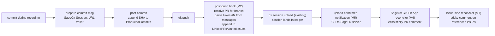

# Session ↔ PR / Issue Linkage (Design)

**Audience:** AI coworkers and engineers extending ox's linkage system beyond commits to GitHub PRs and Issues.
**Status:** v1 (M1–M5) shipped; v2 (M6–M8, GitHub App) + v3 remain. Tracked under epic `bd ox-fdre`.
**Companion:** [`session-commit-linkage.md`](./session-commit-linkage.md) (commit-level linkage; this design builds on it).

---

## Problem

Today (post-`ox-bxo2`) the linkage system answers:

- **commit → session** via `SageOx-Session: <url>` trailer in the commit message
- **session → commits** via `SessionMeta.ProducedCommits` reverse index

It does NOT answer:

- **commit / session → PR** — which pull request carries this commit, and is the session that produced it linked from there?
- **PR → sessions** — show me every session whose commits ended up in this PR
- **issue → sessions** — which sessions touched issue #N (referenced via `Fixes #N`, `Closes #N`, or in PR body)?
- **session → issues** — which issues did this session work on?

And the existing trailer-based forward link has a **timing bug** that has bitten real users:

> The `SageOx-Session: <url>` trailer is injected at commit time. The session is not uploaded to the ledger until later (and can fail or be deferred). PR comments and trailers point at a URL that may 404 when a reviewer clicks it.

The "URL exists at commit time, may not work at view time" gap is the proximate complaint that motivated this design.

---

## Non-goals for v1

- **Do NOT change the trailer format to an opaque ID.** Direct website URLs are a product feature. Stable IDs are a worse UX for the common case (reviewer clicks link, lands on a viewer page). Server-side handles drift via URL redirects, not via client-side indirection.
- **Do NOT block commits or pushes** on linkage state. Every linkage write is best-effort, eventually consistent.
- **Do NOT require server changes for v1.** v1 ships entirely inside the ox CLI. v2+ adds the SageOx GitHub App.

---

## Design principles

1. **URL trailers stay.** The forward link from a commit to its session is a clickable URL, as today. Server provides stable redirects for URL changes (subdomain moves, redact rewrites).
2. **Bidirectional metadata.** Sessions track `LinkedPRs []string` and `LinkedIssues []string`. PRs/Issues track sessions via server-managed sticky comments. Either side can answer the lookup.
3. **Defer outbound side-effects until upload-confirmed.** No outbound notification or sticky-comment write happens until the session is viewable on the server. PR comment posting is gated on upload-confirmation, not on commit-time.
4. **Webhook-driven server reconciler.** GitHub state is authoritative for PR/issue identity and membership. Walking commit messages is a heuristic; the GitHub API is the source of truth.
5. **Same `omitempty`-and-roll-forward pattern** that `ProducedCommits` uses. No breaking schema changes; legacy meta.json round-trips cleanly.

---

## Architecture



The CLI populates session-side metadata. The server-side GitHub App, once it exists, populates the GitHub-side artifacts (PR sticky comment, issue sticky comment, optional Check). The CLI never writes to GitHub directly in v1 — it only updates its own metadata. The "defer until upload-confirmed" property falls out of this split for free: the GitHub App will not have anything to post until the session has been uploaded and a webhook delivers the new state.

---

## Glossary

| Term | Meaning |
|---|---|
| **Sticky comment** | A single GitHub PR or Issue comment, tagged with an HTML marker, that the SageOx GitHub App edits idempotently as state changes. Never appends a second comment. |
| **Upload-confirmed** | A session whose `meta.json` has been written to the ledger AND the LFS Batch upload of content files has returned success AND the ledger push has reached the remote. Until all three hold, the session is not viewable on the SageOx site. |
| **Reconciler** | The server-side webhook handler that rebuilds the sticky comment from authoritative GitHub + ledger state. Stateless: derives output from inputs each run. |
| **Pre-correlation** | Building the session→PR association before a PR exists, e.g. via branch-name convention. |
| **Linkage record** | An ox-side artifact (`SessionMeta.LinkedPRs`, `LinkedIssues`) capturing the linkage as known to the CLI. Server-side state may diverge; the GitHub App's sticky comment is the user-visible truth. |

---

## v1 (ox CLI only)

Implementation scope: `ox-fdre.1` through `ox-fdre.5`. Goal: every meaningful linkage is **stored locally in `SessionMeta`** and **renderable by `ox session view`**. No GitHub-side writes yet.

### v1.1 — Schema extensions (`ox-fdre.1`)

```go
// internal/lfs/meta.go
type SessionMeta struct {
    // ... existing fields ...

    // LinkedPRs is the set of GitHub PR URLs (or PR refs in the form
    // owner/repo#N) that the session is associated with. Populated by
    // the post-push hook when a PR exists for the pushed branch.
    LinkedPRs []string `json:"linked_prs,omitempty"`

    // LinkedIssues is the set of GitHub issue URLs (or refs) referenced
    // by the session's commits via Fixes #N / Closes #N / etc., or by
    // any LinkedPR's body.
    LinkedIssues []string `json:"linked_issues,omitempty"`
}
```

Mirror in `internal/session/recording.go:RecordingState`.

### v1.2 — Push-time linkage population (`ox-fdre.2`)

Git does not ship a `post-push` hook out of the box. After comparing alternatives:

**Decision: `pre-push` hook that captures intended push state + writes linkage records BEFORE the push, paired with a CLI-side reconciliation pass in `ox doctor` and `ox session upload` to repair if the push fails.**

Rationale:

| Option | Why considered | Why rejected / accepted |
|---|---|---|
| `pre-push` hook | Standard git hook, fires for every push (including `git push` from a user's existing workflow — no behavior change required). | **Accepted.** Stdin already gives `<local-ref> <local-sha> <remote-ref> <remote-sha>` per ref. Writes linkage records based on `local-sha..local-sha-of-prior-push` range. Push may fail after we write; `ox doctor` repair pass handles that. |
| CLI wrapper `ox push` | Cleaner than a hook; opt-in. | **Rejected for primary path.** Forces a workflow change; many users use IDE-driven push. We can expose `ox push` later as a convenience that runs the same logic and surfaces the linkage outcome inline, but it's not the primary hook. |
| Daemon-driven post-push poller | Daemon watches refs/remotes and notices when a branch advances. | **Rejected.** Too indirect; relies on the daemon being healthy at push time; doesn't help ephemeral mode where daemon doesn't run. |
| Server-side post-receive on a mirror | Authoritative. | **Rejected for v1.** Too heavyweight; requires mirror infrastructure. v2 GitHub App `push` webhook covers this without a mirror. |

Handler responsibilities (`cmd/ox/hooks_pre_push.go`):

1. Read stdin: lines of `<local-ref> <local-sha> <remote-ref> <remote-sha>`.
2. For each ref being pushed where `<remote-sha>` is non-zero (i.e. branch already exists on remote), compute commit range `<remote-sha>..<local-sha>`. For new branches, use `--not --remotes` to bound the range against everything else on remotes.
3. Resolve PR for the local ref via `gh pr list --head <branch> --json url,number,state` (1 API call, cached for the duration of the push).
4. For each commit in the range, parse the message body for issue references using the patterns: `Fixes #N`, `Closes #N`, `Resolves #N`, `GH-N`, and standalone `#N` in body (NOT subject).
5. Append unique entries to active `RecordingState.LinkedPRs` (PR URL if found) and `LinkedIssues` (resolved to `owner/repo#N`).
6. Atomic-save state via `UpdateRecordingStateForAgent`. Best-effort; never blocks push.

Failure recovery: if `gh` is not installed or returns rate-limit, we log at debug and skip PR resolution for that push. The next push (or `ox doctor`) re-tries. Issue refs from commit messages do not require any API call so they're always populated.

Handler responsibilities:

1. Determine pushed branch (`git symbolic-ref HEAD`).
2. Resolve PR for branch via `gh pr list --head <branch> --json url,number,title`.
3. Parse the pushed commit range (`<old>..<new>` from stdin in pre-push, or `<remote-branch>..<HEAD>` in CLI wrapper).
4. Extract `Fixes #N`, `Closes #N`, `Resolves #N`, `GH-N`, `#N` (in body, not subject) patterns.
5. Append unique entries to `RecordingState.LinkedPRs` and `LinkedIssues`.
6. Atomic-save via `UpdateRecordingStateForAgent`.

Best-effort. Never blocks. Logs at debug.

### v1.3 — Fold into `SessionMeta` on stop (`ox-fdre.3`)

Mirrors `ox-bxo2.7` exactly. At session-stop / recover, the builder gets:

```go
metaBuilder := sessionMetaBase(...).
    // ... existing setters ...
    ProducedCommits(state.ProducedCommits).
    LinkedPRs(state.LinkedPRs).
    LinkedIssues(state.LinkedIssues)
```

### v1.4 — Render in `ox session view` (`ox-fdre.4`)

Add two markdown sections in `renderProducedCommits`-equivalent helpers in `cmd/ox/session_view_text.go`:

```
## Pull Requests
- owner/repo#42 — feat: ship X
- owner/repo#47 — fix: handle Y

## Issues
- owner/repo#101 — Foo broken on Z
```

For each entry, attempt a `gh` lookup for the title. On failure, render the bare ref. Same `<unreachable>` pattern as the commit list.

JSON: extend `sessionMetadata` with the two fields.

### v1.5 — Defer URL in PR comment (`ox-fdre.5`)

**This is the core fix for the stale-URL bug.**

Today, the URL travels in the commit message trailer. The trailer goes wherever git takes the commit — PR comments and emails frequently surface trailers, and if the session isn't viewable yet, the URL 404s.

The fix splits responsibility:

- **Trailer stays as-is** (URL form). Once the session is uploaded, the URL works forever. The trailer is durable.
- **PR comment** with the session link is posted by the server-side reconciler ONLY after upload-confirmed. Until v2 ships the reconciler, the CLI sends a notification to the SageOx server upon successful upload (`POST /api/v1/sessions/<id>/uploaded`). The server can then choose to act on it (e.g., enqueue for the GitHub App when it lands).

#### Upload-confirmed state machine

Each session has a single linkage-relevant state field, `LinkageStatus`, stored in `RecordingState` during the active recording and in `SessionMeta` after stop. State transitions are local-only until v2; the server reconciles independently from webhook state and treats the CLI signal as a hint.

```
pending --> staged --> uploaded --> notified
   |          |           |
   v          v           v
 failed   upload_failed  notify_failed
```

| State | Set by | Meaning |
|---|---|---|
| `pending` | `ox session start` | Session exists locally, has linkage intent (LinkedPRs/Issues may be populated). Not yet eligible for any PR-comment posting. |
| `staged` | `ox session stop` | meta.json written, content files in cache. LFS upload not yet attempted. |
| `uploaded` | `ox session upload` after Batch API + git push success | All three components landed: meta.json + LFS blobs + git push. URL is viewable. |
| `notified` | Server notification HTTP call success | SageOx server has been told. If v2 reconciler exists, it has now enqueued the comment update. |
| `*_failed` | Catch-all for transitions that error | `ox doctor` retries on its schedule. |

Storage:

- `RecordingState.LinkageStatus string` (pre-stop; persisted in `.recording.json`)
- `SessionMeta.LinkageStatus string` (post-stop; persisted in `meta.json` and pushed to ledger)
- Server side is independent: receives notifications, derives state from webhook events.

`ox doctor` runs a soft-signal check `session-linkage-pending`: counts sessions in `uploaded` (terminal-but-not-notified) or `notify_failed` and offers to retry via `ox session relink`.

#### Until v2 reconciler exists

The trailer in the commit message is the only PR-side artifact. That trailer goes stale during the window between commit and successful upload. v1 ships two mitigations:

1. **CLI warning at push time.** When `pre-push` runs and any commit in the push range carries a trailer for a session whose `LinkageStatus != uploaded`, surface a warning on stderr:
   > `WARN: 2 commits in this push reference sessions still uploading. SageOx-Session URLs may not work until upload completes. Run 'ox status' to see upload progress.`
   This is a warning, not a block. User can override by ignoring the message.
2. **Optional pre-push upload.** New flag `pre_push_upload = true` in user config makes pre-push synchronously wait for any `staged` recording to reach `uploaded` before allowing the push to proceed. Default off (would block on slow uploads); opt-in for users who want stronger guarantees.

The second mitigation becomes more attractive once the reconciler exists; for now, the warning is enough to surface the timing issue.

#### Server notification protocol

Single endpoint, idempotent by `session_id`:

```
POST /api/v1/sessions/{session_id}/uploaded
Authorization: Bearer <user PAT>
Content-Type: application/json

{
  "session_id": "ses_01HG...",
  "repo_id": "repo_01...",
  "uploaded_at": "2026-05-28T15:42:11Z",
  "session_url": "https://sageox.ai/repo/repo_01.../sessions/.../view",
  "linked_prs": ["https://github.com/owner/repo/pull/42"],
  "linked_issues": ["owner/repo#101", "owner/repo#103"],
  "produced_commits": ["abc1234...", "def5678..."]
}
```

Server response:

| Status | Meaning | CLI action |
|---|---|---|
| `204 No Content` | Accepted | Set `LinkageStatus = notified`. Done. |
| `409 Conflict` | Already notified for this session | Treat as success; set `notified`. |
| `429 Too Many Requests` | Rate-limited | Set `notify_failed`, retry via doctor later. |
| `5xx` | Server error | Set `notify_failed`, retry. |
| network error / timeout | Transient | Set `notify_failed`, retry. |

The endpoint is intentionally narrow: the server learns of the upload from the CLI; the GitHub App learns from `push` webhooks; the server cross-references the two when generating the sticky comment.

---

## v2 (SageOx GitHub App)

Separate repo, separate deploy. v2 work tracked under `ox-fdre.6`, `ox-fdre.7`, `ox-fdre.8`.

### v2.1 — App scaffold + sticky PR comment (`ox-fdre.6`)

A GitHub App with:

- **Permissions (minimum scope):**
  - `pull_requests: write` — post and edit PR comments
  - `issues: write` — post and edit issue comments
  - `contents: read` — read commit messages (for trailer extraction)
  - `metadata: read` — required by GitHub for app installation
- **Subscribed webhook events:** `push`, `pull_request` (opened, synchronize, reopened, edited), `issues` (opened, edited, closed, reopened), `installation` (added/removed), `installation_repositories` (added/removed).
- **Webhook security:** every payload validated via `X-Hub-Signature-256` HMAC against the per-installation webhook secret. Requests with invalid signatures are rejected with 400 before any parsing. Replay protection via `X-GitHub-Delivery` UUID + 5-minute idempotency window stored in Redis.
- **App-level idempotency:** all comment writes use an HTML-comment tag (`<!-- sageox-sessions:sticky -->`) to find the existing comment and PATCH it via the Issues API. Never creates a second copy. If two webhook deliveries race, the lock key is `installation_id:repo:pr_number`.

#### Reconciliation triggers

| Event | Action |
|---|---|
| `pull_request.opened` | Build sticky comment from commit-message trailers in PR's commits. Resolve each session via ledger lookup. |
| `pull_request.synchronize` | Re-read commits, re-build sticky comment. Diff vs. previous: only PATCH if body changes. |
| `pull_request.reopened` | Same as opened. |
| `push` (to default branch) | Update any open PR's sticky comment if the pushed commits include `Fixes #N` patterns (annotate the issue side). |
| `issues.opened` / `issues.edited` | Re-scan referencing PRs; rebuild issue sticky comment. |
| `installation.added` | Register installation; no immediate action. |
| Internal `/api/v1/sessions/{id}/uploaded` notification | Re-queue any PR whose comment placeholder referenced this session. |

#### Sticky comment template

Default body (markdown):

```markdown
<!-- sageox-sessions:sticky v=1 -->
## 🟢 SageOx Sessions in this PR

This PR contains commits produced during the following recorded sessions.
Sessions become viewable once their content uploads complete.

| Commit | Session | Title | Agent | State |
|---|---|---|---|---|
| `abc1234` | [view](https://sageox.ai/repo/repo_01.../sessions/2026-05-28T14-32-ryan-Oxc0ffee/view) | Feature X scaffolding | Oxc0ffee | ✅ ready |
| `def5678` | _(not yet uploaded)_ | _pending_ | Oxc0ffee | 🟡 uploading |

<sub>Updated automatically by SageOx. Last refreshed: 2026-05-28T15:42 UTC. Sessions are linked via the `SageOx-Session:` commit trailer.</sub>
```

Placeholder rows show when a referenced session has not yet been confirmed uploaded (via the `/api/v1/sessions/{id}/uploaded` notification OR via direct ledger lookup). Once confirmed, the next reconciliation pass replaces the placeholder.

#### Multi-session, multi-PR semantics

| Scenario | Behavior |
|---|---|
| Session X contributes commits to PRs A AND B | Both PR sticky comments list session X. Session X's `LinkedPRs` lists both A and B. |
| PR A contains commits from sessions X AND Y | PR A's sticky comment lists both. |
| Commit is later cherry-picked into PR C | PR C's sticky comment lists the source session (trailer survived). Session's `LinkedPRs` adds C on next reconciliation pass (server-side; CLI's session metadata is frozen after stop). |
| PR squash-merged → merged commit lands on default branch | If GitHub's squash settings preserved the trailer in the merge commit, downstream PRs see it. If not, the `push` webhook handler logs the linkage loss for telemetry. |
| Session has no commits in any PR yet | No sticky comment exists. No spurious empty comments. |

#### Failure modes

| Failure | Behavior |
|---|---|
| Webhook delivery fails (network/timeout) | GitHub auto-retries up to 3x over 12h. Idempotency tag handles duplicates. |
| Comment PATCH fails (rate limit) | Re-queue with exponential backoff. Hard ceiling: 5 attempts over 1 hour. |
| Ledger lookup fails (session not found) | Show placeholder row `_(not found)_`. Do not block other rows. |
| App uninstalled mid-flight | Pending reconciliations drop on the floor; no orphan comments because comments live on PRs/issues, not on the app. |
| GitHub App suspended | All operations short-circuit; user is informed via the SageOx web UI on next visit. |

### v2.2 — Bidirectional issue refs (`ox-fdre.7`)

For each issue referenced (Fixes #N, body mentions, etc.), maintain a sticky comment on the issue listing sessions that touched it. Same idempotency tag pattern, different target.

When a PR merges and closes the issue, annotate the comment: "Closed by session ses_XYZ via PR #42."

### v2.3 — GitHub Checks (UX upgrade) (`ox-fdre.8`)

Replace (or augment) the PR comment with a GitHub Check titled "SageOx Sessions." Check details lists session URLs + summaries. Pending while sessions uploading, success when all referenced sessions viewable. Native PR UI; doesn't pollute conversation thread.

The 2026 trend across Sentry Releases, Vercel previews, CircleCI summaries, and Devin is "GitHub Check > sticky comment" for structured, refreshable CI/agent data. We ship the comment first because Checks require event-driven status updates that depend on the reconciler being fully wired.

---

## v3 (audit-grade provenance, optional)

`ox-fdre.10`. SLSA-style attestations for regulated industries / supply-chain compliance. Out of scope for this design beyond "we have a slot for it."

---

## Branch-name convention (optional pre-correlation)

`ox-fdre.9`. Convention: `agent/<oxsid>/<topic>` branch names allow the server reconciler to pre-correlate sessions to a branch BEFORE any PR exists. Optional; the CLI suggests but does not enforce.

---

## Trade-offs and rejected alternatives

| Alternative | Why rejected |
|---|---|
| Switch trailer to opaque `ses_<id>` | Direct website URLs are a product feature; opaque IDs break click-to-view UX. Server handles drift via redirects. |
| Block push until session uploads | Hostile to dev experience. Many teams push WIP commits before stopping the session. |
| Walk commit messages server-side without webhooks | Polling is wasteful; GitHub Apps are the standard pattern. Webhooks scale better than scheduled scans. |
| Single comment per commit instead of sticky-per-PR | Conversation pollution. Modern tools all moved to sticky-per-PR. |
| Store linkage only server-side | Local `ox session view` should answer without network. Bidirectional storage is the right call. |

---

## Acceptance summary

| Phase | Acceptance signal |
|---|---|
| v1.1 | `SessionMeta` round-trips `LinkedPRs` and `LinkedIssues`. |
| v1.2 | After `ox push` on a branch with a PR, active recording state shows the PR URL and any issue refs. |
| v1.3 | Closed-session `meta.json` carries `LinkedPRs` / `LinkedIssues`. |
| v1.4 | `ox session view` renders PR and Issue sections when populated. |
| v1.5 | CLI emits upload-confirmed notification; warns when pushing commits whose trailers are not yet viewable. |
| v2.1 | PR open / sync produces a sticky comment listing sessions. |
| v2.2 | Issue events produce a reciprocal sticky comment on the issue. |
| v2.3 | Each PR exposes a "SageOx Sessions" Check. |
| v3.x | Per-commit signed attestation produced and verifiable via `ox session verify`. |

---

## Ephemeral mode

When `ephemeral.IsEphemeral()` is true (CI, Codespaces, Devin remote, `OX_EPHEMERAL=1`), the daemon does not run and `git push` may not happen at all in some workflows (the session is uploaded via HTTP and consumed directly). Linkage behavior:

| v1 step | Ephemeral behavior |
|---|---|
| M1 schema | Same. Fields live in meta.json regardless of mode. |
| M2 pre-push hook | Runs if user invokes git push. If user uses `ox session upload` directly without a push, the hook never fires; LinkedPRs/LinkedIssues stays empty unless populated by a future v1.6. |
| M3 fold on stop | Same. Uses whatever was in RecordingState. |
| M4 render | Same. |
| M5 upload-confirmed notification | Same. HTTP-only, works in ephemeral mode. |

For ephemeral users who never push from the ox-CLI environment, linkage is populated server-side from `push` webhooks (v2.1). v1 provides degraded but non-broken UX in ephemeral mode — sticky comments work; pre-PR ProducedCommits-based linkage works; only the CLI-side pre-push enrichment is missing.

---

## Observability

The reconciler is a server-side service; observability lives there. CLI-side telemetry:

| Signal | Where | Purpose |
|---|---|---|
| `linkage.pre_push.duration_ms` | pre-push hook | Catch hook regressions that slow `git push`. Target: <200ms p99 with 0 PRs, <800ms with `gh pr list` round-trip. |
| `linkage.notify.success_total` / `linkage.notify.failed_total` | upload path | Detect notify-endpoint outages. |
| `linkage.linked_prs.count` / `linkage.linked_issues.count` | session stop | Distribution of linkage population per session. |
| `linkage.doctor.pending_uploads` | doctor | Number of sessions stuck in `uploaded`-but-not-`notified`. |

Server-side telemetry (separate spec when v2 lands):

- Webhook delivery success rate per installation
- Reconciliation latency p50/p95/p99
- Sticky comment edit failures by error type
- Comment body size distribution (catch runaway growth on PRs with hundreds of commits)

---

## v1 implementation notes (as shipped)

Divergences from the design above, recorded so the next reader isn't surprised:

| Area | Design | As shipped (v1) | Why |
|---|---|---|---|
| Hook name | `pre-push` (decision) | `pre-push` | As designed. Reads git's ref stream on stdin; installed as the 4th ox hook in `hooks_git.go`. |
| Issue-ref form | `owner/repo#N` | bare `#N` | The CLI doesn't reliably know `owner/repo` without an extra `gh` call; the server reconciler (v2) resolves `#N` to `owner/repo#N` using repo context from the webhook. Cheaper and avoids a second network round-trip in the hot push path. |
| `LinkageStatus` pre-stop transitions | `pending` at start, `staged` at stop | first written as `staged` at stop | `RecordingState.LinkageStatus` exists but is not written during recording in v1; the field is reserved for a future enhancement that tracks pending state mid-recording. Empty == legacy/pending, treated identically. |
| Bare `#N` in subject vs body | body only | whole message (`%B`) scanned | The closing-keyword regex requires a keyword (`Fixes`/`Closes`/`Resolves`/`GH-`), so a subject like `fix: thing` does NOT match; only an explicit `Fixes #N` does, wherever it appears. Net effect matches the design intent (no false positives from passing mentions). |
| Notification gating | always notify on upload | notify only when there is linkage OR produced commits | A session with nothing to link gives the reconciler nothing to act on; skipping the call avoids needless server load. |

Files (v1):

| Concern | File |
|---|---|
| `LinkedPRs` / `LinkedIssues` / `LinkageStatus` schema | `internal/lfs/meta.go`, `internal/session/recording.go` |
| `LinkageStatus*` constants | `internal/lfs/meta.go` |
| pre-push hook install (4th hook) | `cmd/ox/hooks_git.go` |
| pre-push handler (range parse, issue refs, PR resolve) | `cmd/ox/hooks_pre_push.go` |
| fold into SessionMeta on stop | `cmd/ox/agent_session.go` |
| upload-confirmed transition + notify | `cmd/ox/session_linkage_finalize.go` |
| server notification client | `internal/api/repo.go` (`NotifySessionUploaded`) |
| render in `ox session view` | `cmd/ox/session_view_text.go`, `cmd/ox/session_show.go` |

---

## Open questions for the reviewer

1. **v2 GitHub App repo location.** Separate `sageox/sageox-github-app` repo (clean isolation, independent deploy cadence) or in `sageox/sageox` (less infra)? Out of scope for this doc; affects v2 implementation only.
2. **Notify endpoint vs ledger polling.** v1.5 uses an explicit `POST /api/v1/sessions/{id}/uploaded` notification. Alternative: server polls the ledger via the existing webhook from the ledger remote. Notification is more responsive; polling is more resilient. Recommendation: ship notification first, add polling as fallback in v2.
3. **Trailer URL drift.** When the SageOx site changes URL structure or a session is renamed/redacted, existing commit-message trailers point at old URLs. Resolution: server-side redirects (301) from old paths to new. Out of scope for this design but listed as a dependency on the SageOx web service.
4. **Linkage retention for closed PRs.** When a PR closes (merged or rejected), should the sticky comment stay or be archived? Recommendation: stay, with a header annotation: `> ✅ Merged 2026-05-28 — session list frozen.` Comment becomes a permanent retrospective record. Issue sticky comments follow the same pattern.

---

## Implementation order (v1)

Strict dependency order. Each step builds on the prior and is independently testable.

1. **M1** (schema): `LinkedPRs []string`, `LinkedIssues []string`, `LinkageStatus string` on `SessionMeta` + `RecordingState`. Builder methods. JSON round-trip tests.
2. **M3** (fold on stop): agent_session.go + agent_session_recover.go pick up the new state fields. Test: stop session with non-empty LinkedPRs, verify meta.json carries them.
3. **M4** (render): `## Pull Requests` + `## Issues` sections in viewAsText; JSON exposes fields. Test: view session with each field, verify rendering.
4. **M2** (pre-push hook): handler parses commit range, resolves PRs, extracts issue refs, updates RecordingState. Test: real git repo + recording, fake PR via temporary git refs, assert state populated.
5. **M5** (upload-confirmed): LinkageStatus transitions; HTTP notification call; doctor soft-signal for pending. Test: complete upload, assert state transitions; mock server outage, assert failed state.

M1 → M3 → M4 → M2 → M5 is the right ship sequence: schema first, fold-and-display second so we can validate visually, hook third (with rendering already proving the fields work), notification last (highest external dependency).

Total v1 cost estimate: ~1500-2000 LOC across implementation + tests, mirroring the ox-bxo2 footprint.
