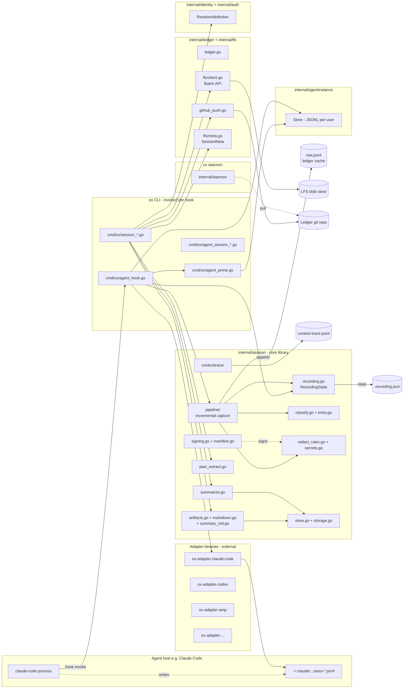
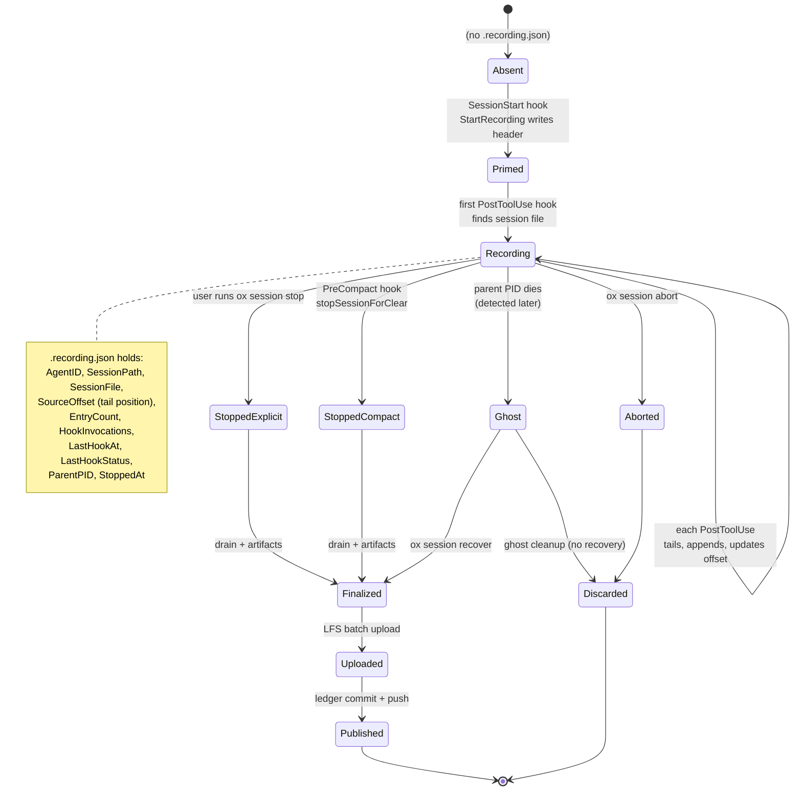
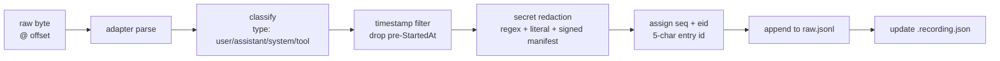
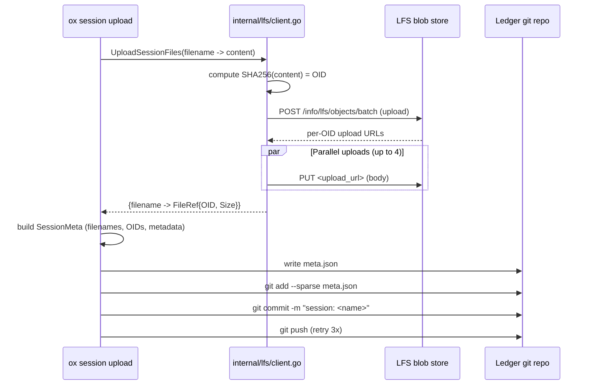

# Session Capture — System Architecture

> Audience: principal engineer onboarding onto the session subsystem. This document
> assumes you've read [session-capture-concepts.md](session-capture-concepts.md). It
> walks the components, the interfaces between them, and the *why* behind the major
> design decisions. It does not repeat implementation details — see
> [session-capture-components.md](session-capture-components.md) for those.

---

## 1. Component map



The diagram separates three *tiers*:

- **Edge (left, yellow in diagrams):** the untrusted agent host. ox observes but does
  not control it. Contract: the host calls `ox agent hook <event>` at lifecycle
  points and does not rely on stdout from those calls.
- **CLI (center):** the ox binary, invoked per hook. The CLI is stateless across
  invocations; all continuity is in files on disk.
- **Core and distribution (right):** Go packages linked into the CLI that do the real
  work, plus the daemon that does background reads.

The boundary between tiers is physical (separate processes). The boundary between
packages inside the CLI is logical, but enforced by Go's import rules: `cmd/ox/`
imports `internal/session/`, not the other way around.

---

## 2. The session recording state machine

The state machine is stored in `.recording.json` and driven by hook invocations. It is
the single most important piece of state in capture; everything else is derived from
it.



### Key transitions

- **Absent → Primed:** `StartRecording` in `internal/session/recording.go`. Allocates
  the session path, writes the first line (header) of `raw.jsonl`, writes
  `.recording.json`. Deduplicates by Agent ID — two `ox agent prime` calls on the same
  host do not start two sessions.

- **Primed → Recording:** The first PostToolUse hook discovers the agent's session
  file via the adapter's `FindSessionFile` and locks the `SessionFile` + `StartOffset`
  into state. Subsequent hooks never re-search.

- **Recording → Recording (the hot loop):** This is the tightest inner loop in the
  capture subsystem. On each hook: open source file at `SourceOffset`, parse new
  lines, classify, redact, append. Updates to `.recording.json` use a write-to-temp +
  atomic rename to be safe under concurrent reads. `LastHookStatus` records *why* a
  hook was a no-op (e.g. `session-file-not-found`, `read-error`,
  `adapter-no-incremental-reader`), which is what makes `ox session status` and
  `ox doctor` actionable.

- **Recording → Stopped*:** Two distinct exits. `StoppedAt` is set. An IPC
  fire-and-forget to the daemon (`SessionFinalizeIPCPayload`) is a courtesy only —
  finalization happens in the CLI. The IPC exists so that a crashed CLI still hands
  off the session name to a healthy daemon for cleanup.

- **Ghost detection:** `IsAgentAlive()` uses `kill(pid, 0)`. Eligible only after
  `GhostGracePeriod` (10 min). Rationale: a new PID shows up briefly as a transient
  shell before the long-lived agent process; without grace we'd cull real sessions
  whose PID hadn't stabilized. See `recording_ghost_grace_test.go`.

### Why observability fields live in `.recording.json`

An earlier design pushed hook status to logs. That made triage miserable — users
asking "why isn't my recording working?" had to grep logs in XDG state dir across
multiple processes. Now a single `cat .recording.json` answers it. The tradeoff is
one extra atomic write per hook, which is cheap compared to reading the source JSONL
itself.

---

## 3. Path resolution: where things live

Session storage is one of the places where getting the path wrong has historically
been a serious bug — content has leaked into the user's source repo, and writes have
landed in directories that never get cleaned up. The architecture pins a single
canonical write path and a search path for reads.

```
┌──────────────────────────────────────────────────────────────────┐
│  Canonical write path (resolveSessionsWritePath)                 │
│                                                                  │
│    ~/.local/share/sageox/<endpoint>/ledgers/<repo_id>/           │
│        .sageox/cache/sessions/<session-name>/                    │
│                                                                  │
│    Falls back (no repo_id or endpoint) to:                       │
│    <XDG_CACHE_HOME>/sageox/context/<repo_id>/sessions/           │
└──────────────────────────────────────────────────────────────────┘
```

Reads use a *search path ladder* (in order):

1. Ledger cache (canonical, environment-independent).
2. Current XDG cache.
3. Alternate XDG caches (e.g. a Conductor GUI session and a terminal have different
   `XDG_CACHE_HOME`; a ghost-cleanup from one shouldn't miss recordings from the
   other).
4. Legacy `projectRoot/sessions/` — read-only fallback for in-flight sessions started
   on older ox versions.

Writes **never** iterate the search path. That invariant is enforced by
`resolveSessionsWritePath` having a different signature and return contract from
`sessionsSearchPaths`. Doing otherwise is the bug that leaked sessions into the source
repo; the rule is called out in a prominent comment in `recording.go`.

### Two classes of path, one folder per session

Within a session folder:

```
<session-name>/
  .recording.json        # ephemeral, deleted on publish
  raw.jsonl              # LFS-backed, .gitignored in ledger
  summary.json           # LFS-backed
  summary.md             # LFS-backed
  session.md             # LFS-backed
  plan.md                # LFS-backed (optional)
  context-trace.jsonl    # LFS-backed (optional)
  meta.json              # git-tracked in the ledger
```

Only `meta.json` is committed. The others are `.gitignore`d by the ledger's
`.gitignore`. Pointer-less LFS (see §6) makes this consistent.

---

## 4. Adapter layer: abstracting the agent host

An adapter is an external binary (`ox-adapter-<type>`) that ox invokes as a
subprocess. The adapter surface, from `internal/session/adapters/adapter.go`:

```
Detect(ctx)                         → bool + metadata    (is this host present?)
FindSessionFile(SessionLookup)      → path               (where is its JSONL?)
ReadMetadata(path)                  → *SessionMetadata   (agent version, model)
IncrementalReader.ReadFromOffset(path, offset)
                                    → []RawEntry, newOffset
CapturePrior(SessionLookup)         → CapturePriorResult (optional capability)
Capabilities                        → []Capability       (CapCapturePrior, …)
```

### Why external binaries, not plugins?

Three reasons from the commit history and ADR discussion:

1. **Blast radius.** A buggy or malicious adapter cannot corrupt the ox process state
   or the raw file. If the adapter exits non-zero, the hook records a `LastHookStatus`
   and moves on.
2. **Independent release cadence.** Claude Code's JSONL format changes faster than ox
   releases. Shipping a fixed adapter as a separate binary means users can `brew
   upgrade ox-adapter-claude-code` without touching ox.
3. **Capability-based dispatch.** New agents register at runtime; ox does not need to
   know their names at compile time. `adapters.RegisterExternalAdapters()` scans
   `PATH` for `ox-adapter-*` and populates a registry.

### Adapter protocol wire format

Adapters communicate via line-delimited JSON on stdin/stdout (see
`internal/adapterprotocol/`). A hook invocation roughly looks like:

```
ox sends:    {"op":"read_from_offset","path":"...","offset":4096}
adapter:     {"entries":[...],"next_offset":8192}
```

Because this is a subprocess, the adapter can be in any language. Today they are all
Go, sharing `pkg/adapterprotocol/` helpers, but that's a convention not a constraint.

---

## 5. Pipeline: from raw line to appended entry



The pipeline has seven stages and is strictly linear. It lives in
`internal/session/pipeline/` with supporting utilities in `classify.go`, `filter.go`,
`redact_rules.go`, `secrets.go`, and `entry.go`.

### Design decisions

- **Classification before redaction.** Entry type determines which fields are
  sensitive. A `tool` entry has an `output` field that needs regex sweeps; a `user`
  entry can have inline credentials in natural language. Classifying first means
  redaction doesn't have to guess what the entry is.

- **`eid` is generated at append time, not at read time.** If the adapter re-emits an
  entry (e.g. because the agent rewrote its own JSONL), we'd rather have a new `eid`
  and let downstream dedup than silently collide. 5-char random IDs give 62⁵ ≈ 916M
  combinations, which is ample per session.

- **Footer is written at finalize, not maintained incrementally.** The footer has
  `entry_count` and `closed_at` — mutating the last line on every append would ruin
  the append-only guarantee.

### Failure modes and what we keep

| Failure | Consequence | Raw file state |
|---|---|---|
| Adapter binary missing | Hook logs status, returns 0 | raw unchanged (header only) |
| Source JSONL moved / permissions | LastHookStatus: read-error | raw unchanged |
| Partial read (EOF mid-entry) | Offset unchanged, retried next hook | raw unchanged |
| Redactor regex panic | Entry dropped, others kept | raw may miss one entry |
| Append fsync failure | Error surfaced; offset not advanced | raw unchanged |
| CLI SIGKILL mid-append | Truncated last line on raw.jsonl | Truncated line is re-read next boot |

The "raw unchanged" property across most failures is what makes session capture
*cheap* — we don't have to second-guess correctness on retry.

---

## 6. Distribution: LFS without `git-lfs`

This is one of the most distinctive decisions in the system. Full rationale is in
[adr-session-lfs-storage.md](../adr/adr-session-lfs-storage.md). Summary:

- Sessions can be dozens of MB (transcripts of hour-long agent runs). Committing that
  into a git tree is intolerable.
- Standard `git-lfs` requires a binary dependency (~70% of users don't have it) and
  smudge/clean filters that auto-hydrate content on `git checkout`, which would
  destroy the dehydrated-by-default model.
- GitLab and GitHub both expose the LFS Batch API over plain HTTPS. A pure-Go client
  (~400 LoC) handles upload and download. No subprocess, no `.gitattributes`.



### The `meta.json` object

Replaces both a git-lfs pointer file *and* a git-lfs `.gitattributes` rule. Schema:

```json
{
  "session_name": "2026-04-19T04-19-galexy-OxSk2e",
  "username": "galex@sageox.ai",
  "agent_id": "OxSk2e",
  "agent_type": "claude-code",
  "model": "claude-sonnet-4-20250514",
  "created_at": "2026-04-19T04:19:00Z",
  "entry_count": 312,
  "summary": "one-line synopsis",
  "stop_reason": "explicit",
  "repo_id": "repo_…",
  "sageox_score": "moderate",
  "files": {
    "raw.jsonl":   {"oid":"sha256:…","size":128934},
    "summary.md":  {"oid":"sha256:…","size":5182},
    "session.md":  {"oid":"sha256:…","size":98441}
  }
}
```

### Consistency model

- **Upload-first, commit-after.** If LFS upload fails, there is no commit. If commit
  succeeds but push fails, the CLI retries; the blobs are already in LFS, so a
  succeeded later push is always referentially valid.
- **No pointer files in the working tree.** A teammate's `git pull` on the ledger
  downloads `meta.json` and nothing else. `ox session list` walks `sessions/*/meta.json`.
- **Hydration is pull, not push.** `ox session hydrate <name>` reads `meta.json`,
  issues a Batch download, streams to the local cache. Cache path is identical to
  the write path from §3, so a hydrated session is indistinguishable from one
  recorded locally.

### Why the daemon doesn't do uploads

The daemon-CLI split is covered in [adr-ledger-architecture.md](../adr/adr-ledger-architecture.md).
For sessions specifically: uploads are bursty and happen exactly when the CLI already
has the context (user, session path, auth). Routing through the daemon would require
IPC for something that is trivially done in the calling process, with no concurrency
benefit (one session per upload).

---

## 7. Context trace: parallel audit log

A context trace is a separate JSONL file in the same session folder. It records:

- **Provided events:** emitted during `ox agent prime`. For each team-context or
  memory snippet injected into the agent, record source type, slug, token count, and
  whether it was inlined vs referenced.
- **Influenced events:** emitted by `ox agent <id> session context-trace` from inside
  the agent's own turn. The agent declares "this decision was driven by
  MEMORY/foo.md". This is how SageOx computes contribution scores.

```
context-trace.jsonl
├── {type:"provided",source_type:"team-context",slug:"conventions",tokens:812,inlined:true}
├── {type:"provided",source_type:"team-memory",slug:"soul",tokens:0,inlined:false}
├── {type:"influenced",eid:"aB7x9",source_type:"team-context",slug:"conventions"}
...
```

Separating this from `raw.jsonl` matters for two reasons:

1. **Different retention.** A tracetracecan be re-derived for an old session, raw
   cannot.
2. **Different consumer.** The SageOx server reads context-trace for team-wide
   attribution dashboards without needing to re-parse the raw conversation.

The `eid` key ties an "influenced" event to a specific entry in raw. If raw is
resummarized, the trace still points at a stable point.

---

## 8. Concurrency architecture

### Three concurrency axes

1. **Multiple agent hosts on one machine.** Solved by per-session folders keyed by
   Agent ID. No shared mutable state outside `agentinstance.Store`, which is an
   append-only JSONL with last-writer-wins semantics (safe because each writer
   appends its own record).
2. **Hook re-entry on one session.** Claude Code can fire hooks rapidly. Each hook
   invocation is a new ox process. Atomic rename on `.recording.json` plus
   append-only `raw.jsonl` means no locks. If two hooks race, the second sees the
   first's offset and is a no-op for those bytes.
3. **Daemon vs CLI on the ledger.** Split cleanly: daemon does pulls, CLI does
   pushes. Conflict window is the few seconds of `git add / commit / push`; the
   daemon's pull uses `--autostash` + `--rebase` to cope with local commits that
   haven't been pushed yet.

### Liveness

The daemon checkpoints its own heartbeat to `~/.local/state/sageox/daemon.pid` +
`state.json`. The CLI checkpoints per-agent via `LastHookAt`. A cleanup sweep only
runs when `Duration() > GhostGracePeriod` *and* the parent PID is dead.

### No two-phase commit

Session publication is **not transactional** across `LFS upload` → `git commit` →
`git push`. The ordering is chosen so partial failures leave valid states:

- After upload, before commit: LFS blobs exist but no one knows about them. Garbage.
  Re-running upload is safe (OID addressing means idempotent writes).
- After commit, before push: meta.json committed locally, blobs in LFS, not visible
  to teammates. Next push resolves it.

The third failure mode — push succeeds but meta.json references an OID that isn't in
LFS — cannot happen because upload is before commit.

---

## 9. Integration surfaces

### Hooks (edge → CLI)

Registered in the agent host's hook config (Claude Code's `settings.json` under
`hooks`). ox's `ox agent hook` command is the universal entry point, with
`resolvePhase()` in `agent_hook.go` mapping host-native event names to canonical
phases (see [agent-support-matrix.md](../specs/agent-support-matrix.md) for the
per-host table). The canonical phases are:

- `phaseStart` — SessionStart
- `phasePrompt` — UserPromptSubmit (the **only** reliable stdout channel for
  whispers/system-reminders; PostToolUse stdout is discarded in Claude Code)
- `phaseAfterTool` — PostToolUse (**primary capture trigger**)
- `phaseCompact` — PreCompact
- `phaseStop` — Stop (fires after every agent turn, not just session end)

### IPC (CLI → daemon)

One call only: `SessionFinalizeIPCPayload`. Fire-and-forget. Used at session stop to
hand off cleanup context (session name, ledger path, cache path) so that if the CLI
exits before it can fully publish, the daemon can pick up. See
[ipc-architecture.md](../specs/ipc-architecture.md) for the general IPC model.

### HTTP (CLI → LFS store)

`internal/lfs/client.go` implements the LFS Batch API as an HTTP client. One POST to
`/info/lfs/objects/batch`, N PUTs or GETs (up to 4 concurrent). Auth is Git PAT in
`Authorization: Basic`. No OAuth required for LFS.

### HTTP (CLI → git host)

Standard `git push` / `git pull` over HTTPS using a PAT embedded in the remote URL.
The daemon refreshes the PAT via `RefreshRemoteCredentials()`; the CLI reads whatever
is on disk.

### HTTP (CLI ↔ SageOx server)

Two endpoints matter for sessions:

- `POST /api/v1/repos/{repo_id}/sessions/{name}/summarize` — server-side summary
  generation (optional path).
- `GET /api/v1/repos/{repo_id}/sessions` — team-visible session listing, backed by
  the same ledger `meta.json` files.

OAuth bearer token. Optional — capture works without connectivity.

---

## 10. Evolution hooks

Choices made to keep specific axes of change cheap.

- **New agent hosts:** add a new `ox-adapter-<type>` binary. No ox changes.
- **New entry types:** `type` is a string in the JSON; readers ignore unknown types
  with a warn. `system-reminder` started as `user` and was promoted later with no
  migration.
- **New artifacts:** add a generator in `internal/session/` and a `ContentFiles` entry
  in the upload pipeline. LFS is content-addressed, so new file names don't break
  old sessions.
- **New redaction patterns:** add to the manifest; bump schema version; re-sign.
  Existing sessions record the old manifest hash, so readers can decide whether to
  re-redact.
- **New identity providers:** `internal/identity/` has a priority chain. Adding a new
  provider means adding a new `Identity` variant and fitting it into `Resolve()`'s
  ordering logic — no caller changes.

---

## 11. Anti-patterns that are actively guarded against

These show up as comments, lint rules, or tests in the codebase:

- Writing session data inside `projectRoot/sessions/` — caught by path-resolution
  tests and a legacy-read-only rule. History: earlier ox versions did this and leaked
  session bytes into users' source repos.
- Shelling out to `git-lfs`, or writing `.gitattributes` with `filter=lfs` — caught
  by `make check-no-git-lfs-shell`. See
  [.claude/rules/lfs-no-git-lfs-binary.md](../../.claude/rules/lfs-no-git-lfs-binary.md).
- Reading pre-session entries from the adapter (entries before `StartedAt`) — the
  timestamp filter in the pipeline catches these. A regression here would pollute
  new sessions with stale conversation from before prime.
- Using `os.Stat(".sageox/")` to decide initialization — use
  `config.IsInitialized(gitRoot)`. An empty dir must be treated as broken, not
  initialized. Same rule applies across the codebase, see top-level
  [CLAUDE.md](../../CLAUDE.md) §"Canonical Functions".
- Discarding `.recording.json` on any error path — the file is the audit trail and is
  explicitly preserved even when the session is otherwise abandoned, so that
  `ox doctor` can diagnose later.

---

## 12. Reading plan for new contributors

1. [session-capture-concepts.md](session-capture-concepts.md) — mental model.
2. This document — map of components and why they're split.
3. [session-capture-components.md](session-capture-components.md) — component
   walkthroughs for the area you'll be touching.
4. Spec files:
   - [session-raw-jsonl.md](../specs/session-raw-jsonl.md)
   - [session-summarization.md](../specs/session-summarization.md)
   - [session-auth-model.md](../specs/session-auth-model.md)
5. ADRs for the major load-bearing decisions:
   - [adr-session-lfs-storage.md](../adr/adr-session-lfs-storage.md)
   - [adr-ledger-architecture.md](../adr/adr-ledger-architecture.md)
6. Source tour, in order: `internal/session/recording.go` →
   `cmd/ox/agent_hook.go` → `internal/session/pipeline/` →
   `cmd/ox/session_upload.go` → `internal/lfs/session_upload.go`.
