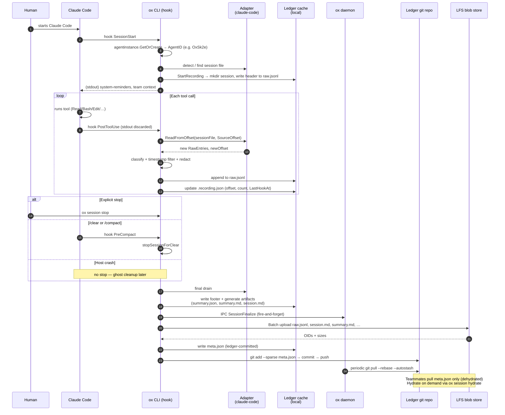

# Session Capture — Conceptual Model

> Audience: a principal engineer with systems/DB/compiler background, new to LLM agent
> tooling. This document builds the mental model. It defines the *nouns* of the system,
> the constraints on them, and how features interact. It does not explain how the code
> is organized — that's [session-capture-architecture.md](session-capture-architecture.md).

---

## 1. What problem is being solved?

An **AI coworker** (e.g. Claude Code, Cursor, Codex, Aider) drives a terminal session: it
reads files, runs tools, and iterates with a human. That process produces a rich,
short-lived artifact — the *conversation* — which today is trapped inside the agent's
local memory and then discarded when context resets. Teammates cannot see it; the same
agent rediscovers the same context tomorrow from scratch.

ox's session capture subsystem treats each of these conversations as a first-class,
**durable, queryable, shareable, LFS-backed object** — like a git commit for
agent-human collaboration. A session is captured incrementally while it is happening,
finalized into derived artifacts on close, and published via a per-project sidecar git
repository (the *ledger*) so every teammate and every future agent can read it.

The design is dominated by one invariant: **the AI agent is the source of truth we are
recording, not a system we control.** ox is an observer. It cannot modify Claude Code's
data model, and must tolerate the agent crashing, being killed, entering `/clear`, or
silently rotating its internal session file.

---

## 2. Core nouns

Twelve concepts cover the entire surface. Everything in the codebase is expressible in
terms of these.

| Concept | One-line definition |
|---|---|
| **Coworker** | Any participant, human or AI, on a team. |
| **Agent host** | The coding-agent process we observe (Claude Code, Codex, …). |
| **Agent instance** | One lifetime of one agent host on one machine for one human. Identified by an **Agent ID** (`Ox` + 4 chars, e.g. `OxSk2e`). |
| **Session** | A recording of one coherent span of agent-host work, from prime through stop/clear. Named `YYYY-MM-DDTHH-MM-<user>-<agentID>`. |
| **Adapter** | A pluggable module that knows a specific agent host's session file format and lifecycle hooks. One adapter per agent type. |
| **Recording state** | In-progress per-session bookkeeping (`.recording.json`) that tracks where we are in the agent's source JSONL and whether the host is alive. |
| **Raw JSONL** | The complete, unfiltered conversation stream (`raw.jsonl`) — header + entries + footer. The source of truth for all derived artifacts. |
| **Artifacts** | Derived, human-readable outputs generated from raw JSONL: `summary.json`, `summary.md`, `session.md`, `plan.md`, `context-trace.jsonl`. |
| **Ledger** | A per-repo sidecar git repository that stores sessions, team context, memory, and cache. Cloud-provisioned; never created locally. |
| **LFS manifest** (`meta.json`) | A small, git-tracked JSON file listing the OIDs + sizes of large session content stored out-of-band. Replaces git-lfs pointer files. |
| **Hydration** | The act of fetching the out-of-band LFS content for a session on demand. A session is *hydrated* when its blobs are locally cached, *dehydrated* when only `meta.json` is present. |
| **Context trace** | A parallel JSONL log of *which* team-context snippets were provided to the agent and *which* the agent said influenced a decision. Audit trail for SageOx attribution. |

### Orthogonal axes

These concepts are deliberately orthogonal; most features live at their intersection:

- **Agent type ⊥ session lifecycle.** The adapter layer absorbs per-host quirks so the
  recording, artifact, and ledger layers are agent-agnostic.
- **Capture ⊥ finalization ⊥ distribution.** Capture produces `raw.jsonl`. Finalization
  produces artifacts. Distribution uploads to LFS + commits `meta.json`. Each phase can
  fail, retry, and be re-run independently. Losing the last phase never loses raw data.
- **Local content ⊥ git-tracked metadata.** Content files (`raw.jsonl`, `session.md`,
  …) live only in local cache + LFS blob store. Only `meta.json` is committed. This is
  what makes sessions both durable-for-the-team and cheap-to-sync.
- **Session-level isolation ⊥ multi-agent concurrency.** Each agent instance has its
  own `.recording.json` in its own session folder. Two Claude Code processes in the
  same repo do not collide; their recordings are keyed by Agent ID.

---

## 3. The session lifecycle

A session passes through well-defined phases. Each transition is observable on disk.

```
  ┌─────────┐   prime   ┌────────┐  hook(afterTool)  ┌──────────┐
  │ absent  │──────────▶│ primed │──────────────────▶│ recording│
  └─────────┘           └────────┘                   └──────────┘
                                                           │
                  ┌────────────────────────────────────────┤
                  │          │              │              │
               stop        /clear         crash         abort
                  │          │              │              │
                  ▼          ▼              ▼              ▼
            ┌──────────┐ ┌─────────┐  ┌─────────┐   ┌──────────┐
            │ stopped  │ │stopped  │  │ ghost   │   │ discarded│
            │(explicit)│ │(compact)│  │(stale)  │   │          │
            └────┬─────┘ └────┬────┘  └────┬────┘   └──────────┘
                 │            │            │
                 └────────────┴────────────┘
                              │
                              ▼
                       ┌──────────────┐
                       │  finalized   │  (artifacts generated)
                       └──────┬───────┘
                              │ commit meta.json + LFS upload
                              ▼
                       ┌──────────────┐
                       │  published   │  (visible team-wide)
                       └──────────────┘
```

### Why four terminal transitions?

- **stop (explicit):** the user ran `/ox-session-stop`. The agent host is still alive.
- **stop (compact):** the agent host entered `/clear` or `/compact`. The host *reuses*
  the process but discards its context; we must finalize and let the next prime begin a
  fresh session.
- **ghost:** the agent host died without stopping — common for SIGINT, terminal close,
  or crashes. Detected later by a parent-PID liveness check, guarded by a 10-minute
  grace period to avoid racing with still-starting agents.
- **abort:** the user explicitly discards the session (corrupted, sensitive, …).

All non-abort terminals converge on the same *finalized* and *published* steps, because
what makes a session valuable — derived artifacts and team visibility — is independent
of how it ended.

---

## 4. Capture model: incremental, observer-driven

The single most important design decision in session capture is **how raw JSONL gets
populated**. The choices in the design space:

| Approach | Rejected / accepted | Why |
|---|---|---|
| Proxy the agent host's stdio | Rejected | Requires wrapping the process; fragile; doesn't work for sub-agents. |
| Poll the agent's session file on a timer | Rejected | Latency/waste tradeoff; misses crashes. |
| Ask the agent to push via API | Rejected | No such API across agents. |
| **Hook-driven incremental tail** | **Accepted** | Works with any agent that exposes lifecycle hooks; zero dependency at runtime on ox being reachable. |

ox registers as a *hook handler* on the agent host (e.g. Claude Code calls
`ox agent hook <event>` at `SessionStart`, `UserPromptSubmit`, `PostToolUse`,
`PreCompact`, `Stop`). On each invocation — primarily `PostToolUse` — ox:

1. Loads `.recording.json` for this Agent ID.
2. Opens the agent's native session file (e.g. Claude Code's `~/.claude/.../*.jsonl`).
3. Reads from the last recorded byte offset (`SourceOffset`) to EOF.
4. Applies entry classification, timestamp filtering, and secret redaction.
5. Appends the redacted entries to `raw.jsonl`.
6. Persists the new offset, entry count, hook status.

This yields three important properties:

- **Tailing is stateless across hook invocations.** If a hook invocation fails
  (adapter missing, session file not found, permission error), only that invocation is
  lost; the next hook picks up from the saved offset.
- **Hook arrival is itself the heartbeat.** `LastHookAt` is updated on every hook, so
  `ox session status` can distinguish "recording idle" from "recording broken."
- **Secrets never hit disk unredacted.** Redaction runs *before* append, not on
  finalize. The `manifest.go` pattern set is signed (Ed25519) so a tampered rule file
  cannot silently exfiltrate.

### What is in raw.jsonl

```
line 1:    {"type":"header","metadata":{agent_id, agent_type, model, user, repo_id,…}}
lines 2-N: {"type":"user|assistant|system|tool","content":…,"timestamp":…,"seq":N,"eid":…}
last:      {"type":"footer","closed_at":…,"entry_count":N}
```

The `eid` (entry ID, 5-char) is a stable key for cross-referencing from derived
artifacts — if `summary.md` quotes a decision, it can point at a specific `eid` that
still resolves after re-summarization.

---

## 5. Finalization and artifact derivation

When a session terminates (any non-abort path), it is *finalized*:

1. One final drain from the agent's source JSONL (capture-complete guarantee).
2. Write footer line to `raw.jsonl`.
3. Generate `summary.json` (LLM-backed if connected, stats-only locally otherwise).
4. Generate `summary.md` (structured markdown: title, executive summary, key actions,
   Mermaid diagrams, final plan, file modifications, topics).
5. Generate `session.md` (full transcript with collapsible tool-output blocks).
6. Optionally extract `plan.md` (markdown-aware priority ladder: `is_plan:true` →
   `## Final Plan` → `## Implementation Plan` → last assistant message).
7. Optionally emit `context-trace.jsonl` (what context was provided/influenced).

Artifacts are *always re-derivable from raw*. `ox session regenerate` and
`ox session resummary` exploit this — the raw file is immutable, artifacts are not.

---

## 6. Distribution model: LFS without git-lfs

Sessions are distributed through the project's **ledger** — a sidecar git repository,
not the user's source repo. The ledger avoids two bad outcomes: polluting the source
repo with many binary-heavy files, and coupling session rights to source-repo rights.

A session ships in two pieces:

- **Small piece (`meta.json`, ~1 KB):** committed into the ledger git tree. Contains
  session metadata and a `files: {name -> {oid, size}}` map. This is what teammates
  receive on `git pull`.
- **Large pieces (`raw.jsonl`, `session.md`, `summary.md`, …):** uploaded to the git
  host's LFS blob store via the pure-Go LFS Batch client (`internal/lfs/client.go`). The
  content files are `.gitignore`d in the ledger working tree — they never get tracked.

**ox never shells out to `git-lfs`** and never writes `.gitattributes` with
`filter=lfs`. The consequence is that dehydrated sessions stay dehydrated: a
`git checkout` in the ledger doesn't trigger a smudge filter, so teammates don't
accidentally download 500 MB of session bodies just by pulling. Hydration is explicit
(`ox session hydrate` or the viewer on sageox.ai).

### Why this split matters for the mental model

- Dehydrated sessions are *index entries.* `ox session list` works on any machine with
  the ledger pulled, even if no content was downloaded.
- `meta.json` is the **commit-level** object. The LFS blobs are *referenced* but not
  *required to be present* for the ledger to be consistent.
- A session cannot be "partially committed." The CLI does
  upload-to-LFS → commit `meta.json` → push. If LFS upload fails, no commit; if push
  fails, commit stays local, retried next upload. There is no state where meta is
  committed but content OIDs don't resolve.

---

## 7. Identity, attribution, and redaction

Two orthogonal concerns that coexist in every published session.

**Identity** resolves "who is this human?" via a priority chain:

1. SageOx OAuth (verified).
2. Git host identity (GitHub/GitLab/Bitbucket/AWS/GCP), but only for the provider
   actually matching the repo's remote.
3. Git config `user.name` / `user.email` (unverified, declarative).

The highest-priority identity becomes `username` in the JSONL header and attribution
display. Critically, **session start is not OAuth-gated** — a session can always record
locally, and is published under whatever identity is available at finalization. This is
the "capture first, authenticate later" invariant.

**Redaction** is defensive: the input stream is untrusted.

- A built-in regex manifest covers AWS/GCP/Azure keys, JWTs, API tokens, DB strings,
  private keys, `key=value` heuristics.
- Team and repo can add `REDACT.md` rules (literal or regex) that apply on top.
- The manifest JSON is Ed25519-signed. A session header records the manifest hash; a
  viewer can refuse to display sessions whose manifest hash isn't trusted.
- Redaction runs *before* `raw.jsonl` append. Secrets cannot appear in `raw.jsonl`
  even if capture crashes mid-stream.

---

## 8. Concurrency and isolation

Multiple Claude Code processes may run at once — same repo, different worktrees,
nested sub-agents, parallel terminals. The invariants:

- **Session identity = Agent ID.** Each agent instance has its own 4-char suffix; two
  hosts will not generate the same one (62⁴ ≈ 14.7M, capped at 500 live instances per
  user).
- **Recording state is per-session.** `.recording.json` lives *inside* the session
  folder, not in a shared registry. No locking needed; each writer is the only writer.
- **Ledger writes are per-session paths.** Session folder names include timestamp +
  user + agent ID, so path collisions are astronomically unlikely; the CLI does a
  simple retry-on-push if it happens.
- **Daemon owns reads, CLI owns writes** (see
  [.claude/rules/daemon-git.md](../../.claude/rules/daemon-git.md)). The daemon
  pulls the ledger on a timer; the CLI does `git add --sparse / commit / push` at
  finalization. This removes the need for the CLI to coordinate with the daemon on
  push, which is a common source of deadlocks in daemon-based designs.

### Parent/child sessions

Sub-agents (e.g. Claude Code's Agent tool launching a sub-task) produce their own
sessions with `origin="subagent"` and `ParentSessionPath` / `ParentAgentID` set. The
parent's aggregation pulls them in at finalization. Each child is independently
recoverable.

### Ghost sessions and grace

A "ghost" is a session whose parent PID is dead. Ghost cleanup:

- Skips any recording younger than `GhostGracePeriod` (10 min) to avoid killing an
  agent whose PID tree is still being set up.
- Resolves symlinks before comparing paths (macOS `/tmp` → `/private/tmp` trap).
- Removes only the recording state, not the raw content — the raw file can still be
  finalized manually via `ox session recover <name>`.

---

## 9. End-to-end sequence diagram



### Why the diagram matters

- **Steps 1–5** establish identity and the recording floor; everything downstream keys
  off `AgentID` and `SessionPath`.
- **Steps 6–10** are the hot loop, running synchronously with each tool. Latency here
  directly hits the user, so the work is scoped to tailing a file + redacting +
  appending.
- **Steps 14–17** are finalize-time and can tolerate latency. If the CLI dies here, the
  raw file still exists locally; `ox doctor` detects unfinalized sessions and offers
  repair.
- **Steps 18–21** are the distribution phase. They are intentionally the only writer;
  the daemon (step 22) reads only. This avoids ambiguity on who owns commit state.

---

## 10. Constraints and interactions you can derive from the model

1. **Session data outlives process crashes.** Because raw.jsonl is appended
   incrementally and .recording.json is persisted on every hook, a crash loses only
   the entries written between the last hook and the crash.

2. **Re-priming the same host resumes, not restarts.** An ephemeral
   `SessionMarker` in `/tmp/<user>/sageox/sessions/` keyed by the agent's *native*
   session ID lets `ox agent prime` be idempotent within one host lifetime. A new
   host (new PID) gets a new Agent ID.

3. **`/clear` is a session boundary, not a noop.** The old session is finalized and
   published; a new Agent ID is minted. This is why session history isn't a single
   infinite conversation — it's a sequence of coherent capture spans.

4. **Capture-prior (import) is the same pipeline, different entry point.** A planning
   discussion before ox was primed can be shipped as a synthetic session via
   `ox agent <id> session capture-prior`. Once the JSONL is written, it's an ordinary
   session that finalizes and publishes like any other.

5. **Redaction is before-persistence, not before-upload.** Therefore re-deriving
   artifacts from a leaked raw file cannot unredact it, and the same raw file can be
   republished safely.

6. **Hydration status is monotone.** A session moves from dehydrated → partial →
   hydrated as blobs download; it never silently rehydrates. Dehydrating back
   (cache eviction) is a separate, explicit operation.

7. **A session is owned by the ledger, not the source repo.** Rotating a source repo
   (fork, migrate to new host) does not require moving sessions. They travel with
   the ledger, which is keyed by `repo_id`.

8. **Distillation is downstream of session publication.** `ox distill` reads
   `summary.json` files across the ledger and derives team memory facts. Distillation
   failures cannot affect capture — the pipeline is DAG-shaped, not cyclic.

9. **Context trace and session raw are peers, not nested.** `context-trace.jsonl`
   lives in the same folder as `raw.jsonl`. A trace event references an `eid` from
   raw; raw does not reference trace.

10. **Adapters are binaries, not libraries.** `ox-adapter-claude-code` and friends are
    external processes. The consequence is that installing support for a new agent
    host does not require rebuilding ox, and a buggy adapter cannot corrupt the ox
    process.

---

## 11. What to read next

- [session-capture-architecture.md](session-capture-architecture.md) — system
  architecture: the components that implement this model, the interfaces between
  them, and the design decisions that shape them.
- [session-capture-components.md](session-capture-components.md) — component-level
  walkthroughs for deeper dives (recording, adapters, pipeline, LFS, ledger).
- [session-raw-jsonl.md](../specs/session-raw-jsonl.md) — canonical spec for the raw
  file format.
- [adr-session-lfs-storage.md](../adr/adr-session-lfs-storage.md) — ADR for the
  pure-Go LFS-without-git-lfs distribution model.
- [adr-ledger-architecture.md](../adr/adr-ledger-architecture.md) — ADR for the
  daemon-CLI split on ledger git operations.
