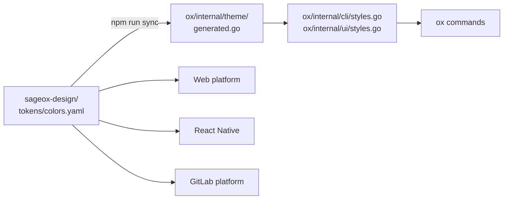

# Theming

ox's palette, themes, and light/dark behavior are owned by the [`sageox-design`](https://github.com/sageox/sageox-design) system. ox is a downstream consumer.

## Flow



The same `tokens/colors.yaml` feeds every SageOx platform. That's why ox cannot change a color unilaterally: a CLI palette tweak would drift from web, mobile, and the studio.

## Where palette decisions happen

| Question | Where |
|----------|-------|
| Adding a new brand color | `sageox-design/tokens/colors.yaml` |
| Adjusting light-mode vs dark-mode contrast | `sageox-design/tokens/themes.yaml` |
| Defining a new semantic token (e.g., "danger-strong") | `sageox-design/tokens/themes.yaml` |
| Mapping a token to terminal output | `sageox-design/platforms/cli/theme.toml` |
| Regenerating ox's Go bindings | `cd ../sageox-design && npm run sync` |

Local working copy: `/Users/ryan/conductor/workspaces/sageox-design/bogota-v2/`.

## Light vs dark detection

ox ships **one palette in two variants** and picks the right one at runtime — no config flag, no theme file, no restart. Detection runs in this order:

1. **OSC 11 query.** At first render lipgloss writes the escape sequence `\x1b]11;?\x07` to stdout. Modern terminals (iTerm2, Alacritty, Kitty, Wezterm, Windows Terminal, recent VS Code) answer back with their actual background color. lipgloss computes luminance and picks dark or light.
2. **`COLORFGBG` fallback.** Older or rxvt-derived emulators export this env var instead of answering OSC 11. lipgloss reads it.
3. **Default dark.** If nothing answers (CI, piped output, exotic terminal), ox assumes a dark background — the most common case among coworkers.
4. **`NO_COLOR=1`** short-circuits everything: no ANSI emitted, terminal default colors only.

Mechanism in code:

```go
// internal/theme/generated.go (synced from sageox-design)
ColorPrimary = compat.AdaptiveColor{
    Light: lipgloss.Color("#4F6A48"),
    Dark:  lipgloss.Color("#7A8F78"),
}
```

When the user toggles their terminal between light and dark, the next ox invocation renders with the matching variant. The published catalog page at [sageox-design.netlify.app/catalog/cli/](https://sageox-design.netlify.app/catalog/cli/) shows both variants per token, with the active variant outlined according to the page's Mode toggle.

## NO_COLOR

[`NO_COLOR=1`](https://no-color.org/) strips all ANSI escapes. lipgloss handles this natively — no per-component code is needed. Test new components with `NO_COLOR=1 ox dev catalog`.

## Forbidden patterns

- Hand-editing `internal/theme/generated.go` (overwritten by sync).
- `lipgloss.Color("#…")` literals in `cmd/ox/**` (use semantic styles instead).
- ANSI escape sequences in command implementations (`\033[…`, `\x1b[…`).
- New tokens added directly to `internal/dashboard/theme/tokens.go` without an upstream `sageox-design` PR.

See [.claude/rules/design.md](../../.claude/rules/design.md) for the full rule set and enforcement.

## Published catalog

The browser-rendered catalog at [sageox-design.netlify.app/2026-05-17-ox-cli-component-catalog/](https://sageox-design.netlify.app/2026-05-17-ox-cli-component-catalog/) reads the same hex tokens via CSS custom properties, so the page's Mode toggle (light/dark) updates the embedded asciinema-player themes live, without reloading recordings.
