# ox Adapter System: Architecture Diagrams

## 1. Current Architecture (Built-in Adapters)

Everything compiled into one binary. Adding a new agent requires modifying ox source.

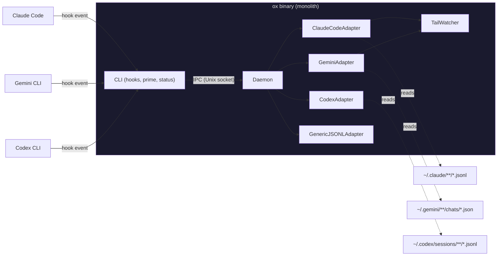

---

## 2. Proposed Architecture (External Adapters)

Agent-specific logic moves into separate binaries. ox core only knows the protocol.

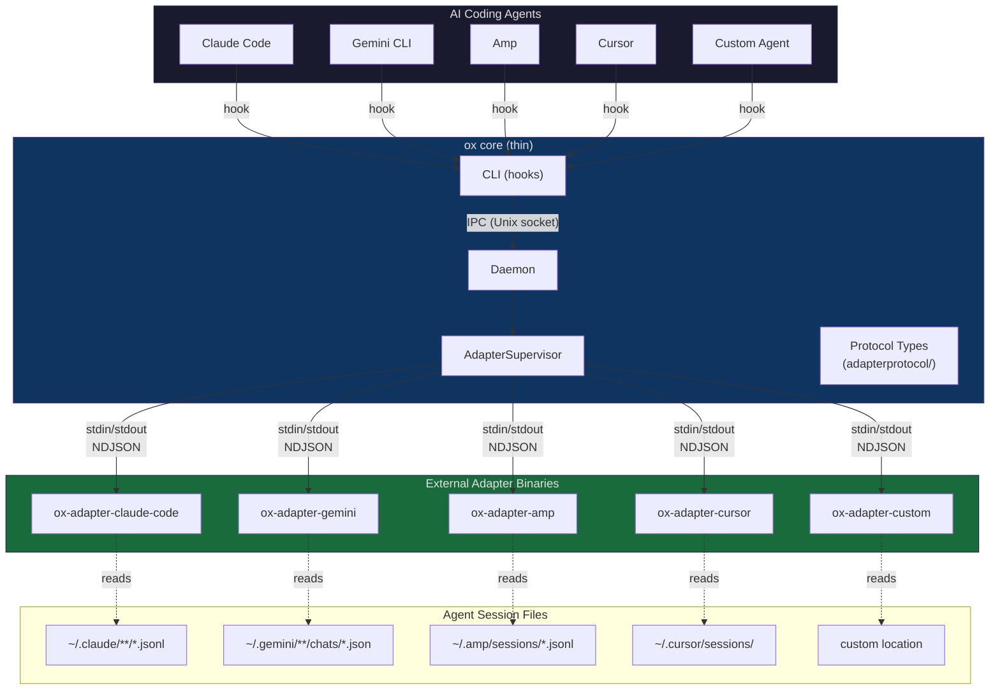

---

## 3. IPC Data Flow: Hook-Driven Recording

Shows the full path from agent tool call to recorded session entry.

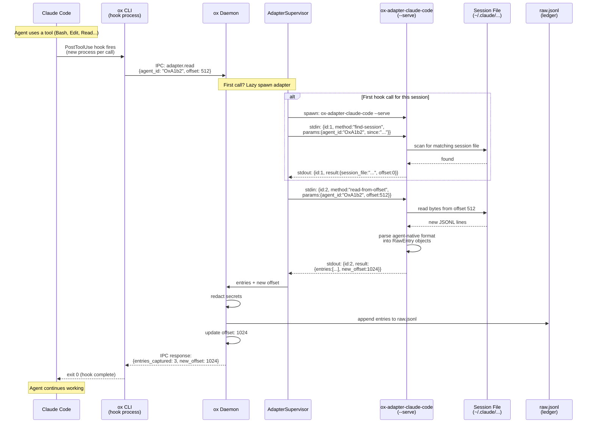

---

## 4. Adapter Process Lifecycle

How the daemon manages adapter processes across a session.

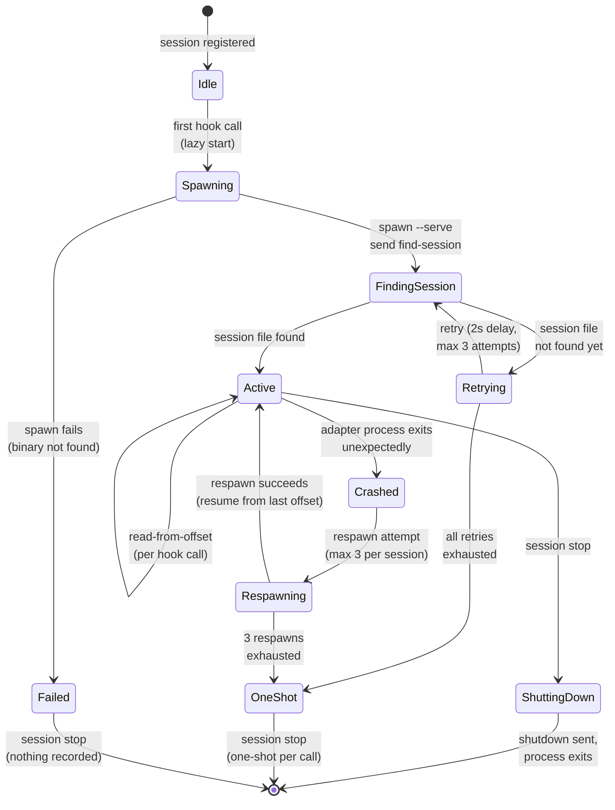

---

## 5. Fallback Behavior: Daemon Available vs Unavailable

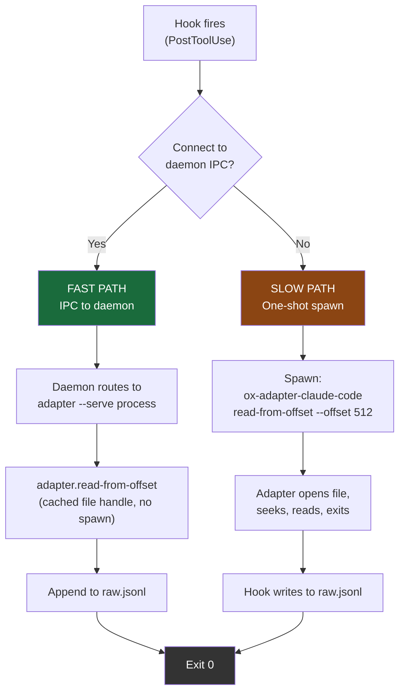

---

## 6. Adapter Discovery and Registration

How the daemon finds and registers adapters at startup.

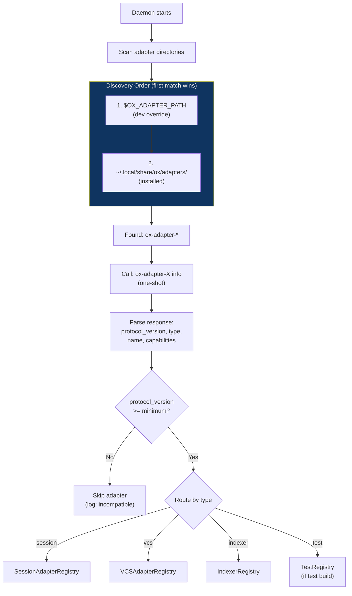

---

## 7. Adapter Types and Capabilities

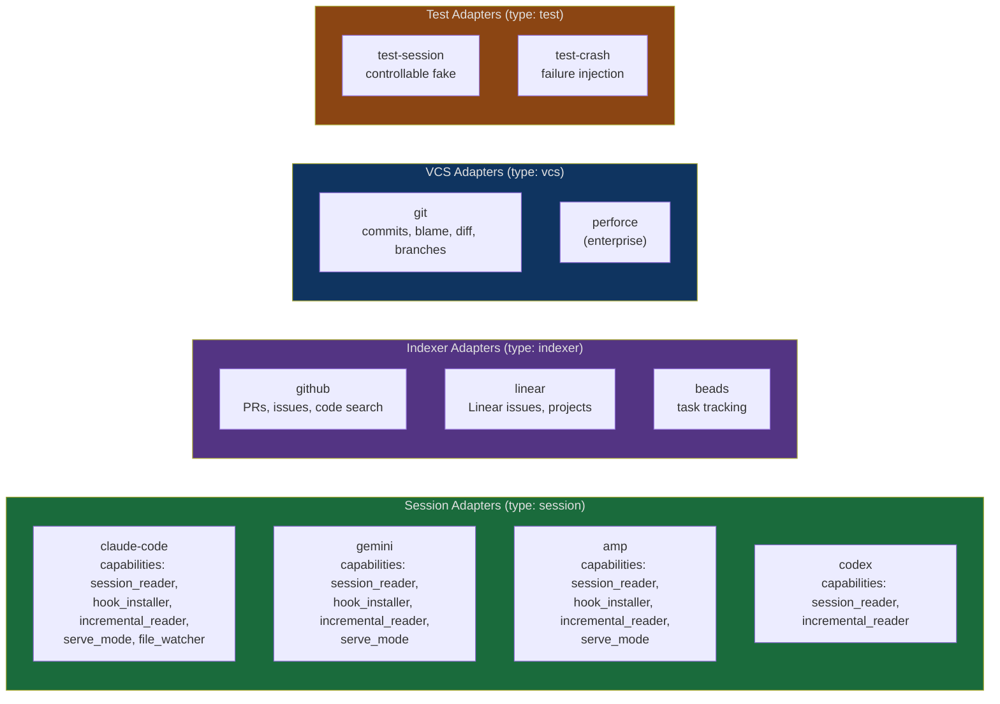

---

## 8. Protocol: One-Shot vs Serve Mode

```mermaid
graph TB
    subgraph oneshot["One-Shot Mode (spawn per call)"]
        direction LR
        O1["ox/daemon"] -->|"exec: ox-adapter-X detect"| O2["Adapter Process"]
        O2 -->|"stdout: JSON + exit"| O1
        O3["Used for: info, detect,<br/>install-hooks, check-hooks,<br/>read, read-metadata"]
    end

    subgraph serve["Serve Mode (long-lived)"]
        direction LR
        S1["ox daemon"] -->|"exec: ox-adapter-X --serve"| S2["Adapter Process<br/>(stays alive)"]
        S1 -->|"stdin: NDJSON requests"| S2
        S2 -->|"stdout: NDJSON responses"| S1
        S2 -->|"stdout: NDJSON events<br/>(push)"| S1
        S3["Used for: find-session,<br/>read-from-offset,<br/>end-session, shutdown"]
    end

    subgraph wire["Wire Format (serve mode)"]
        direction TB
        W1["Request: {id:1, method:'find-session', params:{...}}"]
        W2["Response: {id:1, result:{session_file:'...', offset:0}}"]
        W3["Event: {event:'entries', agent_id:'OxA1', data:{entries:[...], new_offset:2048}}"]
        W4["Error: {id:2, error:{code:'method_not_found', message:'...'}}"]
    end

    style oneshot fill:#1a1a2e,color:#e0e0e0
    style serve fill:#0f3460,color:#e0e0e0
    style wire fill:#333,color:#e0e0e0
```

---

## 9. Installation and Distribution

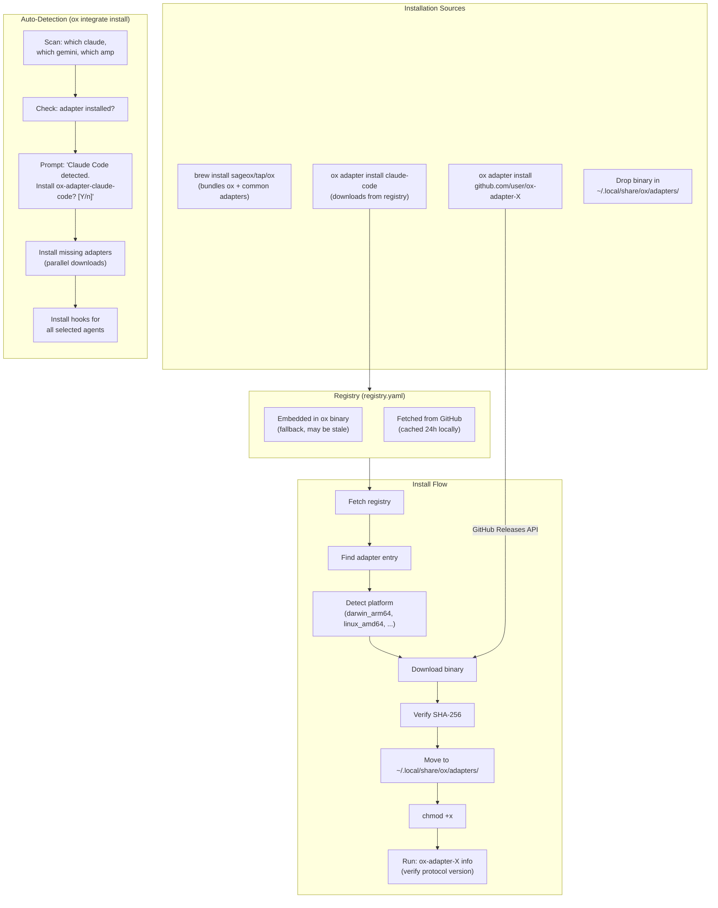

---

## 10. Migration Path (Phases 0-4)

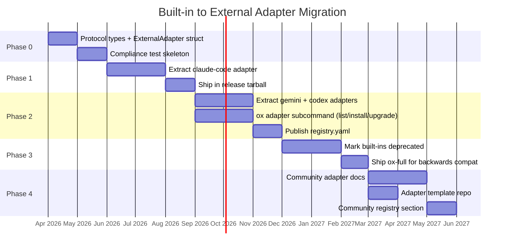

---

## 11. Daemon Supervisor: Multi-Agent Concurrent Sessions

Shows how one adapter process per type handles multiple concurrent sessions. Two Claude Code
sessions share a single `ox-adapter-claude-code --serve` process; an Amp session gets its own
`ox-adapter-amp --serve` process. Sessions are multiplexed by `agent_id`.

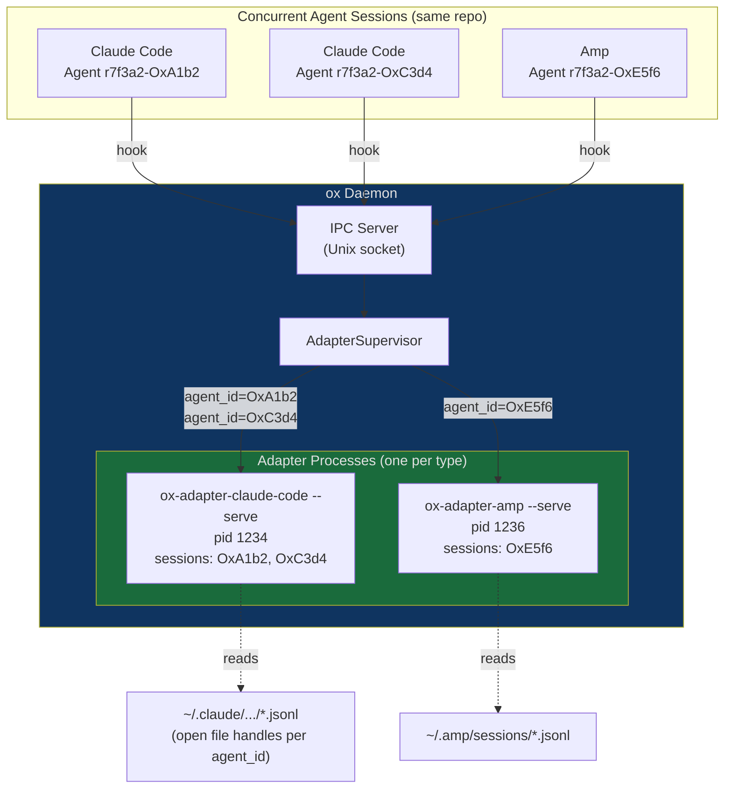

---

## 12. Failure Recovery: Adapter Crash Mid-Session

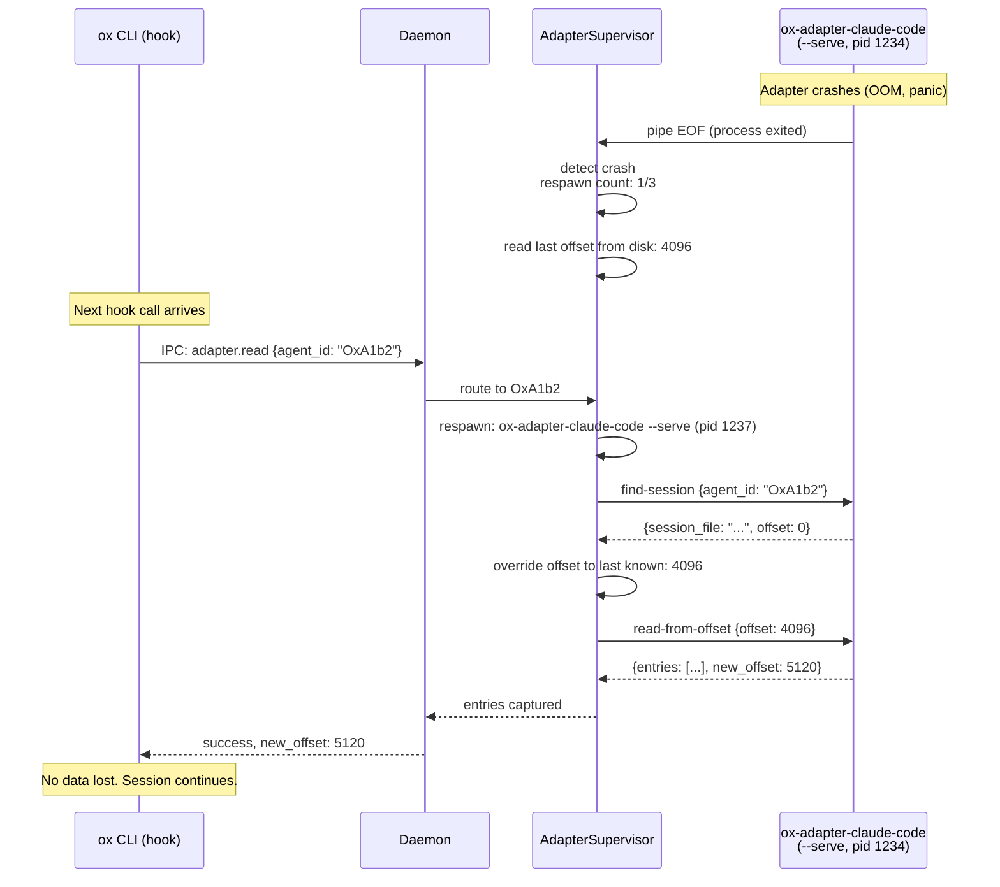
