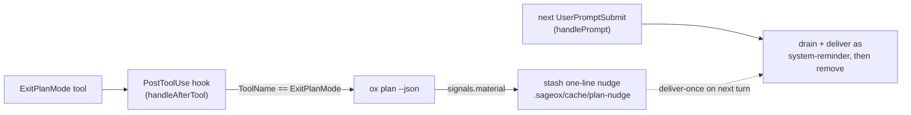
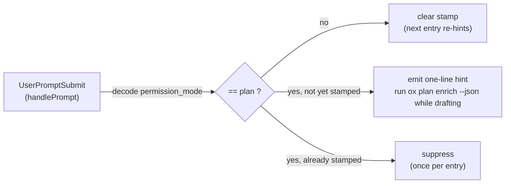

# Agent Support Matrix

Support tiers for each AI coding agent integrated with ox.

## Tier Definitions

| Tier | Requirements | Description |
|------|-------------|-------------|
| **Bronze** | Session recordings + Whispers | Table stakes: agent sessions are captured and team context is injected |
| **Silver** | Bronze + Hooks + Daemon sub-agent | Lifecycle hooks fire on agent events; daemon can use agent as worker for background tasks (session finalization) |
| **Gold** | Silver + Full Claude Code parity | Complete feature parity including real-time TailWatcher, anti-entropy, multi-turn incremental recording |

## Context Injection (Universal)

**AGENTS.md injection is agent-agnostic.** `ox init` and `EnsureOxPrimeMarker()` inject `<!-- ox:prime -->` markers into AGENTS.md (primary) or CLAUDE.md (fallback) at the project root. This works for ALL agents that read these files — OpenCode reads AGENTS.md natively with CLAUDE.md fallback, Amp reads AGENTS.md, and most other agents support at least one of these files.

Agent-specific hooks (`ox integrate install --<agent>`) are *additive* — they set up native lifecycle events that trigger `ox agent prime` automatically, but the AGENTS.md marker ensures context injection works even without hooks installed.

## Support Matrix

| Capability | Claude Code | Gemini CLI | Codex CLI | Amp CLI | OpenCode |
|-----------|:-----------:|:----------:|:---------:|:-------:|:--------:|
| **Bronze: Session Recording** | | | | | |
| Session adapter | Full (JSONL TailWatcher) | Full (monolithic JSON) | Full (JSONL TailWatcher) | Partial (generic) | None (SQLite storage) |
| `ox session start/stop` | Yes | Yes | Yes | Yes | Yes |
| Real-time tail (daemon) | Yes (fsnotify) | Yes (fsnotify, full re-read) | Yes (fsnotify) | No (cloud-first) | No (needs SQLite adapter) |
| Offset persistence / catch-up | Yes (byte offset) | Yes (entry count) | Yes (byte offset) | N/A | N/A |
| **Bronze: Whispers** | | | | | |
| Push whispers (stdout injection) | Yes (UserPromptSubmit) | Yes (BeforeAgent) | No | No | Possible (tui.prompt.append) |
| Pull whispers (`ox agent whisper`) | Yes | Yes | Yes | Yes | Yes |
| AGENTS.md / CLAUDE.md marker | Yes (universal) | Yes (universal) | Yes (universal) | Yes (universal + Amp-specific block) | Yes (universal; OpenCode reads AGENTS.md natively) |
| **Silver: Hooks** | | | | | |
| Native hook/plugin events | 6 (SessionStart, PreCompact, PostToolUse, Stop, SessionEnd, UserPromptSubmit) | 4 (SessionStart, BeforeAgent, AfterTool, SessionEnd) | 2 (SessionStart, SessionEnd) | 2 (tool:pre-execute, tool:post-execute — experimental) | 27+ (session.*, message.*, tool.*, file.*, command.*, permission.*, lsp.*, server.*, tui.*, shell.*, todo.*) |
| ox-used hook events | 6 | 4 | 2 | 0 (AGENTS.md marker only) | 1 (session.created) |
| Phase mapping (agentx) | Full (in agentx) | Local fallback (pending agentx) | Full (in agentx) | N/A | N/A |
| Startup banner (JSON stdout) | Yes | Yes | No | No | No |
| Hook install/uninstall | `ox integrate install` | `ox integrate install --gemini` | `ox integrate install --codex` | `ox integrate install --amp` |
| `ox doctor` detection + auto-fix | Yes | Yes | Yes | Yes | Yes |
| **Silver: Daemon Sub-Agent** | | | | | |
| Runner implementation | ClaudeRunner | GeminiRunner | CodexRunner | None | None |
| Headless CLI mode | `claude -p --output-format json` | `gemini -p` | `codex -p` | No confirmed mode | `opencode run --format json` |
| Auto-detection priority | 1st | 3rd | 2nd | N/A | N/A |
| Auth check (`CheckAgentUsability`) | ANTHROPIC_API_KEY or OAuth | GEMINI_API_KEY or GOOGLE_API_KEY | OPENAI_API_KEY or `codex login` | N/A | N/A |
| Session finalization | Yes | Yes | Yes | No | No |
| `agent_worker.agent` config value | `"claude"` | `"gemini"` | `"codex"` | N/A | N/A |
| **Gold: Full Parity** | | | | | |
| Anti-entropy (daemon recovery) | Yes | Partial (adapter exists, untested E2E) | Yes | No | No |
| Multi-turn incremental recording | Yes (JSONL append) | Yes (full re-read delta) | Yes (JSONL append) | No | No |
| E2E integration tests | Yes (real Claude) | No (needs GEMINI_API_KEY CI) | No (needs OPENAI_API_KEY CI) | No | No |
| **Session pause/resume** (ADR-020) | | | | | |
| `ox session pause/resume` commands | Yes | Yes | Yes | Yes | Yes |
| Per-prompt suspended nudge | Yes (UserPromptSubmit) | Yes (BeforeAgent equivalent) | Limited (no push channel) | Limited | Possible (tui.prompt.append) |
| `/clear` boundary + pause inheritance | Yes | N/A (different lifecycle) | N/A (different lifecycle) | N/A | N/A |
| Upload mask honoring lifecycle | Yes (adapter-agnostic) | Yes | Yes | Yes (lifecycle-only; cloud-side data not gated) | Yes |
| **Plan enrichment** (`ox plan`) | | | | | |
| `ox plan --json` baseline (0-token, no network) | Yes (any agent can run it) | Yes | Yes | Yes | Yes |
| Real-time in-plan-mode hint (during drafting) | Yes (UserPromptSubmit `permission_mode == plan`) | Guidance-only | Guidance-only | Guidance-only | Guidance-only |
| Real-time plan-exit nudge (on presentation) | Yes (PostToolUse on ExitPlanMode → UserPromptSubmit) | Guidance-only | Guidance-only | Guidance-only | Guidance-only |
| Tiered prime guidance for `ox plan` | Gold block + IntentCommand | Silver block + IntentCommand | Silver block + IntentCommand | Bronze note | Bronze note |

## Plan Enrichment (`ox plan`)

`ox plan` enriches an agent-generated implementation plan with deterministic
SageOx signals (collision / prior-art / expert-route). `ox plan --json` is the
plumbing path: 0 tokens, no LLM, no network — it computes badges locally. There
are three graduated levels of exposure:

| Level | Who | Mechanism |
|-------|-----|-----------|
| **Baseline (all agents)** | Every agent | `ox plan --json` is a plain CLI command. Any agent that can run a shell command can invoke it. Nothing to install. |
| **Guidance fallback (Silver/Bronze)** | codex, gemini (Silver); amp, opencode, pi (Bronze) | No real-time hook. The tiered prime guidance (`internal/prime`, agent-tier-aware) tells the agent that `ox plan` exists. Silver gets the full advisory block + IntentCommand; Bronze gets the lighter note. The agent decides when to run it. |
| **Real nudge (Gold — Claude Code only)** | claude-code | A PostToolUse hook fires after the `ExitPlanMode` tool. ox enriches the approved plan via `ox plan --json`; if `signals.material` is true, it stashes a one-line nudge that the next `UserPromptSubmit` delivers into model context. |

### Why the Gold nudge uses PostToolUse → UserPromptSubmit (not PostToolUse stdout)

Claude Code's closest plan-exit signal is the **PostToolUse** event firing after
`ExitPlanMode`. But Claude Code **discards PostToolUse stdout** (empirically
confirmed — see the channel table in `cmd/ox/agent_hook.go`), so a nudge emitted
directly from the PostToolUse handler never reaches the model.

The wiring therefore splits across two events:

1. **Detect (PostToolUse):** `handleAfterTool` already runs on every tool. A
   narrow branch — strictly gated on `ToolName == "ExitPlanMode"` — runs
   `ox plan --json` against the approved plan text and, if material, writes a
   single one-line nudge to `.sageox/cache/plan-nudge/<agentID>.txt`. Every
   other tool is untouched, so this is **not** a noisy always-on hook; it reuses
   the PostToolUse hook that `ox init` / `ox doctor` already manage.
2. **Deliver (UserPromptSubmit):** `handlePrompt` — the only Claude Code channel
   whose stdout is injected into model context — drains the pending nudge as a
   `<system-reminder>` on the user's next turn (which is exactly when execution
   begins after plan approval), then removes the file (deliver-once).

The nudge is fail-open and stale-bounded (30 min): any error or a never-followed
plan exit leaves existing hook behavior completely untouched.

### The in-plan-mode hint (Gold — fires *during* drafting, not at exit)

The plan-exit nudge above fires *after* the plan is presented. It is paired with
a second Gold-only hint that fires *while the agent is still drafting*, so the
deterministic `ox plan enrich --json` team context is folded into the plan
**before** it reaches the human — the JSON enrich is the whole point of the
planning cycle, not an after-the-fact decoration.

The signal is Claude Code's **`permission_mode`** field on the `UserPromptSubmit`
payload (value `"plan"` while in plan mode). `UserPromptSubmit` is already the
only stdout-injection channel, so `handlePrompt` decodes the mode straight off
`HookInput.RawBytes` and, on plan-mode entry, emits a one-line steer toward the
two-beat flow (`ox plan enrich --json` while drafting → render a **SageOx
team-context-optimized plan** with `ox plan render --open` when presenting).

- **Field name:** decoded under both spellings — snake_case `permission_mode`
  (hook stdin) and camelCase `permissionMode` (transcript) — so it is robust to
  Claude Code's surface differences.
- **Throttle:** exactly once per plan-mode entry. A per-agent stamp
  (`.sageox/cache/plan-mode-hint/<agentID>.txt`) suppresses repeat prompts within
  the same entry and is cleared the moment a non-plan prompt arrives, so
  re-entering plan mode re-hints.
- **Gold-only by construction:** only Claude Code reports a permission mode, so
  for every other agent the decode returns `""` and the hint is a clean no-op —
  no per-agent install, no new adapter capability.

### Silver / Bronze degradation

Silver (codex, gemini) and Bronze (amp, opencode, pi) get **no real-time hook**
— they rely on the already-shipped tiered prime guidance plus the baseline
`ox plan --json` command. Nothing in the plan-exit wiring breaks them: the
PostToolUse branch is gated on `ToolName == "ExitPlanMode"` (a Claude-Code tool
name), so for other agents it is simply never taken. No per-agent install is
required for plan enrichment beyond what each tier already has.

### No new adapter capability

The Gold nudge rides entirely on the existing `PostToolUse` lifecycle hook
(already in `claudeLifecycleEvents`) and the `ox agent hook PostToolUse` routing.
It is managed by the same `ox init` / `ox doctor` install path and the existing
`CapHookInstaller` adapter capability — no new `pkg/adapterprotocol` capability
was added.

## Overall Tier Status

| Agent | Current Tier | Blockers to Next Tier |
|-------|:------------:|----------------------|
| **Claude Code** | **Gold** | Reference implementation |
| **Gemini CLI** | **Silver** | E2E integration tests with real Gemini CLI; agentx module needs `AgentTypeGemini` |
| **Codex CLI** | **Silver** | E2E integration tests with real Codex CLI |
| **Amp CLI** | **Bronze** | No native hooks (only 2 experimental tool events); no headless CLI mode for daemon worker; cloud-first sessions |
| **OpenCode** | **Bronze** | Session adapter (SQLite-based), expand plugin to use more events (session.compacted, tool.execute.after, message.updated), OpenCodeRunner, checkOpenCodeUsability |

## OpenCode Upgrade Path to Silver

OpenCode has rich plugin capabilities (27+ events) that ox significantly underutilizes. Current ox integration only uses `session.created`. Key gaps and how to close them:

### Session Adapter (Bronze blocker)

OpenCode stores sessions in SQLite (`~/.local/share/opencode/opencode.db`), not files. Approach:

1. **SQLite TailWatcher**: fsnotify watch on `.db-wal` file triggers `SELECT` for new messages using ULID cursor
2. ox already depends on `modernc.org/sqlite` — no new dependency
3. Offset = last message ULID (similar to Gemini's entry-count offset pattern)
4. Fits existing `Adapter` interface: `Watch()` returns `<-chan RawEntry`, `ReadFromOffset()` uses ULID cursor

### Expanded Plugin Events

| ox Phase | OpenCode Event | Status |
|----------|----------------|--------|
| Start | `session.created` | Implemented |
| Prompt | `tui.prompt.append` | Not used — enables push whispers |
| AfterTool | `tool.execute.after` | Not used |
| Compact | `session.compacted` | Not used |
| End | `session.deleted` or `session.idle` | Not used |

### Daemon Runner

`opencode run --format json "prompt"` provides structured JSON output suitable for an `OpenCodeRunner`.

### Auth Check

Needs `checkOpenCodeUsability()` — verify `opencode` binary in PATH and check configured providers (OpenCode supports multiple LLM providers).

## User Configuration

No per-agent configuration is required in `.sageox/config.json` — that file is intentionally agent-agnostic. Agent behavior is controlled by:

1. **AGENTS.md marker** — `ox init` injects `<!-- ox:prime -->` into AGENTS.md (universal, works for all agents)
2. **Hook installation** — `ox integrate install --<agent>` writes to agent-native config files (additive, not required)
3. **Runtime detection** — `AGENT_ENV` env var set by hook commands identifies the active agent
4. **Daemon worker** — `~/.config/sageox/config.yaml` → `agent_worker.agent` (optional; auto-detects by default)

### Per-Agent Setup

| Agent | Install Command | Config Files Modified | Env Vars Required |
|-------|----------------|----------------------|-------------------|
| Claude Code | `ox integrate install` | `.claude/settings.json` | None (OAuth or ANTHROPIC_API_KEY) |
| Gemini CLI | `ox integrate install --gemini` | `.gemini/settings.json` | GEMINI_API_KEY or GOOGLE_API_KEY |
| Codex CLI | `ox integrate install --codex` | `.codex/hooks.json` | OPENAI_API_KEY or `codex login` |
| Amp CLI | `ox integrate install --amp` | `AGENTS.md` (additional Amp block) | None (Amp handles its own auth) |
| OpenCode | `ox integrate install --opencode` | `.opencode/plugin/ox-prime.ts` | None |

## Architecture Notes

### Session Storage by Agent

| Agent | Storage Format | Location | Tailing Strategy |
|-------|---------------|----------|-----------------|
| Claude Code | JSONL (append-only) | `~/.claude/projects/<hash>/sessions/<id>.jsonl` | fsnotify + line reader |
| Gemini CLI | Monolithic JSON (rewritten per turn) | `~/.gemini/tmp/<hash>/chats/session-*.json` | fsnotify + full re-read, entry-count offset |
| Codex CLI | JSONL (append-only) | Similar to Claude Code | fsnotify + line reader |
| OpenCode | SQLite (WAL mode) | `~/.local/share/opencode/opencode.db` | fsnotify on .db-wal + SQL query, ULID offset |
| Amp CLI | Cloud-first | ampcode.com/threads | No local tailing; export-based |

### Known Limitations

- **Gemini monolithic JSON**: File is rewritten each turn, so line-based TailWatcher can't be used. The adapter uses direct fsnotify + full re-read with entry-count-based offset tracking.
- **OpenCode SQLite**: No per-session files exist. Real-time tailing requires SQLite queries triggered by WAL file changes.
- **Amp cloud-first**: Sessions live on ampcode.com, not locally. The generic adapter supports manual `session log` but not real-time tailing.
- **agentx module**: Lacks `AgentTypeGemini`. A `localEventPhases` map in `agent_hook.go` provides temporary phase mapping until the agentx module is updated.

### Future: Pluggable Agent Architecture

See [GitHub issue #394: pluggable agent adapter architecture](https://github.com/sageox/ox/issues/394) for research on whether agent support should be externally pluggable vs compiled-in. Current agent count is 5; as more AI coding agents emerge, the maintenance cost of compiled-in adapters may warrant a plugin registry pattern.
