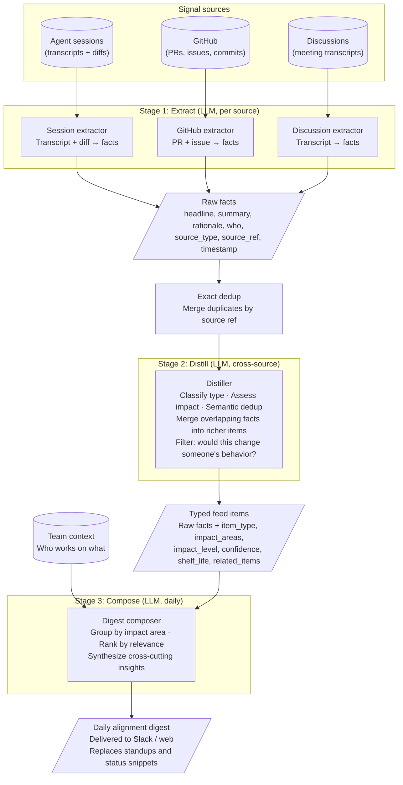
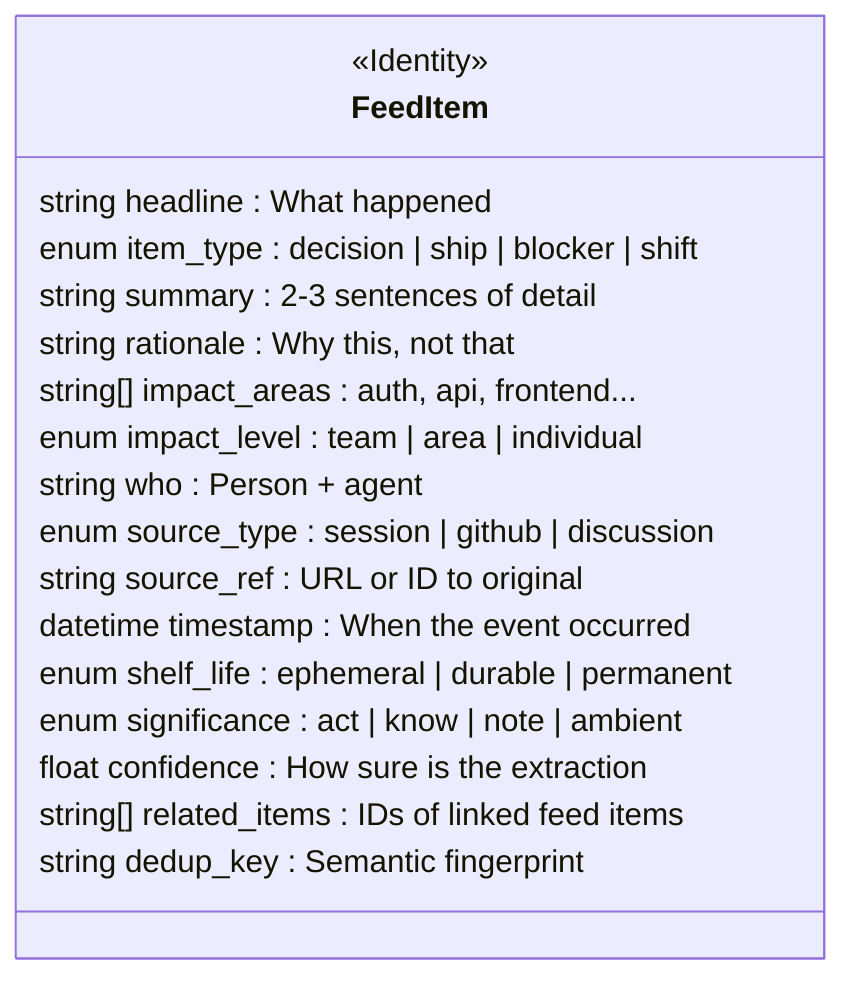

# Alignment Feed

**Shared proprioception for agentic-first teams**

PRFAQ — DRAFT — March 2026

---

# Press release

**Alignment Feed launches to eliminate standups and status updates for agentic-first teams**

FOR IMMEDIATE RELEASE

Today we are announcing Alignment Feed, a product that gives every member of an agentic-first software team a daily digest of what changed in their world overnight — without anyone writing a status update. The product watches three signal sources that teams already generate (coding agent sessions, GitHub activity, and meeting transcripts), distills them into structured alignment signals, and delivers a personalized digest before the team's first coffee of the day.

## The problem

Small software teams increasingly rely on coding agents to build products. Each team member may direct dozens or hundreds of agent sessions per week, meaning the pace of execution has increased by an order of magnitude. But the pace of human alignment has not. Teams still depend on standups, Slack messages, and status emails to stay coordinated — communication mechanisms designed for a world where people moved slowly enough that misalignment was self-correcting.

At agentic speed, the cost of misalignment explodes. When each person commands a fleet of agents, the feedback loop between "we disagree on approach" and "we've now produced conflicting work" collapses from days to minutes. The blast radius of a missed conversation is no longer a wasted afternoon — it's a week of rework across multiple codebases. Creating work is now cheap (agents do it), but evaluating and reconciling conflicting work is still expensive (humans have to do it).

## The solution

Alignment Feed is a daily alignment digest that replaces standups and manual status communication. It requires no behavior change from the team — the signals it consumes are already being generated. The product captures activity from three sources: coding agent session transcripts and diffs, GitHub pull requests, issues, and commits, and transcripts of team discussions and meetings. An LLM-powered pipeline extracts, distills, and composes these signals into a personalized feed for each team member.

The key insight is that the digest is organized by impact area, not by person. Rather than telling you what your teammates did (a status report), it tells you what changed in your world (an alignment signal). If you work on the frontend, you see every API change that affects you, regardless of which backend engineer's agent made it. If you own the auth module, you see that three people touched it from different directions this week — a cross-cutting insight that no single status update would reveal.

## How it works

Teams opt in specific signal sources. The system captures agent session transcripts and their diffs, GitHub events via webhooks, and meeting transcripts via upload or integration. A three-stage LLM pipeline processes these signals:

Stage one extracts raw facts from each source: decisions made, features shipped, blockers encountered, and the rationale behind choices. Stage two distills these facts by classifying them, assessing their impact scope, merging overlapping facts from different sources into richer combined items, and filtering for significance. Stage three composes a daily digest personalized to each reader based on what areas they work in.

Each item in the digest carries a significance tier: Act (requires your response today), Know (updates your mental model), Note (tangential background), or Ambient (stored but not pushed). The tier determines how the item is delivered — from a direct notification to quiet archival.

## Customer quote

*"We went from spending forty-five minutes every Monday reconstructing what happened last week to spending ten minutes scanning a digest that's better than anything we could have written ourselves. The first week, it caught a conflict between two features that would have cost us days of rework. That alone paid for the entire setup."*

## Getting started

Alignment Feed works with existing tools. Connect your GitHub organization, point it at your agent session logs, and upload or integrate your meeting transcripts. The first digest is delivered within 24 hours. No workflow changes required from any team member.

---

# Frequently asked questions

## Product

***Who is this for?***

Alignment Feed is built for small software teams (2–15 people) that rely heavily on coding agents like Claude Code, Cursor, or similar tools for daily development work. The product is designed for teams where the volume of agent-driven work has outpaced the team's ability to stay aligned through traditional communication.

***What problem does this solve that Slack and standups don't?***

Slack and standups depend on humans remembering to communicate the right things at the right level of detail. In practice, people forget to mention decisions that feel obvious to them but matter to teammates, they summarize at the wrong level of abstraction, and the information arrives hours or days after it would have been most useful. Alignment Feed captures the signal passively and delivers it proactively, with distillation that specifically surfaces decisions and rationale — the information most likely to prevent misalignment.

***What if our team doesn't use coding agents heavily yet?***

The product still works with GitHub activity and discussion transcripts alone. However, the highest-value signal source is agent coding sessions, because they contain the richest record of design decisions and rationale. Teams that are not yet agent-heavy will get value, but teams that run dozens of agent sessions per week will see the most dramatic improvement.

***How is this different from a changelog or a git log?***

A changelog tells you what changed. Alignment Feed tells you what changed, why it changed, what areas it affects, and whether you need to act on it. The distillation pipeline specifically extracts rationale (why this approach, not that one) and assesses impact scope (which parts of the product are affected). The digest is grouped by impact area and personalized to the reader, so each person sees what matters to them. A git log is organized by time and author; Alignment Feed is organized by relevance.

***What are the four significance tiers?***

Each feed item is classified into one of four tiers that determine how it is delivered. Act means this requires a response from you today — a blocker on code you own, a decision that conflicts with your in-flight work. Know means this updates your mental model of the project — a new pattern was adopted, a feature shipped that changes what's possible. Note means this is tangential background — useful if you're curious, but not required reading. Ambient means this happened and is recorded, but it's routine work that doesn't need to be pushed to anyone. Act items are flagged and may trigger direct notifications. Know items form the main body of the digest. Note items appear in a collapsible section. Ambient items are searchable but never appear in the digest.

## Technical

***What are the three signal sources?***

The MVP captures three sources. Agent coding sessions provide transcripts of the human-agent conversation plus the resulting code diffs. GitHub provides pull requests, issues, and commits via webhook integration. Discussion transcripts come from meeting recordings or uploaded transcripts. Each source has a dedicated extractor tuned to the structure and noise profile of that source type.

***How does the three-stage pipeline work?***

Stage one (Extract) runs a source-specific LLM prompt against each signal source to produce raw facts — structured records containing a headline, summary, rationale, attribution, source reference, and timestamp. Stage two (Distill) takes all raw facts, performs exact deduplication by source reference, then runs an LLM pass that classifies each fact by type and significance, assesses impact scope, performs semantic deduplication across sources, and merges overlapping facts from different sources into richer combined items. Stage three (Compose) takes the day's typed feed items plus a model of the team's areas of focus, groups items by impact area, ranks by relevance to each reader, synthesizes cross-cutting insights, and produces the daily digest.

***What is the feed item schema?***

Every signal source normalizes into a single universal schema. The extractor populates the substance and provenance fields. The distiller adds classification, scope, and composer hints:

***How does semantic deduplication work?***

Exact dedup happens before the distiller, matching on source references — if two raw facts point to the same PR number, they are merged upstream. Semantic dedup happens inside the distiller, where the LLM recognizes that facts from different sources describe the same underlying event. For example, a decision discussed in Monday's meeting, implemented in Tuesday's coding session, and documented in Wednesday's PR description are three separate raw facts about one decision. The distiller merges them into a single richer feed item that combines the rationale from the meeting with the implementation detail from the session and the final scope from the PR. This merged item is more useful than any single source alone.

***What does each extractor do specifically?***

The session extractor takes a coding agent transcript and its associated diff and finds steering moments where the human made active choices, design decisions with rationale, and the final scope of changes. It distinguishes between routine agent behavior and deliberate human direction. The GitHub extractor looks beyond PR descriptions into review threads where substantive pushback and decisions happen, and correlates PRs with referenced issues to reconstruct full context. The discussion extractor detects when decisions are actually made in unstructured conversation, distinguishing between options being explored and options being committed to, and reconstructing implicit references.

## Architecture

***What is the pipeline architecture?***

The pipeline consists of four processing stages with data flowing between them:

| Stage | Type | Input | Output | Key challenge |
|---|---|---|---|---|
| Extract | LLM (x3) | Raw source data | Raw facts | Signal vs. noise |
| Exact dedup | Logic | Raw facts | Deduped facts | Source ref matching |
| Distill | LLM | Deduped facts | Typed feed items | Judgment + merge |
| Compose | LLM | Feed items + team | Daily digest | Relevance routing |

***What LLM powers the pipeline?***

The pipeline is designed to be LLM-agnostic. Each stage is a structured prompt with well-defined input and output schemas. The MVP will use Claude for all three LLM stages, but the architecture allows swapping models per stage based on cost and quality tradeoffs. The extraction stage is the most token-intensive (processing long transcripts), while the distillation and composition stages operate on already-compressed structured data.

***How does personalization work in the composer?***

The composer takes a team context model as input alongside the day's feed items. The team context specifies each person's areas of focus — which parts of the codebase or product they work on. The composer uses this to determine which items are relevant to each reader and at what significance tier. An item classified as Know for someone working in the affected area might be Note for someone in an adjacent area and Ambient for everyone else. The composer can also promote items when cross-cutting patterns emerge: three individually routine items all touching the same module collectively become a Know or Act insight.

## Scope and future

***What is in the MVP and what is deferred?***

The MVP includes the three-stage LLM pipeline (extract, distill, compose), the three signal sources (agent sessions, GitHub, discussions), the four-tier significance model, the universal feed item schema, and daily digest delivery via Slack and a simple web view. Deferred for future iterations: real-time streaming feed (as opposed to daily batch), agent-facing context priming (feeding the knowledge back into agents), a durable knowledge base that feed items promote into over time, a feedback loop for signal quality improvement, and per-reader digest customization beyond area-based filtering.

***How does this relate to a longer-term team memory system?***

The alignment feed is the first layer of a broader system. The daily feed is a temporal stream — what changed recently. Over time, durable decisions and patterns will graduate from the feed into a persistent knowledge base that captures how the team does things and why. That knowledge base becomes context fuel for agents, so that when a team member spins up a new agent session, the agent already knows the team's architectural patterns, recent decisions, and current constraints. The feed is where signal enters the system; the knowledge base is where it accumulates. The promotion mechanism between them — how a feed item becomes team doctrine — is a key design problem for the next phase.

***What are the key experimentation points?***

Six areas require iteration and cannot be fully specified upfront. First, what to instrument: which signal sources to opt in and at what granularity. Second, distillation quality: how well the LLM extracts decisions and rationale from noisy source material. Third, the promotion bridge: when and how feed items graduate to durable knowledge. Fourth, relevance routing: filtering by persona, role, and current task. Fifth, compression for consumption: packaging the same knowledge differently for humans reading a digest versus agents consuming context. Sixth, feedback signal quality: learning from whether surfaced knowledge was useful, correct, or missing something.
