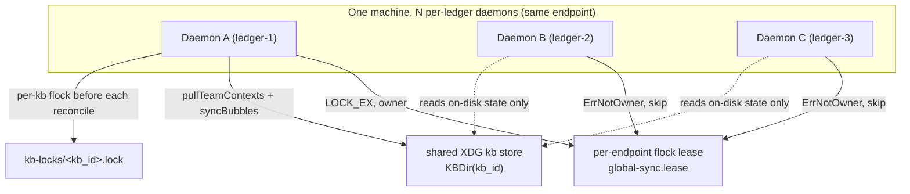

# Knowledge-Bubble Sync — daemon model, multi-daemon coordination, doctor parity

> How knowledge bubbles (kb) are synced to disk, why N concurrent daemons don't
> step on each other, what `ox daemon status` / `ox doctor` report, and the one
> deliberately-deferred question (agents without a git repo).

Knowledge bubbles are the kb-era successor to **ledgers** and **team contexts**
(ADR-028/030 in `sageox-mono`). A bubble is a single git repo cloned into a
canonical XDG path and kept fresh by the daemon — the same shape ledgers and
team contexts already had. This doc records how the CLI side handles them so the
model isn't re-derived every time someone touches kb sync.

---

## On-disk layout

```
~/.local/share/sageox/<endpoint>/kb/<kb_id>/      # one clone per bubble (immutable kb_id key)
  .git/
  .sageox/
    meta.json        # daemon-written: {type, slug, owner_user_id, viewer_role, last_sync}
    kb.yaml          # server-pushed bubble metadata
    sync.manifest    # sparse-checkout rules
```

`paths.KBDir(kb_id)` is the canonical path; `paths.KBDir("")` is the per-endpoint
root. Bubbles are keyed by the **immutable** `kb_id`, never the renameable slug.

---

## Who syncs bubbles — leader-gated, exactly like team context

There is **one daemon per ledger/worktree**, so a user with N projects open runs
N daemons concurrently. All of them share the *same* on-disk kb store. To avoid N
daemons each cloning/pulling the same bubbles every 15s, kb sync is gated by the
**per-(user, endpoint) global-sync flock lease** — the identical mechanism that
already gates team-context pulls (bead ox-6zme).



**Two layers, both `flock(2)`, both kernel-released on process death:**

1. **Global-sync lease** (`internal/daemon/global_lease.go`). Acquired once at
   daemon startup. In the scheduler loop (`internal/daemon/sync.go`, the
   `teamContextChan` case) only `IsGlobalSyncOwner()` runs `pullTeamContexts`
   **and** `syncBubbles`. Followers skip both and consume the on-disk state the
   owner keeps fresh. One API `ListBubbles` call per endpoint, not per daemon.

2. **Per-kb lease** (`internal/daemon/kb_lock.go`). `reconcileBubble` takes a
   `LOCK_EX|LOCK_NB` on `kb-locks/<kb_id>.lock` before any clone/pull. This is a
   belt-and-suspenders layer: even if the global lease is bypassed (manual
   `OX_KB_DISABLE` toggling, lease-file weirdness), two daemons can never clone
   the same bubble dir simultaneously or have GC rename a clone mid-write.

**Invariant for followers:** a follower daemon never writes a bubble dir. It can
still *read* and *report* what's on disk — which is exactly what
`ox daemon status` does (below).

Escape hatch: `OX_KB_DISABLE=1` takes the daemon's kb sync loop offline, mirroring
the client-side merger short-circuit in `internal/kb/merge.go`.

---

## `ox daemon status` — what's synced + who owns sync

`StatusData.Workspaces["kb"]` carries one row per locally-cloned bubble, scanned
from disk (`SyncScheduler.kbWorkspaceStatus` in `internal/daemon/status_kb.go`):
`kb_id`, slug, type, `.git` existence, and `last_sync` from `meta.json`. Because
it's a pure disk scan, **any** daemon — owner or follower — reports the same
picture.

`StatusData.GlobalSyncOwner` / `GlobalSyncEndpoint` tell the user whether *this*
daemon pulls the bubbles or a sibling does. The human view renders a
"Knowledge Bubbles (N · syncing here)" or "(N · synced by another daemon
(<endpoint>))" header so a follower never looks idle when the owner is busy.

---

## `ox doctor` — kb checks, at parity with ledger/team-context

A bubble is a daemon-managed git checkout like a ledger, so it shares the same
failure modes. The kb checks (`cmd/ox/doctor_kb.go`,
`doctor_kb_repo_health.go`, `doctor_kb_global_sync.go`,
`doctor_kb_migrate.go`):

| kb check | Mirrors | What it catches | Fix |
|---|---|---|---|
| `kb-orphans` | `orphaned-team-dirs` | on-disk kb_id absent from API list | daemon GC move-aside |
| `kb-missing-clone` | (inverse of orphans) | API bubble with no local clone | kick daemon sync |
| `kb-wedged` | `ledger-unmerged-paths` | stuck merge/rebase (U-state / rebase dir) — **Critical**, blocks the owner's sync for every project | kick daemon sync, else manual `rebase --abort` |
| `kb-sparse-checkout` | `ledger-sparse-checkout`, `team-sparse-checkout` | `.sageox` dropped from sparse cone | kick daemon sync (reapply from manifest) |
| `kb-stale-sync` | (kb-specific) | `meta.json` `last_sync` > 1h | kick daemon sync |
| `kb-failed-provision` | (kb-specific) | server `lifecycle_state=provision-failed` | requires-agent (server side) |
| `kb-global-sync-no-owner` | (kb-specific, ox-6zme) | an endpoint with daemons but no lease holder | check-only |
| `kb-project-config-migrate` | (kb-specific, ADR-017) | legacy `config.json` → `config.yaml` | auto |

**Design rule — repairs go through the daemon, not the CLI.** The daemon owns kb
git writes and serializes them with the per-kb flock. A kb doctor repair therefore
*kicks a daemon sync* (`kbHookSync`) rather than committing/aborting inline the way
the CLI-owned ledger checks do — a CLI write into a daemon-managed tree would race
the per-kb lock. Detection is read-only and runs CLI-side. See the header comment
in `doctor_kb_repo_health.go`.

**Intentionally deferred (not yet ported from ledger/team):**

- **Secret scanning** (`ledger-secrets`). Ledger scans its `sessions/` tree for
  credential patterns. Bubbles have no `sessions/` — they hold imported data,
  murmurs, and recordings. A kb scan would need a different target set and a
  policy decision; deferred until kb import flows settle.
- **Dirty-workdir / cache-tracked auto-commit** (`ledger-clean-workdir`,
  `ledger-cache-tracked`). These auto-commit from the CLI. For a daemon-managed
  tree that's the wrong owner; if needed, the repair belongs in the daemon's
  reconcile pass, not in doctor.
- **Remote-URL / embedded-creds audit** (`ledger-url-api-match`,
  `ledger-embedded-creds`). Bubble remotes are set by the daemon at clone time;
  the daemon is the right place to correct drift, not a CLI doctor check.

---

## Future / open question — agents without a git repo (Cloud Co-Work)

Today the CLI is **repo-bound**: endpoint resolution and credentials flow from a
project root, and the daemon's `syncBubbles` returns early when `ProjectRoot == ""`.
Bubbles bind to the current repo via the cwd `.kb-marker` (`internal/kb/resolve.go`).

Cloud Co-Work may run an AI coworker with **no git repo at all**. In the cloud
model, bubbles are explicitly *not* tied to repos (ADR-028), so the repo-bound
assumption doesn't carry over cleanly.

**Decision (now): keep the CLI repo-bound.** Breaking the repo binding touches
endpoint resolution, daemon lifecycle, and selection — too much blast radius for
a case that doesn't exist in the product yet. When it does, the likely surface is
a **global/no-repo binding**: resolve a "current bubble" from an env var (`OX_KB`)
or an XDG-global marker when no git root is found, leaving the repo path unchanged.
Captured here so the tradeoff isn't re-litigated; no implementation until
Cloud Co-Work needs it.

---

## Pointers

- Leader election: `internal/daemon/global_lease.go`
- Per-kb serialization: `internal/daemon/kb_lock.go`
- Sync loop gate: `internal/daemon/sync.go` (`teamContextChan` case, `IsGlobalSyncOwner`)
- Reconcile: `internal/daemon/sync_bubbles.go`
- Status scan: `internal/daemon/status_kb.go`
- Doctor checks: `cmd/ox/doctor_kb*.go`
- Domain model (cloud): `sageox-mono` ADR-028, ADR-030, ADR-032
