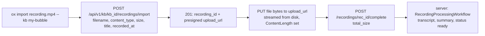

# KB import parity — `ox import --kb`

**Status:** implemented (CLI side; backend bulk-import endpoint lands in parallel in sageox-mono)
**Audience:** SageOx engineers working on `ox import`, the recordings API client, or Knowledge Bubble ingestion

`ox import` historically targeted team contexts only. This design brings Knowledge Bubbles to
parity for the import paths that go through the cloud recording pipeline, and documents which
path is deliberately deferred.

## The three things called "import"

"Import" is overloaded in ox. Three distinct mechanisms share the word:

| Mechanism | What it does | Transport | Team | Knowledge Bubble |
|---|---|---|---|---|
| **URL-video import** | Submit a video URL (Loom, Cap, direct) for cloud processing | `POST …/recordings/import/url` | ✅ existing | ✅ **this change** (route already mounted server-side) |
| **Bulk recording-file import** (new) | Upload a pre-existing local media file as a recording | `POST …/recordings/import` → presigned PUT → `POST …/{rec_id}/complete` | ❌ **not used** — team media stays on document-LFS (below) | ✅ **this change** |
| **Document-LFS import** | Store a document (PDF, markdown, **and media files**) with LFS-backed content + git-tracked metadata in the team context repo | LFS batch upload + git commit/push + `POST /api/v1/teams/{team_id}/context/import` notify | ✅ existing — **including media transcription** | ❌ **deferred** |

### Team media import already transcribes — team is UNCHANGED

`ox import meeting.mp4` (no flag, or `--team`) was already complete before this change: the
media file is written as a git-LFS doc into the team-context repo, and the
`POST /api/v1/teams/{team_id}/context/import` notify kicks off the backend's
team-context-doc-import workflow, which routes by content type — `video/*` →
`ImportVideoFileWorkflow`, `audio/*` → `ImportAudioWorkflow` — so team media imports were
already transcribed server-side AND git-tracked. This change does not touch that path.

The new `…/recordings/import` endpoint is used **only for `--kb`**, because a Knowledge Bubble
has the genuine gap: there is no `/api/v1/kb/{kb_id}/context/import` route and no KB doc-import
workflow, so the recording pipeline is a KB's only media-ingestion path.

**Known, intentional asymmetry:** team media lands as a git-LFS doc in the team-context repo
(history, pointers, repo-visible), while KB media lands as a presigned-S3 recording row
processed by `RecordingProcessingWorkflow` (no git artifact). Unifying the two storage models
is out of scope here; if the team path ever moves to the recording pipeline (or KB grows a
`/context/import` route), the dispatch in `runImport` is the single seam to change.

### Why document-LFS to a Knowledge Bubble is deferred

- **No backend route:** verified against sageox-mono — `/context/import` is registered for
  teams only; no `/api/v1/kb/{kb_id}/context/import` exists today.
- **A different path already serves the need:** document content reaches a Knowledge Bubble via
  the MCP `SaveToBubble` / `kb-import` tools, which write through the bubble's own git repo.
- **Decision:** `ox import <document> --kb …` returns a clear error pointing at `--team`. If a
  KB `/context/import` route ships later, the CLI's `NotifyImport` path gets the same context
  parameterization described below — the seam is already in place.

## UX decision: `--kb` flag, not `ox kb import`

The chosen surface is a `--kb <slug|kb_id>` flag on the existing `ox import` command.

- **Mirrors `--team`:** import already takes an optional context override; `--kb` is the same
  shape pointed at a different context. One command, one mental model, one set of
  `--status` / `--list` / `--watch` follow-ups.
- **No breaking change:** every existing invocation (`--team`, auto-discovered team, `--status`,
  `--list`) behaves identically when `--kb` is absent.
- **Mutual exclusion:** `--team` and `--kb` are mutually exclusive (enforced by cobra's
  `MarkFlagsMutuallyExclusive` plus a defensive check in the resolver). Exactly one context is
  resolved per invocation.
- **Why not a subcommand:** `ox kb import` would fork the import surface — two help texts, two
  flag sets, and a second home for `--status` / `--list`. The `ox kb` namespace is for bubble
  *management* (config, path, resolution); ingestion stays on `ox import`.

KB resolution reuses `resolveKBInputForCmd` (`cmd/ox/kb_resolve.go`): accepts a bare slug,
`#slug`, or `kb_…` ID; `kb_…` resolves fully offline, slugs go through the kb API with the
legacy fallback.

## API-layer context abstraction

The backend mounts identical recording routes under `/api/v1/teams/{team_id}/recordings` and
`/api/v1/kb/{kb_id}/recordings`. Rather than duplicating each client method per context, the
path segment is parameterized once:

- **`recordingsBase(contextType, contextID)`** (`internal/api/video.go`) returns the collection
  path for `"team"` or `"kb"` and rejects anything else. Exported constants
  `api.ContextTypeTeam` / `api.ContextTypeKB` are the only valid inputs.
- **`ImportVideoURL`, `GetVideoStatus`, `ListVideos`, `ImportRecordingFile`** all take
  `(contextType, contextID, …)` and build URLs from `recordingsBase`. The nil-nil-on-404
  graceful-degradation pattern (endpoint not yet deployed) is preserved unchanged.
  `ImportRecordingFile` supports both contexts at the client layer but the CLI only ever
  invokes it for KB (see routing above); `--status` / `--list` / URL import legitimately
  serve both team and KB recording routes.
- **`cmd/ox/import.go` resolves context once** via `resolveImportContext()`, which returns
  `(contextType, contextID, client, endpoint)` for either flag, then threads the pair through
  URL import, file import, `--status`, and `--list`.

This keeps the team/kb split to exactly two places: one path builder in the API layer, one
context resolver in the command layer.

## Bulk recording-file import: the 3-step sequence

A local media file (`.mp4 .mov .mkv .avi .webm .m4a .mp3 .wav .ogg .opus .flac .aac .wma`) is
routed to `ImportRecordingFile` instead of the document-LFS path **only when `--kb` is set**;
team media files fall through to document-LFS unchanged (see the team-is-UNCHANGED section
above). `runImportRecordingFile` also carries a defensive KB-only guard so a future caller
can't silently switch the team storage model. The extension set mirrors the audio/video groups
in `detectContentType` so routing and MIME detection cannot disagree.

Step details:

- **Step 1 — init:** JSON body `{filename, content_type, size, title?, description?, recorded_at?}`.
  `size` is always taken from `os.Stat` so the presigned request can never disagree with the
  bytes uploaded. `recorded_at` back-dates historical imports (`--date` flag, else file mtime).
  A 404 here returns `nil, nil` — the endpoint is not deployed yet, matching `ImportVideoURL`.
- **Step 2 — presigned PUT:** the open `*os.File` is the request body with `ContentLength`
  set explicitly — the file is **never** read fully into memory. The PUT uses a dedicated
  HTTP client without the default 10s timeout (media files routinely take longer); context
  cancellation still applies. `Content-Type` matches step 1 because presigned URLs may sign it.
- **Step 3 — complete:** `{total_size}` finalizes the recording and kicks off server-side
  processing. Imports are a single PUT, never chunked, so `chunk_count` is omitted — the server
  branches on `metadata.source = "import"`. The response's `status` is surfaced to the user;
  progress is tracked with `ox import --status rec_… --watch --kb …`.

## Test plan

| Layer | Test | Asserts |
|---|---|---|
| API client | `TestImportRecordingFile_KB_MockServer` (`cmd/ox/import_recording_test.go`) | all 3 legs fire exactly once, in order, against `kb/` paths; size from disk; full bytes arrive; final status comes from the complete response |
| API client | `TestImportRecordingFile_404GracefulDegradation` | 404 on init → `nil, nil`, no error |
| API client | `TestImportRecordingFile_InvalidContextType` | unknown context rejected before any network traffic |
| Command | `TestImport_TeamMediaFile_DoesNotUseRecordingImport` | team media (no `--kb`) falls through to the document-LFS path and never hits `recordings/import` |
| Command | `TestImport_KBMediaFile_UsesRecordingImport` | `--kb` + media drives the 3-leg import on `kb/` paths through `runImport` |
| Command | `TestImport_KBDocumentFile_Errors` | `--kb` + non-media rejected with the use-`--team` error |
| Command | `TestRunImportRecordingFile_RequiresKB` | defensive guard: direct call without `--kb` fails before any context resolution |
| Command | `TestResolveImportContext_KBFlag` | `--kb kb_…` resolves offline to a kb context with an authenticated client |
| Command | `TestResolveImportContext_BothFlagsError` | `--team` + `--kb` rejected |
| Command | `TestIsMediaImportFile` | media-vs-document routing boundary pinned |
| Command | `TestImportCmd_KBFlagRegistered` | `--kb` registered; help text documents it |
| Regression | existing `TestImportVideoURL_*`, `TestListVideos_*`, `internal/api/video_test.go` suite | team behavior unchanged through the context-parameterized signatures |
| Manual (post-backend-merge) | `ox import ./sample.mp4 --kb <slug>` against test.sageox.ai | recording appears under the bubble; `--status --watch` reaches `ready` |

## Out of scope

- **Backend implementation** of `POST …/recordings/import` (sageox-mono, shipping in parallel).
- **Document-LFS import to a Knowledge Bubble** (see deferral rationale above).
- **Chunked/multipart upload** for very large files — single presigned PUT only; revisit if
  imports above the server's max file size become a real need.
