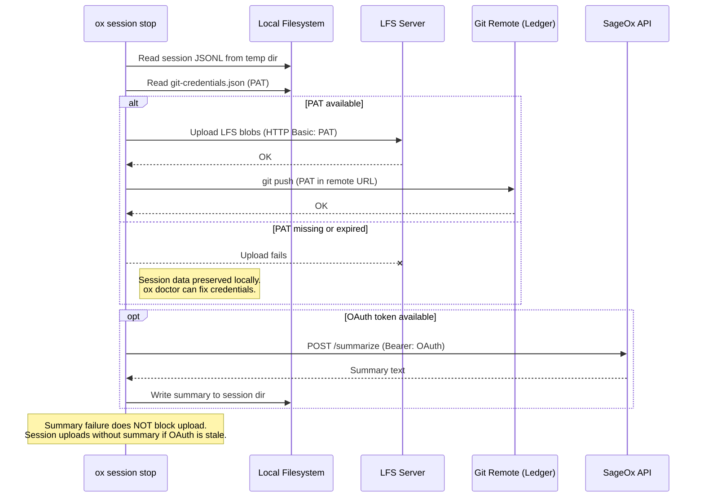

# Session Auth Model

Two independent credential systems serve different purposes in the ox session lifecycle. Understanding which credential is needed at each stage prevents misdiagnosis of auth failures.

## Credential Systems

### OAuth Token (`auth.json`)

- **Location**: `~/.config/sageox/auth.json`
- **Obtained via**: `ox login` (device code flow)
- **Used for**: SageOx cloud API calls (summary generation, repo metadata, credential exchange)
- **Format**: JWT with expiry, keyed by normalized endpoint
- **Refresh**: Manual (`ox login`) or daemon-initiated credential exchange

### Git PAT (`git-credentials.json` / OS keychain)

- **Location**: `~/.config/sageox/git-credentials.json` or OS credential store
- **Obtained via**: Daemon exchanges OAuth token for a scoped PAT via cloud API
- **Used for**: Git push/pull operations, LFS uploads (HTTP Basic auth)
- **Format**: Personal Access Token with expiry timestamp
- **Refresh**: Lazy, via `refreshCredentialsIfNeeded()` in daemon sync scheduler

### Independence

These two credential systems are **fully independent at runtime**. A valid PAT does not require a valid OAuth token, and vice versa. The only dependency is at provisioning time: the daemon uses OAuth to obtain a fresh PAT. Once the PAT is stored, OAuth can expire without affecting git operations.

## Session Lifecycle Auth Requirements

| Phase | OAuth Token | Git PAT | Notes |
|-------|:-----------:|:-------:|-------|
| `ox agent prime` / session start | Not required | Not required | Identity enrichment from OAuth is best-effort. Session starts regardless. |
| Session recording | Not required | Not required | Purely local file writes (JSONL to temp directory). |
| Session stop: LFS upload | Not required | **Required** | LFS blobs uploaded via HTTP Basic auth using PAT. |
| Session stop: git push | Not required | **Required** | PAT embedded in remote URL for ledger push. |
| Session stop: summary generation | **Required** | Not required | Calls SageOx API. Optional — failure does not block upload. |

### Key design decision

`ox agent prime` does **not** gate on OAuth. This was an intentional removal of an earlier auth gate. Rationale: agents should always be able to start sessions, even when credentials are stale. Upload is the only operation that truly needs credentials, and it happens at session stop when the user is present to fix issues.

## PAT Refresh: Lazy Strategy

The daemon refreshes git credentials lazily via `refreshCredentialsIfNeeded()` in `internal/daemon/sync_discovery.go`.

**Refresh logic:**

1. Check if PAT expiry is within `credentialRefreshThreshold` (1 hour).
2. If PAT is fresh (expiry > 1 hour away): **exit early, no OAuth call**.
3. If PAT is stale or missing: exchange OAuth token for new PAT via cloud API.
4. Deduplication via mutex stamp-then-release prevents concurrent callers from hitting the API simultaneously (avoids TOCTOU race).

**When refresh runs:**
- Before each sync cycle (pull operations)
- Before credential-dependent daemon operations

**When refresh does NOT run:**
- During CLI session upload (CLI uses whatever PAT is on disk)
- During `ox agent prime` (no credentials needed)

## Session Upload Credential Flow

## Identity Package: Single Gateway

`internal/identity/attribution.go` is the single gateway for all user identity resolution. It returns an `Attribution` struct with four fields, each with a precise purpose.

### Attribution Fields

| Field | Format | Example | Privacy | Use Cases |
|-------|--------|---------|---------|-----------|
| `Username` | Lowercase slug, filesystem-safe | `"ryan"`, `"anonymous"` | Safe (non-PII) | Folder names, file paths, principal IDs, slug matching |
| `Email` | Full email or `""` | `"ryan@example.com"`, `""` | PII (local only) | Git commit author field |
| `Name` | Full unabbreviated name | `"Albert Einstein"` (not PII — illustrative), `"Anonymous"` | **LOCAL ONLY** — never in ledger or shared contexts | Local git commit author, login display, internal audit |
| `DisplayName` | Privacy-abbreviated | `"Albert E."`, `"Anonymous"` | **SAFE FOR SHARING** — all team-visible metadata | Session meta.json, murmur files, session list/view |

### Field-to-Location Mapping

| Location | Field Used | Rationale |
|----------|-----------|-----------|
| Ledger `meta.json` `username` field | `DisplayName` | Team-visible, privacy-safe |
| Session folder names | `Username` | Filesystem-safe slug |
| Murmur `principal_id` | `Username` | Stable identifier for matching |
| Git commit author | `Name` + `Email` | Local-only git config |
| Login display ("Signed in as...") | `Name` | Shown only to the authenticated user |

### Fallback Chain

Resolution order in `ResolveAttribution()`:

1. **SageOx OAuth** (`auth.GetTokenForEndpoint`) — verified identity. Provides `Email` and `Name`.
2. **Config `display_name`** (`ox config`) — provides `DisplayName` only.
3. **Git identity** (`git config user.name` / `user.email`) — provides `Email`, `Name`, and `Username` (via slug).
4. **OS username** (`$USER` / `$USERNAME`) — provides `Username` only.
5. **Absolute fallback** — `Username` = `"anonymous"`, `Name` = `"Anonymous"`, `DisplayName` = `"Anonymous"`.

`ResolveAttribution()` never fails. It always returns a valid `Attribution` with non-empty `Username`, `Name`, and `DisplayName`. `Email` may be empty.

## Common Failure Modes

### OAuth expired, PAT valid

- **Impact**: Sessions upload fine. Summary generation skipped (optional).
- **Identity fallback**: `ResolveAttribution` falls through to git config or OS username.
- **User experience**: No visible error during session stop. Summary field empty in ledger.
- **Fix**: `ox login` when convenient. Not urgent.

### PAT expired, OAuth valid

- **Impact**: Upload fails at git push. Session data preserved locally.
- **Detection**: Push error during `ox session stop`.
- **Recovery**: Daemon will refresh PAT on next sync cycle (exchanges OAuth for new PAT). Alternatively, `ox doctor` triggers credential refresh.
- **User experience**: Error message at session stop. Local session data is safe.

### PAT expired, OAuth expired

- **Impact**: Upload fails. Summary generation fails. Session records locally only.
- **Recovery**: `ox login` → daemon refreshes PAT → manual retry or next session uploads.
- **User experience**: Error at session stop. `ox doctor` detects and guides through fix.

### No credentials at all (fresh install, no `ox login`)

- **Impact**: Session records locally. No upload, no summary.
- **Detection**: `ox doctor` reports missing credentials.
- **Recovery**: `ox login` to establish OAuth, daemon provisions PAT.
- **User experience**: `ox agent prime` still works (no auth gate). Sessions accumulate locally until credentials are established.
