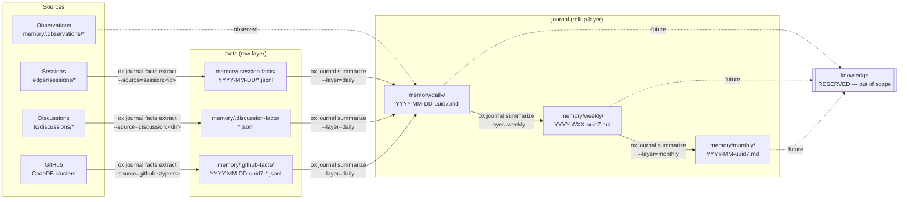

# `ox distill history` — Team Memory Journal

Status: spec
Owner: agent-ux
Supersedes (in spirit): the `ox distill` pipeline shape, not its on-disk artifacts.

This spec defines a new top-level CLI surface — `ox distill history` — and the
pipeline restructure that splits today's monolithic `ox distill` into
extract, summarize, and read concerns. It is a **what** spec; it does not
prescribe Go packages, function signatures, or implementation order.

A downstream plan author and implementer should be able to execute against
it without interpreting any unstated intent. Open questions are explicitly
called out at the bottom — anything not in "Open questions" is decided.

---

## 1. Scope and goals

### 1.1 What this delivers

1. A new top-level namespace, `ox distill history`, that owns the team's daily /
   weekly / monthly journal — the rolled-up, human-readable record under
   `memory/daily/`, `memory/weekly/`, `memory/monthly/`.
2. A visible sub-namespace, `ox journal facts`, that exposes the raw fact
   layer extracted from individual sources (sessions, discussions, GitHub
   PRs, GitHub issues, GitHub commit batches).
3. **Pipeline split**: extract (one source → facts) and summarize (facts →
   journal entry) become independent commands with independent cadences.
   Today they are fused inside a single `ox distill` invocation.
4. A **stable read surface** (`list`, `show`, `since`) that agents and
   downstream tools (like `factory/distill/summary.ts`) call instead of
   walking `memory/daily/` themselves.
5. JSON-default output across the entire surface, with `--format=text` for
   humans and `--format=content` on `since` / `show` to emit assembled
   markdown ready to feed a summarizer.

### 1.2 Problems this fixes

- **Brittle external readers.** `factory/distill/summary.ts` currently
  hands Claude an `--add-dir` and tells it to "find today's files". The
  consumer guesses about timezone, file naming (`YYYY-MM-DD.md` vs
  `YYYY-MM-DD-<uuid7>.md`), late-arriving days, and multi-summary days.
  After this change there is one canonical answer: `ox distill history since 24h
  --format=content`.
- **Agents hard-coding `memory/...` paths.** Any AI coworker that wants
  to read the journal currently has to know the directory layout, the
  filename pattern, the frontmatter shape, and the citation rules. The
  read commands hide all of that behind a stable contract.
- **Coupling of extract to summarize cadence.** Today, every `ox distill`
  run does extract + summarize + push in one pass, with retry semantics
  that conflate "this PR is unchanged" with "this day is fully
  summarized". Splitting them lets `extract` run on event hooks (after a
  session uploads, after a GitHub webhook lands) while `summarize` runs
  on a periodic schedule (every 6 hours, end of day, etc.).
- **Discoverability.** `ox distill` is a verb most users do not connect
  to "where is my team's recent activity?". `ox distill history` matches the
  mental model of the artifact.

### 1.3 What this explicitly does NOT deliver

- Does not delete `ox distill` or `ox memory distill`. Both keep
  working as hidden aliases (see §6).
- Does not introduce a semantic / vector / "knowledge" layer. The name
  `ox knowledge` is reserved (see §7) but is out of scope.
- Does not change the on-disk layout under `memory/` for daily / weekly /
  monthly summaries. New entries follow the existing
  `YYYY-MM-DD-<uuid7>.md` shape so old and new files coexist.
- Does not change the fact file format. `internal/facts.FileHeader` /
  `Fact` (see `internal/facts/types.go`) is still authoritative.
- Does not write the new `factory/distill/summary.ts` replacement. That
  is downstream work; this spec only guarantees the surface it can call.
- Does not rename `ox memory put` (the observation write path).

### 1.4 Why now

The `distill` pipeline has accumulated three concerns that were never
separated: scanning sources, calling LLMs to extract structured facts,
and synthesizing those facts into narrative summaries. Each of those has
different failure modes, different cadences, different cost profiles, and
different "is this idempotent?" answers. The split lets us fix
extraction-only bugs (PR #487, the github-facts-per-day fix, the
summary.json fast path) without re-running summarization, and lets us
rerun summarization without re-paying extraction LLM costs.

---

## 2. Pipeline model



### 2.1 Boundaries and what crosses them

| Boundary | Direction | Data shape that crosses |
|---|---|---|
| Source → fact | extract | One JSONL fact file per (source, run) under `memory/.{source}-facts/...`. Header is `facts.FileHeader{_meta:{schema_version, source_type, recorded_at, source_hash, query_since?, query_until?}}`. Body lines are `facts.Fact{headline, summary, rationale, who, source_type, source_ref, source_url, source_title, timestamp, category}`. |
| Fact → journal entry (daily) | summarize | A set of fact files within a window are passed to the LLM with extraction guidance and a citation list. Output is one daily `.md` file with YAML frontmatter (`sources:` list, the cache-index input list), a `# Daily Memory — <date>` body, and a `## Sources` section with numbered citations. |
| Daily → weekly | summarize | All daily `.md` files within an ISO week are merged (citations renumbered into a unified list) and passed to the LLM. Output: one weekly `.md`. |
| Weekly → monthly | summarize | All weekly `.md` files overlapping a calendar month are merged and synthesized. Output: one monthly `.md`. |
| Journal → reader | list / show / since | An `entry` envelope (id, layer, date, path, sources, citations summary). `--format=content` swaps to the file's raw markdown (without YAML frontmatter). |
| Fact → reader | facts list / facts show | A `fact` envelope (id, source_type, source_ref, source_url, source_title, headline, summary, category, who, timestamp, file path). |

### 2.2 Hard rules of the model

1. **`summarize` reads from the fact store ONLY.** It never re-opens
   sessions, discussions, or CodeDB. Anything `summarize` needs about
   the source must already be on the fact (`source_url`, `source_title`,
   `source_ref`, `category`, `who`, `timestamp`).
2. **Extraction is source-scoped.** One invocation of `ox journal facts
   extract --source=<type:id>` produces facts from exactly one source.
3. **Citations are a two-hop chain.** Journal entries cite fact IDs; facts
   cite source refs. Journal → fact → source. Read commands surface this
   chain so consumers do not re-derive it.
4. **The fact store is the bus.** Anything that wants to influence the
   journal writes a fact. Anything that wants to read the journal reads
   entries — and, if it needs raw signal, drills into facts.

---

## 3. Command reference

All commands live under `ox distill history`. JSON is the default. `--format=text`
is human-readable. `--format=content` (only on `since`, `show`, `facts
show`) emits assembled markdown ready to feed an LLM, with no envelope.

Stdout is parseable. Stderr carries progress, warnings, and debug. Exit
codes: `0` success, `1` runtime error, `2` usage error.

### 3.1 `ox journal facts extract`

```
ox journal facts extract --source=<type:id> [--team=<slug>] [--force]
                         [--dry-run] [--format=json|text]
```

**Purpose.** Pull facts from exactly one source, write a single fact
file, commit it. Idempotent: if the source's fingerprint matches the
latest existing fact file's `_meta.source_hash`, this is a no-op.

**Flags.**

| Flag | Default | Semantics |
|---|---|---|
| `--source=<type:id>` | (required) | The source to extract from. See §5.f for the supported `type:id` grammar. |
| `--team=<slug>` | active team | Which team context to write facts into. If the project belongs to multiple teams, must be set explicitly when ambiguous; see §5.g. |
| `--force` | `false` | Re-extract even if the source hash is unchanged. Writes a new UUID7-named fact file (does not overwrite). |
| `--dry-run` | `false` | Do everything except call the LLM, write the file, and commit. JSON output still includes a `would_extract` block. |
| `--format=json\|text` | `json` | Output mode. |

**Success JSON.**

```json
{
  "success": true,
  "type": "fact_extraction",
  "data": {
    "source": {
      "type": "github",
      "id": "pr-487",
      "ref": "https://github.com/SageOx/ox/pull/487",
      "title": "fix(doctor): adapter diagnose fixes"
    },
    "fact_file": {
      "id": "2026-04-12-019c8a0e",
      "path": "memory/.github-facts/2026-04-12-019c8a0e-...-pr-487.jsonl",
      "fact_count": 3,
      "source_hash": "9b5ef157c16c4d1a",
      "snapshot": "latest",
      "previous_snapshots": 2
    },
    "skipped": false,
    "skipped_reason": null
  },
  "agent_hint": "Run `ox journal summarize --since=6h` to roll these into the daily journal.",
  "elapsed_ms": 8421
}
```

When the source is unchanged (the common idempotent case), `data.skipped`
is `true`, `data.skipped_reason` is `"unchanged_source_hash"`, the
`fact_file` block points at the existing latest snapshot, and
`elapsed_ms` is small.

**Error JSON (examples).**

```json
{
  "success": false,
  "error": {
    "code": "source_not_found",
    "message": "no session matches id 'OxefRI' in this team's ledger",
    "retryable": false
  }
}
```

```json
{
  "success": false,
  "error": {
    "code": "extractor_unavailable",
    "message": "no AI coworker CLI detected; install claude or set OX_AGENT_CLI",
    "retryable": true
  }
}
```

Error codes (not exhaustive): `source_not_found`, `source_type_invalid`,
`team_ambiguous`, `team_not_found`, `extractor_unavailable`,
`extractor_failed`, `parse_failed`, `write_failed`, `commit_failed`.

**`--format=text` rendering.**

```
extract: github pr-487 (fix(doctor): adapter diagnose fixes)
  facts written:    3
  fact file:        memory/.github-facts/2026-04-12-019c8a0e-...-pr-487.jsonl
  source hash:      9b5ef157c16c4d1a (new)
  prior snapshots:  2
  elapsed:          8.4s
hint: run `ox journal summarize --since=6h` to roll into the daily journal.
```

**Exit codes.** `0` success (including idempotent skip). `1` extractor or
write failure. `2` usage error (missing or malformed `--source`).

---

### 3.2 `ox journal facts sweep`

```
ox journal facts sweep [--since=<dur>] [--source=<type>...]
                       [--team=<slug>] [--concurrency=N] [--dry-run]
                       [--format=json|text]
```

**Purpose.** Catch-up extractor. Walks all sources of the requested
type(s) within the lookback window, calls `extract` for each one whose
fingerprint has changed (or whose snapshot is missing), and reports a
roll-up. This is the cron / hook fallback when an event-driven extract
was missed.

**Flags.**

| Flag | Default | Semantics |
|---|---|---|
| `--since=<dur>` | `7d` | Lookback window. Resolved against UTC `now`; see §5.b. |
| `--source=<type>` (repeatable) | all types | Restrict the sweep to one or more source types: `session`, `discussion`, `github`, `observation`. |
| `--team=<slug>` | active team | Which team to sweep. Honors `--all-teams` only via the dedicated flag below. |
| `--all-teams` | `false` | Sweep every configured team. Mutually exclusive with `--team`. |
| `--concurrency=N` | `1` | Parallel LLM calls. Same 1–8 clamp as today's `--concurrency`. |
| `--dry-run` | `false` | Report what would be extracted without calling the LLM or writing files. |
| `--format=json\|text` | `json` | Output mode. |

**Success JSON.**

```json
{
  "success": true,
  "type": "fact_sweep",
  "data": {
    "window": {
      "since": "2026-04-05T00:00:00Z",
      "until": "2026-04-12T18:30:00Z"
    },
    "by_source_type": {
      "session":    {"scanned": 14, "extracted": 3, "skipped": 11, "failed": 0},
      "discussion": {"scanned":  6, "extracted": 1, "skipped":  5, "failed": 0},
      "github":     {"scanned": 42, "extracted": 7, "skipped": 33, "failed": 2}
    },
    "extracted_facts": 41,
    "extracted_files": 11,
    "items": [
      {"source": "github:pr-487", "fact_file_id": "2026-04-12-019c8a0e", "fact_count": 3, "skipped": false},
      {"source": "session:OxefRI", "fact_file_id": "2026-04-12-019c8a12", "fact_count": 5, "skipped": false}
    ]
  },
  "agent_hint": "Sweep complete. 11 new fact files written. Run `ox journal summarize` next.",
  "elapsed_ms": 41203
}
```

**Error JSON.** Sweep aggregates per-item failures into the success
envelope (same shape as today's GitHub extraction loop). The top-level
envelope is `success: false` only when the sweep itself cannot run
(unauthenticated, no team context, no extractor backend).

**`--format=text` rendering.**

```
sweep window: 2026-04-05 → 2026-04-12 (7d)
  session     scanned 14   extracted  3   skipped 11   failed 0
  discussion  scanned  6   extracted  1   skipped  5   failed 0
  github      scanned 42   extracted  7   skipped 33   failed 2
totals: 41 facts in 11 files (41.2s)
```

**Exit codes.** `0` if the sweep ran (even with per-item failures). `1`
if the sweep itself errored. `2` usage.

---

### 3.3 `ox journal summarize`

```
ox journal summarize [--since=<dur>] [--until=<ts>] [--layer=daily|weekly|monthly|auto]
                     [--team=<slug>] [--all-teams] [--dry-run]
                     [--format=json|text]
```

**Purpose.** Read the fact store within the resolved window and write
journal entries. Reads facts only — never sources. Default `--layer=auto`
runs daily, then any completed weeks since the last weekly, then any
completed months since the last monthly (matching today's
`determineLayers` logic at `cmd/ox/distill.go:762`).

**Flags.**

| Flag | Default | Semantics |
|---|---|---|
| `--since=<dur>` | `6h` | Lookback window for facts. Must be a Go duration string (`30m`, `6h`, `7d`). Resolved against UTC `now`; see §5.b. |
| `--until=<ts>` | `now` (UTC) | Upper bound. RFC3339 or `now`. Naked timestamps without an offset are interpreted as UTC. |
| `--layer=daily\|weekly\|monthly\|auto` | `auto` | Which rollup layers to write. |
| `--team=<slug>` | active team | Which team context to write into. |
| `--all-teams` | `false` | Summarize for every configured team. Mutually exclusive with `--team`. |
| `--dry-run` | `false` | Skip the LLM call and the file write; report which days/weeks/months would be touched. |
| `--format=json\|text` | `json` | Output mode. |

**Success JSON.**

```json
{
  "success": true,
  "type": "journal_summarize",
  "data": {
    "window": {
      "since": "2026-04-12T12:30:00Z",
      "until": "2026-04-12T18:30:00Z"
    },
    "entries_written": [
      {
        "id": "2026-04-12-019c8a3f",
        "layer": "daily",
        "date": "2026-04-12",
        "path": "memory/daily/2026-04-12-019c8a3f-...-....md",
        "fact_count": 14,
        "fact_files": 11,
        "citation_count": 9
      }
    ],
    "entries_skipped": [],
    "facts_consumed": 14,
    "facts_skipped_already_distilled": 22
  },
  "agent_hint": "Wrote 1 daily entry. Use `ox distill history since 24h --format=content` to feed it to a downstream summarizer.",
  "elapsed_ms": 12044
}
```

**Error JSON.**

```json
{
  "success": false,
  "error": {
    "code": "no_pending_facts",
    "message": "no fact files in the requested window have not yet been distilled",
    "retryable": false
  }
}
```

This is `success: false` only if `--dry-run=false` and there is nothing
to do AND no entries already exist in the window — i.e., the caller
asked for an entry that cannot be produced. Routine "nothing to do"
runs return `success: true` with `entries_written: []`.

**`--format=text` rendering.**

```
summarize window: 2026-04-12 12:30 → 18:30 (UTC, 6h)
  daily     2026-04-12  14 facts → memory/daily/2026-04-12-019c8a3f-...-....md
  facts already distilled: 22
done in 12.0s
```

**Exit codes.** `0` ran. `1` LLM or write failure. `2` usage error.

---

### 3.4 `ox distill history list`

```
ox distill history list [--since=<dur>] [--until=<ts>]
                [--layer=daily|weekly|monthly|auto]
                [--team=<slug>] [--all-teams]
                [--limit=N] [--format=json|text]
```

**Purpose.** Enumerate journal entries in a window. Returns metadata
only — no entry bodies. Agents call this first, then call `show` /
`since` for the bodies they actually need.

**Flags.**

| Flag | Default | Semantics |
|---|---|---|
| `--since=<dur>` | none | If set, filter to entries whose `date` falls within `[now - dur, until]` in UTC (see §5.b). |
| `--until=<ts>` | `now` | Upper bound. RFC3339 or `now`. Naked timestamps without an offset are interpreted as UTC. |
| `--layer=...` | `auto` | `auto` returns the most informative non-empty layer for the window: monthly if the window covers a full month, else weekly if it covers a full week, else daily. Explicit values pin to that layer. |
| `--team=<slug>` | active team | Which team's journal to list. |
| `--all-teams` | `false` | List entries from every configured team. The result entries carry a `team` field. |
| `--limit=N` | `100` | Maximum entries returned. |
| `--format=json\|text` | `json` | Output mode. |

**Success JSON.**

```json
{
  "success": true,
  "type": "distill_history_list",
  "data": {
    "window": {
      "since": "2026-04-05T00:00:00Z",
      "until": "2026-04-12T23:59:59Z",
      "layer_resolved": "daily"
    },
    "entries": [
      {
        "id": "2026-04-12-019c8a3f",
        "layer": "daily",
        "date": "2026-04-12",
        "team": "sageox",
        "path": "memory/daily/2026-04-12-019c8a3f-...-....md",
        "fact_count": 14,
        "citation_count": 9,
        "source_files": 11,
        "created_at": "2026-04-12T18:30:42Z"
      },
      {
        "id": "2026-04-12-019c87aa",
        "layer": "daily",
        "date": "2026-04-12",
        "team": "sageox",
        "path": "memory/daily/2026-04-12-019c87aa-...-....md",
        "fact_count": 8,
        "citation_count": 5,
        "source_files": 6,
        "created_at": "2026-04-12T12:30:11Z"
      }
    ],
    "truncated": false
  },
  "elapsed_ms": 14
}
```

Ordering: chronological by `date` ascending, then `created_at` ascending
within the same date. Multiple entries per day are returned as separate
rows (see §5.c).

**Error JSON.**

```json
{
  "success": false,
  "error": {
    "code": "team_ambiguous",
    "message": "project belongs to multiple teams; pass --team or --all-teams",
    "retryable": false
  }
}
```

**`--format=text` rendering.**

```
journal entries (daily, UTC)  2026-04-05 → 2026-04-12
  2026-04-12  019c8a3f  14 facts   9 cites   memory/daily/2026-04-12-019c8a3f-....md
  2026-04-12  019c87aa   8 facts   5 cites   memory/daily/2026-04-12-019c87aa-....md
  2026-04-11  019c7c10  21 facts  13 cites   memory/daily/2026-04-11-019c7c10-....md
  ...
2 entries on 2026-04-12 (multiple summarize runs in the same day)
```

**Exit codes.** `0`. `2` on usage error. Reads never return `1` for
"empty result"; an empty `entries` list with `success: true` is the
correct shape.

---

### 3.5 `ox distill history show`

```
ox distill history show <id>... [--team=<slug>]
                        [--format=json|text|content]
```

**Purpose.** Return one or more specific journal entries by ID. IDs are
filename stems (`YYYY-MM-DD-<uuid7>`) and may be **prefix-matched** so
agents can pass the short form `2026-04-12-019c8a3f`. Multiple IDs are
allowed; results come back in argument order.

**Flags.**

| Flag | Default | Semantics |
|---|---|---|
| `<id>` (positional, 1+) | (required) | Entry IDs or prefixes. See §5.c for prefix matching rules and the date-only special case. |
| `--team=<slug>` | active team | Disambiguates when the same prefix matches entries in more than one team. |
| `--format=json\|text\|content` | `json` | `json` returns metadata + body. `text` returns a compact human view. `content` returns just the file body, no envelope, no frontmatter. |

**Success JSON.**

```json
{
  "success": true,
  "type": "distill_history_show",
  "data": {
    "entries": [
      {
        "id": "2026-04-12-019c8a3f",
        "layer": "daily",
        "date": "2026-04-12",
        "team": "sageox",
        "path": "memory/daily/2026-04-12-019c8a3f-...-....md",
        "fact_count": 14,
        "citation_count": 9,
        "source_files": ["memory/.github-facts/2026-04-12-...-pr-487.jsonl", "..."],
        "citations": [
          {"num": 1, "label": "PR #487 — fix(doctor): adapter diagnose fixes", "url": "https://github.com/SageOx/ox/pull/487", "key": "https://github.com/SageOx/ox/pull/487"},
          {"num": 2, "label": "Discussion: 2026-04-11 — Architecture sync", "url": "https://sageox.ai/...", "key": "discussions/2026-04-11-1432-ryan"}
        ],
        "body_md": "# Daily Memory — 2026-04-12\n\n..."
      }
    ]
  },
  "elapsed_ms": 7
}
```

**`--format=content` output.** No envelope. The entry body markdown is
written directly to stdout, with the YAML frontmatter stripped (the
frontmatter is internal cache-index input, never useful to a downstream
LLM). When multiple IDs are passed, entries are concatenated with a
single `\n---\n` separator and a `<!-- entry: <id> -->` marker line
preceding each body.

**`--format=text` rendering.**

```
entry 2026-04-12-019c8a3f  daily  team=sageox
  path: memory/daily/2026-04-12-019c8a3f-....md
  facts: 14   citations: 9   source files: 11

  # Daily Memory — 2026-04-12
  ...
```

**Error JSON.**

```json
{
  "success": false,
  "error": {
    "code": "id_ambiguous",
    "message": "prefix '2026-04-12' matches 2 entries; pass full id or use `ox distill history list`",
    "retryable": false
  }
}
```

```json
{
  "success": false,
  "error": {
    "code": "id_not_found",
    "message": "no journal entry matches '2026-04-12-deadbeef'",
    "retryable": false
  }
}
```

**Exit codes.** `0`. `1` if at least one ID failed AND no other IDs
succeeded. `2` usage. When `show` is given multiple IDs and some fail,
the envelope reports per-id results in the `entries` array with a
`status` field instead of failing the whole call:

```json
{
  "success": true,
  "type": "distill_history_show",
  "data": {
    "entries": [
      {"id": "2026-04-12-019c8a3f", "status": "ok", "...": "..."},
      {"id": "2026-04-12-deadbeef", "status": "not_found", "error": {"code": "id_not_found", "message": "..."}}
    ]
  }
}
```

---

### 3.6 `ox distill history since`

```
ox distill history since <dur> [--layer=daily|weekly|monthly|auto]
                       [--team=<slug>] [--all-teams]
                       [--format=json|text|content]
                       [--limit=N]
```

**Purpose.** The most common agent call: "give me the journal entries
from the last N hours/days, ready to feed to a summarizer." Equivalent
to `list` + `show --format=content` over the same window, with the
content concatenated in chronological order.

**Flags.**

| Flag | Default | Semantics |
|---|---|---|
| `<dur>` (positional) | (required) | Lookback window. Go duration. |
| `--layer=...` | `auto` | Same semantics as `list`. |
| `--team=<slug>` | active team | |
| `--all-teams` | `false` | |
| `--format=content\|json` | `content` | `content` is the default for downstream summarizers. `text` is intentionally not supported on `since` (no spec'd text shape yet). |
| `--limit=N` | `100` | Max entries to assemble. |

**Success JSON (`--format=json`).** Same shape as `journal_list` with an
extra `bodies` array of length equal to `entries` containing the
markdown body of each entry (frontmatter stripped):

```json
{
  "success": true,
  "type": "distill_history_since",
  "data": {
    "window": {"since": "...Z", "until": "...Z"},
    "entries": [ /* same as list */ ],
    "bodies": [ "# Daily Memory — 2026-04-12\n\n...", "..." ],
    "truncated": false
  }
}
```

**`--format=content` output.** No envelope. The bodies are concatenated
in chronological order, separated by `\n---\n`, each preceded by a
`<!-- entry: <id> | layer: daily | date: 2026-04-12 -->` marker. This is
the format `factory/distill/summary.ts` will pipe straight into Claude.

**Exit codes.** `0`. `2` usage. Empty result is `success: true` with
`entries: []` and an empty `bodies` array.

---

### 3.7 `ox journal facts list`

```
ox journal facts list [--since=<dur>] [--until=<ts>]
                      [--source=<type>] [--source-id=<id>]
                      [--team=<slug>] [--all-teams]
                      [--snapshots=latest|all] [--limit=N]
                      [--format=json|text]
```

**Purpose.** Enumerate fact files (NOT individual facts). Returns one
row per fact file with the file's metadata, fact count, and a short
preview of the headlines. Agents that want individual facts call `facts
show` next.

**Flags.**

| Flag | Default | Semantics |
|---|---|---|
| `--since=<dur>` | `7d` | Lookback window. |
| `--until=<ts>` | `now` | Upper bound. |
| `--source=<type>` | all | Restrict to one source type: `session`, `discussion`, `github`, `observation`. |
| `--source-id=<id>` | none | Restrict to a specific source identifier (e.g., `pr-487`, the directory name of a discussion). When set, all matching snapshots are returned (subject to `--snapshots`). |
| `--team=<slug>` | active team | |
| `--all-teams` | `false` | |
| `--snapshots=latest\|all` | `latest` | Per-source-id selection. `latest` returns only the lexicographically last UUID7 snapshot per source id (matches today's `findLatestFactFileSourceHash` behavior at `cmd/ox/distill_github.go:513`). `all` returns every snapshot. See §5.a. |
| `--limit=N` | `200` | |
| `--format=json\|text` | `json` | |

**Success JSON.**

```json
{
  "success": true,
  "type": "facts_list",
  "data": {
    "window": {"since": "...Z", "until": "...Z"},
    "fact_files": [
      {
        "id": "2026-04-12-019c8a0e",
        "path": "memory/.github-facts/2026-04-12-019c8a0e-...-pr-487.jsonl",
        "source": {
          "type": "github",
          "id": "pr-487",
          "ref": "https://github.com/SageOx/ox/pull/487",
          "title": "fix(doctor): adapter diagnose fixes"
        },
        "snapshot": {
          "is_latest": true,
          "source_hash": "9b5ef157c16c4d1a",
          "prior_count": 2,
          "recorded_at": "2026-04-12T00:00:00Z"
        },
        "fact_count": 3,
        "categories": ["ship", "decision"],
        "headlines": ["Fixed adapter diagnose ...", "Squashed LFS repair ..."],
        "in_journal": true,
        "journal_entry_id": "2026-04-12-019c8a3f"
      }
    ],
    "truncated": false
  }
}
```

`in_journal` and `journal_entry_id` are populated from the daily index
(`cmd/ox/distill_index.go:182`); `false` means the fact file has not
yet been included in any journal entry.

---

### 3.8 `ox journal facts show`

```
ox journal facts show <id> [--team=<slug>] [--format=json|text]
```

**Purpose.** Return the full contents of a fact file by ID. `<id>` is
the filename stem (`YYYY-MM-DD-<uuid7>...`) and supports prefix
matching across all `memory/.{type}-facts/` directories under the
selected team.

**Success JSON.**

```json
{
  "success": true,
  "type": "fact_file_show",
  "data": {
    "id": "2026-04-12-019c8a0e",
    "path": "memory/.github-facts/2026-04-12-019c8a0e-...-pr-487.jsonl",
    "header": {
      "schema_version": "2",
      "source_type": "github",
      "recorded_at": "2026-04-12T00:00:00Z",
      "source_hash": "9b5ef157c16c4d1a",
      "query_since": "2026-04-05T00:00:00Z"
    },
    "facts": [
      {
        "headline": "Fixed adapter diagnose flow for missing repos",
        "summary": "...",
        "rationale": "...",
        "who": "ryan",
        "source_type": "github",
        "source_ref": "https://github.com/SageOx/ox/pull/487",
        "source_url": "https://github.com/SageOx/ox/pull/487",
        "source_title": "fix(doctor): adapter diagnose fixes",
        "timestamp": "2026-04-12T15:42:11Z",
        "category": "ship"
      }
    ]
  }
}
```

**Error JSON.** Same `id_ambiguous` / `id_not_found` codes as
`journal show`.

---

## 4. Output format contracts

All commands use the agent-ux envelope (see `agent-ux-principles.md`).

### 4.1 Success envelope

```json
{
  "success": true,
  "type": "<command_type>",
  "data": { /* command-specific */ },
  "guidance":  "optional human/agent guidance string",
  "agent_hint": "optional next-action hint",
  "elapsed_ms": 12044
}
```

### 4.2 Error envelope

```json
{
  "success": false,
  "error": {
    "code": "<stable_machine_code>",
    "message": "<human readable>",
    "retryable": true
  }
}
```

`code` is a stable, snake_case identifier. Agents may branch on it
without parsing `message`. `retryable` is `true` only for transient
faults (network, LLM rate limit, daemon busy) — never for usage errors
or "not found".

### 4.3 Object shapes

**Entry object** (returned by `journal list`, `journal show`, `journal
since`, `journal summarize`):

```jsonc
{
  "id":             "YYYY-MM-DD-<uuid7>",          // filename stem
  "layer":          "daily" | "weekly" | "monthly",
  "date":           "YYYY-MM-DD",                  // for weekly: ISO Monday; for monthly: 1st of month
  "team":           "<team-slug>",                 // present when --all-teams or always (caller decides)
  "path":           "memory/daily/YYYY-MM-DD-<uuid7>...md",
  "fact_count":     <int>,                         // sum of facts cited in this entry
  "citation_count": <int>,                         // unique citations in the Sources section
  "source_files":   ["memory/.github-facts/...jsonl", ...], // from YAML frontmatter
  "created_at":     "<RFC3339 UTC, Z suffix>",     // file mtime, NOT from filename
  "citations":      [ /* citation objects, only on `show` */ ],
  "body_md":        "<full markdown, frontmatter stripped, only on `show`>"
}
```

**Fact object** (returned inline in `facts show` and as the unit of the
fact store):

```jsonc
{
  "headline":     "string",
  "summary":      "string",
  "rationale":    "string",
  "who":          "string",
  "source_type":  "github" | "discussion" | "session" | "observation",
  "source_ref":   "string",            // canonical id (URL or path)
  "source_url":   "string",            // clickable URL, may be empty
  "source_title": "string",            // short label for citations
  "timestamp":    "<RFC3339 UTC, Z>",  // see §5.b for write-time policy
  "category":     "decision" | "learning" | "open_question" | "action_item" | "context" | "ship" | "blocker" | "direction_change"
}
```

This is `internal/facts.Fact` from `internal/facts/types.go` — no
changes. Read commands MUST emit it verbatim, including any optional
fields, even when empty.

**Source ref object** (used inside `fact_file` rows):

```jsonc
{
  "type":  "github" | "discussion" | "session" | "observation",
  "id":    "<short id>",      // see §5.f for the type:id grammar
  "ref":   "<full canonical>", // URL or repo-relative path
  "title": "<source_title>"
}
```

**Window object** (returned by every command that takes a `--since`):

```jsonc
{
  "since":          "<RFC3339 UTC, Z suffix>",
  "until":          "<RFC3339 UTC, Z suffix>",
  "layer_resolved": "daily" | "weekly" | "monthly"   // only on list/since/auto
}
```

There is no `timezone` field. UTC is the only contract — see §5.b.

**Citation object** (already implemented as `cmd/ox/distill_citations.go:22`):

```jsonc
{
  "num":   <int>,
  "label": "string",
  "url":   "string",   // empty string allowed
  "key":   "string"    // url if non-empty, else source_ref
}
```

### 4.4 Short ID format

Entry IDs and fact-file IDs are filename stems of the form
`YYYY-MM-DD-<uuid7>`. Agents may pass any unambiguous prefix, with two
special cases:

1. A bare `YYYY-MM-DD` matches every entry/fact for that date — see
   §5.c for the resolution rules.
2. Anything 6 characters or longer that starts with the date or with
   the UUID7 portion is matched as a prefix.

The "6-char short id" form referenced in the agent-ux principles is
the first 6 hex characters of the UUID7, e.g., `019c8a`. The CLI MUST
accept that form too, but only when it's unambiguous within the
selected team and time window.

### 4.5 Stdout/stderr discipline

- `--format=json` writes nothing but the envelope to stdout, terminated
  by a single newline.
- `--format=text` and `--format=content` may write to stdout in
  newline-terminated chunks, but never interleave progress.
- All progress, spinners, warnings, debug, and LLM verbose output go to
  stderr unconditionally. Even when `--format=text` is set.
- The daemon-side `slog.Warn` calls in today's distill code (see
  `cmd/ox/distill.go:597`, `:702`, `:1029`, etc.) MUST land on stderr,
  not on the JSON envelope.

---

## 5. Operational subtleties

These are the non-obvious behaviors a naive implementer will get wrong.
Each is grounded in an existing code path; references are `file:line`.

### 5.a. Multi-snapshot fact files for the same source

**The shape today.** GitHub PRs and issues are re-indexed as their state
changes (new comments, new commits, merge, close). Each invocation of
the GitHub extractor produces a *new* fact file with a UUID7 in the
filename, even when it represents the same `(day, type, number)` triple.
The intra-day collision case is what `github-facts-per-day-fix.md`
explicitly fixes: filenames are now
`memory/.github-facts/{day}-{uuid7}-{type}-{number}.jsonl`
(`cmd/ox/distill_github.go:312`). UUID7 is lexicographically
chronological so the latest snapshot is always the lexicographic max.

**Dedup at extraction time.** Before re-extracting, the code globs the
day-prefixed pattern and reads `_meta.source_hash` from the latest
matching file (`cmd/ox/distill_github.go:227-231`,
`cmd/ox/distill_github.go:513`). If the hash matches the current source
content, extraction is skipped — no new file is written. If it doesn't
match, a new UUID7 file is written and the prior snapshots are LEFT IN
PLACE on disk.

**This means a single PR can have N fact files for the same day**, all
representing different points in its lifecycle, all kept on disk for
auditability and provenance.

**Required behavior of the new surface:**

| Command | Default | Notes |
|---|---|---|
| `ox journal facts extract` | "latest snapshot per source" | Uses the same hash-glob check. Returns `skipped: true` if unchanged. With `--force`, always writes a new UUID7 snapshot. |
| `ox journal facts list` | `--snapshots=latest` | Returns only the lex-max UUID7 per `(source_type, source_id, day)`. The previous snapshots are counted into `snapshot.prior_count` so the caller can see they exist. |
| `ox journal facts list --snapshots=all` | | Returns every snapshot as a separate row. |
| `ox journal facts show <id>` | | ID resolves a single specific file; no implicit "latest" rewrite. |
| `ox journal summarize` | dedup by source-id | When multiple snapshots exist within the summarize window for the same `(source_type, source_id)`, summarize MUST consume only the latest snapshot. The non-latest snapshots are still recorded in the entry's `sources:` frontmatter so the cache index does not re-process them next run. |

The "consume only latest" rule exists because today's `loadDayFacts`
(`cmd/ox/distill.go:1406`) flat-merges every fact file into one slice
and then `buildCitationsFromFacts` dedups by `key` (URL or source_ref)
at the citation level. That works for citations but lets stale facts
from earlier snapshots leak into the LLM prompt. The new pipeline must
filter snapshots out *before* the LLM sees them.

### 5.b. Date computation: UTC, hardcoded

**The team-tz feature is being removed as part of this refactor.** The
old pipeline supported a configurable team timezone via
`config.ResolveTimezone(projectRoot)` (`internal/config/timezone.go:15`),
resolved from `OX_TIMEZONE` → project config → team config → UTC. That
entire resolution stack — env var, both config fields, the resolver,
and every `.In(tz)` callsite in `cmd/ox/distill*.go` — is deleted. See
§6.5 for the exact revert surface.

**The new pipeline computes every date in UTC.** No exceptions, no
override, no per-invocation flag, no per-team override. Specifically:

1. The "day" of a daily journal entry is the **UTC day**. The `date`
   field on every entry envelope is the UTC `YYYY-MM-DD` derived from
   the entry's UUID7 timestamp (which is already a UTC instant).
2. `--since=<dur>` is `time.Now().UTC().Add(-dur)`. No conversion.
3. `--until=<ts>` is parsed as RFC3339; if no offset is provided, it
   is interpreted as **UTC** (not as local, not as team-local) and
   stored as UTC.
4. The `window` object in JSON output uses `Z`-suffixed RFC3339
   timestamps everywhere — `since`, `until`, `created_at`,
   `_meta.recorded_at`. There is no longer a `timezone` field on the
   `window` object. UTC is the only contract.
5. `--all-teams` reads/writes use the same UTC clock for every team.
   The result envelope's `window` block is a single object, not a
   per-team map.
6. The CLI MUST NOT introduce a `--timezone` flag, MUST NOT read
   `OX_TIMEZONE`, and MUST NOT consult any project or team config for
   timezone information.

**Legacy file handling.** Existing `memory/daily/YYYY-MM-DD-<uuid7>.md`
files on disk may have been written by the old pipeline with a
team-tz-derived `YYYY-MM-DD` prefix that does NOT match the UTC day
embedded in the UUID7 portion. (Concretely: a daily summary written at
2026-04-12 21:00 PDT under `tz=America/Los_Angeles` was filed as
`2026-04-12-019c8a3f-...md` even though the UUID7 timestamp is
`2026-04-13T04:00:00Z`.) The new reader has three options:

| Option | Behavior | Cost | Risk |
|---|---|---|---|
| (a) Trust the filename prefix | The `YYYY-MM-DD` prefix is the entry's `date` regardless of the UUID7 instant. Treat it as opaque. | Zero. | Legacy entries appear on a different UTC day than new entries written for the same wall-clock event. A `journal since 24h` query at 03:00 UTC may return a "2026-04-12" legacy file alongside a "2026-04-13" new file for events that happened minutes apart. |
| (b) Re-derive the date from the UUID7 timestamp | Parse the UUID7, extract the UTC instant, format `YYYY-MM-DD`. The on-disk filename is unchanged but the `date` field in the envelope reflects the UTC day. | One UUID7 parse per file at list time. Legacy files without UUID7 (the `YYYY-MM-DD.md` form per §6.2) fall back to filename. | The envelope's `date` disagrees with the filename prefix, which agents that grep filenames will find confusing. Sort order in `journal list` may surprise users. |
| (c) Rewrite legacy files at startup | On first run of the new CLI, scan `memory/daily/` and rename any file whose filename prefix doesn't match its UUID7 UTC day. | One full scan + N renames + N git commits per team context, once. Bypasses the no-migration guarantee in §6.3. | Rewrites the team's git history. Concurrent CLIs racing the rewrite can collide. Cannot be undone without restoring from git. |

**Recommendation: (a) trust the filename prefix.** Rationale:

- It is the only option that preserves §6.3's "no data migration
  required" guarantee.
- The discrepancy is bounded: only legacy files written by users in
  non-UTC zones are affected, only by ±1 day, and only during the
  finite window before the team rolls over to all-new entries.
- Option (b)'s envelope/filename disagreement is worse than option
  (a)'s small UTC offset, because it breaks the equality between
  "filename stem" and "entry id" that every read command depends on.
- Option (c) violates the no-migration constraint and rewrites shared
  git history — Ryan-review territory.

The shipped reader handles this silently: it trusts the filename
prefix as the entry's event day, does not parse the UUID7 for
filtering, and emits no stderr warning or `agent_hint`. This is a
deliberate simplification over earlier drafts that proposed a
once-per-process stderr warning — the mismatch is observable via the
entry's `date` field in the envelope, and adding noisy stderr would
violate the stdout/stderr discipline the agent-ux contract depends on.

**`parseFactDate` becomes legacy-only.** The function at
`cmd/ox/distill_discussions.go:456` and its `tz ...*time.Location`
variadic parameter are stripped of the `In(loc)` conversion. The
function still exists for backward compatibility with old fact files
that have a date in a footer or filename, but it always returns a UTC
day (or the literal date string from the filename, whichever the
parser found). The variadic `tz` parameter is removed from the
signature.

### 5.c. Multiple summary files per day

**The reality.** Today, `inferDailyHighWater` (`cmd/ox/distill.go:63`)
scans `memory/daily/` for the latest `YYYY-MM-DD` prefix and uses
*start of day* as the lookback so observations from that date are
re-distilled. Combined with UUID7 filenames, this is intentional: every
`ox distill` run for "today" produces a new `2026-04-12-<uuid7>.md`
without overwriting prior runs.

Once the `extract` / `summarize` split lands, the summarize cadence will
typically be every 6 hours, producing four daily files for the same
date — each summarizing the facts that landed in that 6-hour window
*plus* (because of the start-of-day high-water) facts already covered
by earlier runs in the same day. Without intervention this means the
4th run repeats the morning's facts.

**Required behavior of the new surface:**

| Command | Rule |
|---|---|
| `ox distill history list` | Returns every entry whose `date` falls in the window as a separate row. Ordered by `date` ascending then `created_at` ascending. The `truncated` field in the response is set when `limit` was hit. |
| `ox distill history since 24h` | Returns every entry from the last 24h, in chronological order, concatenated in `--format=content`. Consumers get all 4 daily files in order — they decide how to merge. |
| `ox distill history show 2026-04-12` | A bare date prefix matches MULTIPLE entries. The command ALWAYS returns every matching entry in the envelope, in `created_at` order, in a single `entries` array. Callers that want only the latest must pick it themselves from the returned `entries` array, or pass the full stem id of the specific entry they want. `--latest` is deliberately NOT a flag — see note below. |
| `ox journal summarize` | Each invocation MUST compute a non-overlapping window. The window's lower bound is `max(--since-resolved, latest_entry_in_layer.created_at)`. This means a 6h cadence summarize that runs every 6h emits non-overlapping windows even though the user passed `--since=6h`. The `since` field in the response reflects the *effective* lower bound, not the literal `now - 6h`. |
| Facts already cited in a prior same-day daily entry | Filtered out via the existing `idx.distilledSources()` check (`cmd/ox/distill.go:1058-1077`). New entries only cover facts not yet referenced by ANY entry on the same day. |

The result: multiple-files-per-day is a first-class state in the
read surface, but `summarize` does NOT produce duplicate content
inside those files. Entries for the same day are temporally
non-overlapping slices of the day's facts.

For "I want today's most recent rollup, ignoring earlier partial
runs," callers either pass the full stem id of the newest file or
pick the last element of the returned `entries` array (which is
sorted `created_at` ascending). `--latest` is deliberately NOT a
flag on `show` — the "newest snapshot" concept is rejected because
late-arriving facts mean no single snapshot is canonical for a day.

### 5.d. `extract` idempotency fingerprint

**Today's behavior, by source type.**

- **GitHub PR/issue:** fingerprint is `contentHash(json.Marshal(cluster))`
  computed at `cmd/ox/distill_github.go:226`. Compared against the
  `_meta.source_hash` of the latest matching file under the day's
  pattern. If equal, skip. Dedup is per `(day, source_type, source_id)`,
  NOT per content_hash. This is why running `extract` twice in five
  minutes is a no-op.
- **Discussion:** fingerprint is `discussionContentHash(dirPath)` at
  `cmd/ox/distill_discussions.go:227`, which hashes the concatenation
  of `metadata.json + summary.md + transcript.vtt + keyframes.json +
  summary.json + annotations.json`. Compared against the latest fact
  file matching `<dirName>-*.jsonl`. Same dedup-per-source rule.
- **Session:** fingerprint is `contentHash(string(summaryData))` at
  `cmd/ox/distill_sessions.go:231`, hashing only `summary.json`. Same
  rule.
- **Observation:** observations are NOT extracted; they are written
  directly via `ox memory put`. The journal pipeline reads them as-is.

**Required behavior of the new surface:**

1. The fingerprint scheme is unchanged. The new commands MUST reuse
   the existing helpers and the existing `_meta.source_hash` value.
2. `extract --force` writes a new UUID7 snapshot regardless of the
   fingerprint result. The prior snapshot is preserved on disk.
3. `extract` without `--force` and unchanged source returns
   `skipped: true` with `skipped_reason: "unchanged_source_hash"` and
   exit code `0`. This is the common case and must be cheap (no LLM
   call, no git op, no spinner).
4. `extract --source=github:pr-487` MUST use the PR cluster's *current*
   serialized form for the fingerprint, not a cached one — otherwise an
   external GitHub webhook delivering a comment update would be
   silently ignored.
5. When a fingerprint mismatch is detected, the new fact file's
   `_meta.source_hash` is the new content hash, and the file's UUID7
   is freshly generated (the timestamp portion ensures lex order).

**The dedup key is `(source_type, source_id)`, NOT `(source_type,
source_id, content_hash)`.** This is intentional: the on-disk record
is "latest snapshot wins for downstream consumption, all snapshots
preserved for audit." Per-content-hash dedup would let stale snapshots
be re-emitted into journal entries.

### 5.e. What `summarize` consumes

There are three plausible answers; the spec picks one.

| Choice | Meaning | Rerun behavior | Gap behavior |
|---|---|---|---|
| (A) facts whose `_meta.recorded_at` falls in the window | "facts about events in the window" | Reruns reproduce identical content | Late-arriving fact files are silently ignored if their `recorded_at` is older than the window |
| (B) facts whose file mtime falls in the window | "facts that landed during the window" | Reruns may differ if files were rewritten | Late-arriving facts are correctly picked up |
| (C) facts not yet included in any journal entry (watermark) | "everything pending" | Idempotent across reruns | No gaps; late-arriving facts are picked up on next run |

**Decision: (C) with (A) as a window filter.** `summarize` consumes
every fact file that:

1. Has a `date` (parsed via `parseFactDate` per source type) within
   `[since, until]` in UTC (see §5.b), AND
2. Is NOT already referenced in the `sources:` frontmatter of any
   existing entry on its date in the target layer.

This is exactly what `cmd/ox/distill.go:1058-1077` does today
(`idx.distilledSources()` filter), and matches the cache-index design
in `cmd/ox/distill_index.go:252`. Late-arriving session facts whose
session date is older than the window are picked up by the
`session-facts` reader's mtime fallback (`distill_sessions.go:425-432`),
which is the only source type that uses mtime instead of content date —
the implementation MUST preserve this asymmetry.

The watermark-style behavior makes `summarize` safe to rerun and safe
to skip. A 6-hour cadence that misses one tick will catch up on the
next tick automatically.

### 5.f. First-class source types and the `<type:id>` grammar

**Supported source types (and their `<id>` grammar):**

| Type | `<id>` form | Example | Resolves to |
|---|---|---|---|
| `session` | the session's short agent id OR full session dir name | `session:OxefRI` or `session:2026-04-12T21-29-galexy-OxefRI` | `<ledger>/sessions/<dir>/summary.json` (matches `cmd/ox/distill_sessions.go:181`) |
| `discussion` | the discussion dir name | `discussion:2026-04-11-1432-ryan` | `<tc>/discussions/<dir>/` |
| `github` | one of: `pr-N`, `issue-N`, `commits:YYYY-MM-DD` | `github:pr-487`, `github:issue-211`, `github:commits:2026-04-12` | a `query.PRCluster`, `query.StandaloneIssue`, or `[]query.StandaloneCommit` from CodeDB |
| `observation` | NOT EXTRACTABLE | n/a | observations are written by `ox memory put`; the extract command rejects this type with `error.code = source_type_not_extractable` |

All other forms are rejected with `error.code = source_type_invalid`.

The `<type:id>` parser MUST be strict: no whitespace, `:` is the
separator, the `id` portion is opaque to the parser and is validated by
the per-type extractor.

### 5.g. Multi-team scoping

**Today's precedent.** The `--all-teams` flag exists in `ox sync` at
`cmd/ox/sync.go:71`. `ox agent prime` and `ox agent team-ctx` use the
project's *active* team by default and accept a positional slug to
override (`cmd/ox/agent_prime.go`). There is no per-command `--team`
flag in the existing distill surface — it always uses
`config.FindRepoTeamContext(projectRoot)`.

**Required behavior of the new surface:**

| Command | Default team | `--team=<slug>` | `--all-teams` |
|---|---|---|---|
| `extract` | active team | overrides | rejected with `error.code = usage_error`; extract is single-source, single-team |
| `sweep` | active team | overrides | walks every configured team's facts dir; per-team rollup in the response |
| `summarize` | active team | overrides | summarizes every team in turn; per-team `entries_written` |
| `list` / `since` / `show` | active team | overrides | merges entries from every team into one chronological list with a `team` field on each entry; ordering is by date then created_at, then team slug as tiebreaker |
| `facts list` / `facts show` | active team | overrides | same merge behavior as journal reads |

When the project is configured with a single team, `--all-teams` is a
no-op. When there is no active team (init not run), every command
returns `error.code = team_not_found, retryable: false`.

When the project is configured with multiple teams and neither `--team`
nor `--all-teams` is given, write commands (`extract`, `summarize`)
return `error.code = team_ambiguous`. Read commands (`list`, `since`,
`show`, `facts list`, `facts show`) implicitly default to the active
team — never to `--all-teams` — to avoid surprising agents with
cross-team data they didn't ask for.

### 5.h. Other non-obvious behaviors

These are subtle behaviors in the current distill code path that the
new surface MUST preserve. A naive port will lose them.

1. **Empty-marker fact files.** The GitHub extractor writes a
   zero-fact JSONL file with a populated `_meta` header when the LLM
   returns nothing for a PR (`cmd/ox/distill_github.go:341-363`,
   `:451-460`). This serves as a "we already looked at this and there
   was nothing meaningful" marker so the next run skips it. The
   discussion and session extractors do the same
   (`distill_sessions.go:90-110`,
   `distill_discussions.go` summary.json fast path).
   - `journal facts list` MUST surface these as entries with
     `fact_count: 0` and `categories: []`.
   - `journal facts list` MUST NOT hide them by default. If the caller
     wants only non-empty fact files, they pass `--non-empty` (NEW
     flag, lowest priority — can be omitted from v1).
   - `summarize` MUST short-circuit when every fact file in the day's
     window is an empty marker AND there are no observations. Today
     this writes a placeholder daily without an LLM call
     (`cmd/ox/distill.go:1136-1154`). The new pipeline must keep the
     same short-circuit and the placeholder body.

2. **The cache index is a derived view.** `distill_index.go` is
   explicitly NOT the source of truth (`cmd/ox/distill_index.go:14`).
   The new commands MUST treat it the same way: rebuildable from
   files, never authoritative. `journal list` and `facts list` MAY
   read from it for performance but MUST fall back to a directory
   scan if it is missing or stale. The cache index file lives at
   `.sageox/cache/distill-index.json` per `ledger-cache.md`; the
   new commands should NOT relocate it (Ryan-review constraint).

3. **Per-source URL mirroring for GitHub.** GitHub fact files store the
   PR/issue URL in `source_ref` as well as `source_url`
   (`cmd/ox/distill_github.go:495`). The new `facts show` and
   `facts list` MUST emit BOTH fields verbatim — older fact files
   may have an empty `source_url`, in which case the citation
   pipeline degrades to label-only.

4. **Citation dedup is by URL/ref, not by fact id.** Multiple facts
   from the same source share one citation
   (`cmd/ox/distill_citations.go:38`). The `citation_count` in
   the entry envelope is the count of unique citations, NOT the count
   of facts. Agents may NOT use `citation_count` as a proxy for
   `fact_count`.

5. **Session date can disagree with session directory name.** A
   session's effective date is its `raw.jsonl _meta.started_at` UTC
   day, NOT the directory name's `YYYY-MM-DD` prefix
   (`cmd/ox/distill_sessions.go:214-218`). The new `extract` MUST use
   the same resolution. The `journal facts list` row for a session
   fact MUST report the resolved date, not the directory date.

6. **The `--no-push` and "deferred push" behavior.** Today's distill
   pushes the team context after every run via a deferred call
   (`cmd/ox/distill.go:594-600`). The new commands SHOULD push by
   default but MUST honor a `--no-push` flag. The push is fire-and-
   forget on `extract` and `summarize`; failure logs to stderr but
   does not change exit code (matches today's `slog.Warn` behavior at
   `cmd/ox/distill.go:597`).

7. **Quality gate on sessions.** `cmd/ox/distill_sessions.go:30`
   defines `minSessionQuality = 0.2`. Sessions below this threshold are
   silently skipped at extract time. The new `extract --source=session:<id>`
   MUST surface the skip in JSON output as `skipped: true,
   skipped_reason: "quality_below_threshold"` rather than silently
   succeeding with zero facts.

8. **Discussion summary.json fast path.** When server-generated
   `summary.json` exists in a discussion dir, the extractor bypasses
   the LLM and emits facts directly from structured data
   (`cmd/ox/distill_discussions.go:274`). The new `extract` MUST use
   the same fast path; the JSON output MUST report
   `data.fact_file.extractor: "structured"` versus `"llm"` so cron
   schedulers can reason about cost.

9. **Concurrency clamp.** `cmd/ox/distill_github.go:270-276` clamps
   `--concurrency` to `[1, 8]`. The new `sweep` MUST keep the same
   clamp and emit a warning to stderr (not fail) if the user passes
   an out-of-range value.

10. **Git commit ordering.** Today's GitHub extractor serializes file
    writes and git commits behind a mutex (`cmd/ox/distill_github.go:282`)
    because `git` is not concurrent-safe. The new commands MUST
    preserve this constraint — extract is the only multi-source command
    that may run in parallel, and it MUST serialize commits.

11. **Endpoint normalization.** Every endpoint stored or compared MUST
    be normalized via `endpoint.NormalizeEndpoint()` per
    `.claude/rules/endpoints.md`. This applies to `source_url` for
    discussion facts (`buildDiscussionURL` at
    `cmd/ox/distill_discussions.go:301`) and to `source_url` for
    session facts (`buildSessionURL` at
    `cmd/ox/distill_sessions.go:314`). The new `extract` MUST NOT
    introduce any code path that builds a URL from a raw, un-normalized
    endpoint.

---

## 6. Migration and compatibility

### 6.1 Existing commands

| Command | Status under new surface |
|---|---|
| `ox distill` | Hidden alias for `ox journal facts sweep && ox journal summarize`. No flags removed; `--all`, `--sync`, `--layer`, `--no-push`, `--concurrency`, `--dry-run`, `--verbose`, `--model` all still work and are forwarded to the appropriate sub-command. A deprecation note is logged to stderr on every invocation. Removal is NOT scheduled by this spec. |
| `ox memory distill` | Unchanged. It remains the agent-facing API-backed distill flow used by `ox agent <id> distill`. Out of scope for this refactor. |
| `ox memory put` | Unchanged. Observations continue to land in `memory/.observations/<day>/*.jsonl`. The new pipeline reads them via the same `parseObservationFile` path. |

### 6.2 Existing on-disk artifacts

| Artifact | New reader behavior |
|---|---|
| `memory/daily/YYYY-MM-DD-<uuid7>.md` | Read as-is. ID = filename stem. `created_at` = file mtime. Frontmatter `sources:` parsed for the entry envelope. |
| `memory/daily/YYYY-MM-DD.md` (legacy, no UUID7) | Still read by today's `dailyDateRe` regex (`cmd/ox/distill.go:40`). New reader MUST keep the same regex. ID is the filename stem (no UUID7 portion); `created_at` is the file mtime. |
| `memory/weekly/YYYY-WXX-<uuid7>.md` and `memory/weekly/YYYY-WXX.md` | Same dual-form support. |
| `memory/monthly/YYYY-MM-<uuid7>.md` and `memory/monthly/YYYY-MM.md` | Same. |
| `memory/.{github,session,discussion}-facts/...` | Read via existing `internal/facts.ReadFacts`. v1 (legacy observation) and v2 fact formats both supported, since the parser already handles both (`internal/facts/io.go:74`). |
| `.sageox/cache/distill-index.json` | Read as a performance hint, rebuilt on miss/corrupt (matches today's behavior at `cmd/ox/distill_index.go:37-53`). The new commands MAY rename or extend it, but any rename MUST preserve compatibility for users who rebuild from scratch. |
| `.sageox/distill-state.json` | Still written by `ox memory distill` (the API-backed flow). The new local pipeline does NOT need it; the v2 state struct (`distillStateV2` at `cmd/ox/distill.go:387`) only tracks `LastWeekly` / `LastMonthly` and is consulted via `inferWeeklyHighWater` / `inferMonthlyHighWater`. New commands SHOULD continue to write this struct so a downgrade to old `ox distill` keeps working. |

### 6.3 No data migration required

There is no rewrite of existing files. Old daily files (with or
without UUID7) are read by the new reader. Old fact files (v1 or v2)
are read by the new reader. The new commands write only in the same
formats. A user can install the new CLI on a long-running team context
without any migration step.

### 6.4 Team timezone removal

The configurable team timezone feature is reverted as part of this
refactor. The new pipeline is UTC-only (see §5.b). The implementer
must remove or replace each of the following touchpoints. Items marked
"replace" need a `time.UTC` substitution at the callsite; items marked
"delete" are pure deletions.

**Env var (delete in full):**

- `internal/config/env.go:30-32` — the `EnvTimezone` constant and its
  doc comment.

**Project config schema (delete the field, preserve the struct):**

- `internal/config/project_config.go:142-145` — the `Timezone string`
  field on `ProjectConfig`. Existing `.sageox/config.json` files that
  carry a `"timezone": "..."` key are silently ignored on read (Go's
  `encoding/json` drops unknown fields). No migration; no error.

**Team config schema (delete the field, preserve the struct):**

- `internal/config/team_config.go:27-30` — the `Timezone string` field
  on `TeamConfig`. Existing `config.toml` files that carry a `timezone
  = "..."` line are silently ignored on read (BurntSushi/toml drops
  unknown keys). No migration; no error.

**Resolver and helper (delete in full):**

- `internal/config/timezone.go` — entire file. `ResolveTimezone`,
  `loadTeamTimezone`, and `IsValidTimezone` all go away.
- `internal/config/timezone_test.go` — entire file deleted alongside.

**Distill callsites (replace `tz` with `time.UTC` or remove parameter
threading):**

- `cmd/ox/distill.go:664-665` — `tz := config.ResolveTimezone(projectRoot)`
  is deleted; `tz` is no longer threaded into `determineLayers`,
  `distillDaily`, `distillWeekly`, `distillMonthly`,
  `groupObservationsByDay`, `enumerateWeeks`, or `enumerateMonths`.
- `cmd/ox/distill.go:667` — `now := time.Now().In(tz)` becomes
  `now := time.Now().UTC()`.
- `cmd/ox/distill.go:782-789` — the "normalize both sides to the team
  timezone" comment and the `lastInTZ` / `nowInTZ` conversions in
  `determineLayers` are deleted; the comparison is straight UTC.
- `cmd/ox/distill.go:167-208` — `endOfDay`, `endOfMonth`, and
  `isoWeekRange` lose the `tz ...*time.Location` variadic parameter.
  All callers stop passing `tz`.
- `cmd/ox/distill.go:210-226` — `groupObservationsByDay` loses its
  `tz *time.Location` parameter; `obs.RecordedAt.In(tz)` becomes
  `obs.RecordedAt.UTC()`.
- `cmd/ox/distill.go:1084-1085` — `groupObservationsByDay(observations, tz)`
  becomes `groupObservationsByDay(observations)`.
- `cmd/ox/distill_discussions.go:393-405` — `readPendingDiscussionFacts`
  drops the `tz ...*time.Location` variadic; the cutoff is
  `since.UTC().Format("2006-01-02")`.
- `cmd/ox/distill_discussions.go:455-490` — `parseFactDate` is
  retained as legacy-only (per §5.b) but loses its `tz` variadic and
  the `t.In(loc)` branch at `:471`. It always returns a UTC day.
- `cmd/ox/distill_github.go:592-604` — `readPendingGitHubFacts` same
  changes as the discussions reader.
- `cmd/ox/distill_sessions.go:443-446` — the comment about "converting
  UTC timestamps to the team timezone for day-bucketing" is deleted;
  `parseFactDate(content, f.Name(), tz...)` becomes
  `parseFactDate(content, f.Name())`. Sessions already use UTC for
  their effective day (`distill_sessions.go:214-218`), so this is
  literally just dropping the parameter.

**`config get/set` surface (delete the timezone setting):**

- `cmd/ox/config_settings.go:176-200` — the entire `timezone`
  `ConfigSetting` block is deleted from the registry.
- `cmd/ox/config_settings.go:399-405` — the `case "timezone"` arm in
  the value-resolution switch is deleted.
- `cmd/ox/config_settings.go:518-522` — the `if key == "timezone"`
  custom-validation branch is deleted.
- `cmd/ox/config_settings.go:670-671` and `:730-731` — the `case
  "timezone"` arms in the per-level setter switches are deleted.
- `cmd/ox/config_get.go:152-155` — the comment and the `if key !=
  "timezone"` exception in the lowercasing logic is deleted; all
  values lowercase uniformly now (no IANA case-sensitivity to
  preserve).

**Tests (delete in full or update):**

- `internal/config/timezone_test.go` — already covered above (whole
  file deleted).
- `cmd/ox/distill_sessions_test.go:741-794` and `:796-818` — the
  `TestScanPendingSessionsStartedAt` and
  `TestSessionSummaryToFactsStartedAt` tests already assert UTC
  behavior; they keep working as-is. Cosmetic: update test data
  comments that reference "Timezone test" to "UTC date test".
- Any other `_test.go` that calls `ResolveTimezone`,
  `LoadProjectConfig` with a `Timezone` field, or `SaveTeamConfig`
  with a `Timezone` field must be updated. The implementer should
  `grep -r Timezone cmd/ internal/` after the deletions and fix any
  remaining compile errors.

**Documentation (delete or rewrite):**

- `docs/specs/codedb-temporal-distillation.md` — audit and remove
  any "team timezone" references.
- `docs/coes/2026-04-07-multi-node-write-conflicts.md` —
  same audit.
- The `ox config` reference docs are auto-generated from
  `cmd/ox/config_settings.go`; deleting the registry entry cascades
  to the docs on the next `make docs` run.

**Behavior for users with `OX_TIMEZONE` set or a `timezone:` config
key:** Both are **silently ignored**. No warning, no error. Rationale:

- Erroring would break existing users on first run after upgrade —
  unacceptable for a config key they did nothing wrong to set.
- Warning on every CLI invocation would be noisy and would persist
  long after the user has any way to fix it (the env var may be set in
  a shared CI profile; the config key may be in shared team git).
- Silent drop is the same policy Go's `encoding/json` and
  `BurntSushi/toml` already apply to unknown fields, so the deletion
  is mechanically self-cleaning.

If we later need a one-time loud nudge, `ox doctor` is the right
place: it can detect the dead key in `.sageox/config.json` /
`config.toml` and offer to remove it under `--fix`. That `doctor`
addition is out of scope for this spec.

### 6.5 `factory/distill/summary.ts` cutover

The TypeScript caller currently:

1. `--add-dir`s the team context root.
2. Tells Claude to "find today's daily files".
3. Pipes the result to a downstream summarizer.

After this change, the caller can replace steps 1–2 with:

```sh
ox distill history since 24h --format=content
```

…and pipe stdout to the same downstream summarizer. The TS rewrite
itself is out of scope for this spec (called out in §1.3 and §7).

---

## 7. Non-goals

Explicitly out of scope. Implementers MUST NOT add code for these.

1. **`ox knowledge`.** The semantic / vector / "knowledge graph" layer
   is reserved by name only. No package, no command, no flag, no
   subcommand stub.
2. **Semantic search over journal entries.** Use the existing `ox query`
   for that — it queries the SageOx team-knowledge index, not the
   on-disk journal.
3. **Renaming `ox memory put`.** Observations continue to flow through
   the existing write API. Renaming is a separate, future decision.
4. **A UI / TUI for browsing the journal.** Read commands return JSON or
   text; no interactive view, no `ox journal browse`.
5. **Writing the new `factory/distill/summary.ts` replacement.** This
   spec guarantees the surface; the TS rewrite is downstream work.
6. **Cross-team merge / conflict resolution.** `--all-teams` reads
   merge teams in the response envelope but never coalesce facts or
   entries across teams.
7. **A push notification / subscribe API.** No `ox journal watch`. If
   an agent wants to be notified, it polls `journal list` with a
   suitable `--since`.
8. **Changing the LLM prompts.** The extraction and distillation
   prompts (see `cmd/ox/distill_github.go:27`,
   `internal/agentcli/prompts.go`) stay as-is. This refactor is purely
   structural.
9. **Per-fact `ox journal facts edit` or hand-curation.** Facts are
   immutable extractor outputs. Editing is out of scope.
10. **Replacing the existing GitHub assembly pipeline.** `query.AssembleActivity`
    and the cluster shapes in `internal/codedb/query/` are unchanged;
    `extract --source=github:...` calls the same assembly path.

---

## 8. Open questions

These could not be decided without further input from the user. Each is
a single, narrow decision.

1. **Default `--limit` for `journal since`.** Picked `100` to match
   `journal list`, but a 30-day window could legitimately have more
   than 100 daily entries (if the cadence is sub-daily). Consider
   raising to `500` for `since` specifically, or making `--limit`
   default to "no limit" on `since` since the typical caller wants
   the full window's content.

2. **Should `journal show <date>` (a bare date prefix) default to
   "all entries on that date" or "the latest entry on that date"?**
   The spec picks "all" with a `--latest` opt-in. If agents typically
   want only the most recent rollup, swap the defaults: `--all` for
   the full set, latest implicit. Pick one before implementation.

3. **Snapshot pruning policy.** With multi-snapshot fact files for
   PRs that change frequently, a long-lived team will accumulate
   dozens of fact files per PR. Today nothing prunes them. Should the
   new pipeline introduce a `--keep-snapshots=N` flag, or a
   `journal facts gc` command, or leave pruning to manual cleanup?
   This spec leaves it manual; the user should confirm that's OK.

4. **`journal since` and `--all-teams` content separator.** When
   merging multiple teams' bodies in `--format=content`, do we want
   a `<!-- team: <slug> -->` marker per entry, a section heading, or
   nothing? The spec picks per-entry comment markers for consistency
   with the per-entry `<!-- entry: <id> -->` markers, but that may
   be too verbose for downstream summarizers.

5. **Is `extract --source=observation:...` something we want to
   support eventually?** The spec rejects it today on the grounds that
   observations are written directly. But there is a plausible future
   where an external tool drops a free-text observation and the
   pipeline must "extract structured facts from it." If that's
   desired, decide now whether to reserve `observation` as a write
   target for `extract` or close the door.

6. **`summarize` consumption model — should we expose the watermark
   choice as a flag?** The spec hard-codes choice (C) (watermark via
   `idx.distilledSources()`). If the user wants experimentation, a
   `--consume=watermark|window-mtime|window-recorded-at` flag would
   make it explicit. Default would still be `watermark`.

7. **Should `journal facts list` default `--snapshots=latest` or
   `--snapshots=all`?** The spec picks `latest` because that's the
   90% case ("show me what's currently in play"). Confirm before
   implementation; flipping the default is a breaking change later.

8. **Legacy daily-file warning loudness — RESOLVED: silent.** §5.b's
   recommendation (a) trusts the filename prefix on legacy files
   written under the old team-tz pipeline. The shipped reader handles
   this silently: no stderr warning, no `agent_hint`, no per-file or
   once-per-process output. The mismatch is observable via the entry's
   `date` field in the envelope, and stdout/stderr cleanliness is more
   valuable than a debug breadcrumb for a case that is rare and
   self-documenting. Earlier drafts of this spec proposed a noisier
   policy; see `ox-ejv` for the follow-up to align the remaining
   spec language with the shipped silent-tolerance contract.

9. **Should `ox doctor` actively scrub the dead `timezone` keys?**
   Per §6.4, `OX_TIMEZONE` env vars and `timezone:` config keys are
   silently ignored. A `doctor --fix` rule could detect them in
   `.sageox/config.json` and team `config.toml` and offer removal.
   This is out of scope for this spec but the policy should be
   confirmed: scrub on `doctor --fix`, or leave the dead keys as
   harmless drift.

---
