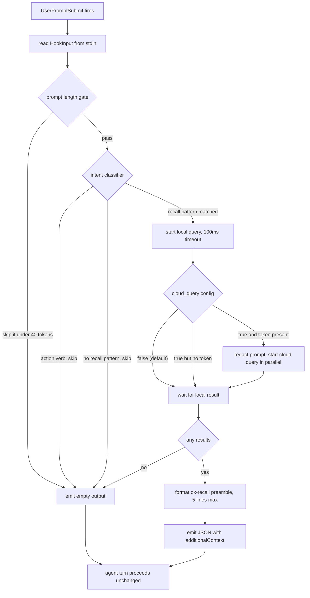

# UserPromptSubmit JIT Discovery Hook — Implementation Spec

**Status:** Draft
**Owners:** epic ox-r9mq
**Related:** [ADR-018](../adr/ADR-018-userpromptsubmit-jit-discovery.md)
**Sub-tasks:** ox-m01h (local query), ox-tshf (hook wiring), ox-8wmo (cloud opt-in)

This spec defines the implementation contract for the UserPromptSubmit hook that JIT-prepends `ox query --local` findings to coding-agent prompts. Read this before touching `cmd/ox/agent_hook.go` (phasePrompt), `cmd/ox/query.go` (--local flag), `cmd/ox/doctor_hooks.go`, or `internal/promptintent/`.

## 1. Hook surface

| Property | Value |
|----------|-------|
| Lifecycle event | `UserPromptSubmit` |
| Invoking binary | `ox agent hook --phase=prompt` |
| Process model | Fire-and-forget, async with hard timeout |
| Blocking behavior | Never blocks the turn — fail-open on every error path |
| Source mode (default) | `local` — cached ledger only, zero network |
| Source mode (opt-in) | `local + cloud` when `hooks.userpromptsubmit.cloud_query=true` |

The hook is registered via the same project-hook installer that owns SessionStart and PreCompact (see `cmd/ox/doctor_hooks.go`, `InstallProjectClaudeHooks`). The new event is added to `claudeLifecycleEvents` and surfaced by `oxHookCommandForEvent`.

## 2. Hook input contract

The hook reads `agentx.HookInput` from stdin as JSON. The shape is the existing Claude Code `UserPromptSubmit` payload:

```json
{
  "session_id": "string",
  "transcript_path": "string",
  "hook_event_name": "UserPromptSubmit",
  "prompt": "string",
  "cwd": "string"
}
```

Only `prompt`, `session_id`, and `cwd` are load-bearing for this hook. Other fields are passed through to existing whisper machinery unchanged.

## 3. Hook output contract

The hook writes a single JSON object to stdout matching Claude Code's `UserPromptSubmit` hook response shape:

```json
{
  "hookSpecificOutput": {
    "hookEventName": "UserPromptSubmit",
    "additionalContext": "string (optional, 5 lines max)"
  }
}
```

Output rules:

- On no-hit / timeout / error / silent-skip: emit `{}` (empty object). Claude Code treats this as "no injection."
- On hit: `additionalContext` is a `[ox-recall]` preamble, max 5 lines, max ~400 chars total. Each result line is `<session-name-or-source> · <one-line excerpt>`. Lines are truncated at 80 chars with an ellipsis.
- When cloud_query is enabled and remote hits are merged, remote lines are tagged `[ox-recall:remote]` so the user can see provenance.
- The preamble is prepended via the existing whisper channel — do NOT mutate the prompt itself.

## 4. Gate matrix

Every prompt passes through these gates in order. Any gate that returns `skip` short-circuits the hook to empty output. The gates exist to keep relevance high and avoid the cost-regression failure mode documented in the ADR.

| # | Gate | Condition to skip | Implementation |
|---|------|-------------------|----------------|
| 1 | Length | `tokens(prompt) < 40` (approx `len(prompt) < 160` bytes for ASCII-heavy prompts) | `internal/promptintent.IsBelowLengthGate` |
| 2 | Intent classifier | Prompt matches an action-verb pattern OR fails to match any recall pattern | `internal/promptintent.ClassifyIntent` |
| 3 | Local-query result | Query returned zero results | `cmd/ox/query.go` `--local` mode |
| 4 | Timeout | Local query did not return within 100ms | `context.WithTimeout(ctx, 100*time.Millisecond)` |

### 4a. Intent classifier patterns

Recall patterns (any match advances past this gate):

- `(?i)\b(how (did|do|does) we\b)`
- `(?i)\b(has (anyone|anybody)\b)`
- `(?i)\b(where (is|are|does|do)\b)`
- `(?i)\b(what (is|are|was|were) (the|our)\b)`
- `(?i)\b(why (did|do|does) we\b)`
- `(?i)\b(explain|recall|remind me|find\b)`
- `(?i)\b(prior|previous|last time|before)\b`

Action-verb patterns (any match forces skip — overrides recall match):

- `(?i)^\s*(write|add|create|make|edit|fix|rename|delete|remove|move|run|exec|kill|stop|start)\b`
- `(?i)^\s*(yes|no|ok|go|continue|retry|try again)\b`

The classifier is regex-only — no LLM call. Performance budget: <1ms p99.

## 5. Failure semantics

The hook is **fail-open**. Every failure mode below must leave the prompt unchanged and the turn unblocked.

| Failure | Detection | Response |
|---------|-----------|----------|
| Missing local index | `os.IsNotExist` on cache path | Return empty output, no error log |
| Corrupt local index | Index open / parse error | Return empty output, log at debug level only |
| Auth absent for cloud mode | `auth.Token == ""` when cloud_query=true | Skip cloud path; local path still runs; no error |
| Network error on cloud path | Any non-nil error from cloud client | Skip cloud path; local results (if any) still emitted |
| Local query panic | Recovered via `defer recover()` in hook entrypoint | Return empty output, log panic, do not propagate |
| Hook timeout (100ms) | Context cancellation | Return empty output, log at debug level only |
| Output write error | Stderr write fails | Best-effort silent; never propagate to agent |

The fail-open contract is load-bearing. A hook that fails closed would tax every prompt with the risk of breaking the turn, which destroys the value proposition.

## 6. Config keys

All keys live under `hooks.userpromptsubmit.*`. The resolver contract (see `ResolveUserPromptSubmitCloudQuery` in `internal/config/hooks_cloud_query.go`) is **user config > project config > defaults** — a user-level setting always wins over a project-level setting. Any config-load error fails closed (returns the default). Surfaced via `ox config get/set`.

| Key | Type | Default | Effect |
|-----|------|---------|--------|
| `hooks.userpromptsubmit.enabled` | bool | `true` | Master switch. When false, hook returns empty immediately. |
| `hooks.userpromptsubmit.cloud_query` | bool | `false` | When true, cloud query runs in parallel with local. Even when true, prompt passes through `internal/session/secrets.go` redactor first. |
| `hooks.userpromptsubmit.timeout_ms` | int | `100` | Hard timeout for the query path. Both local and cloud share this budget. |
| `hooks.userpromptsubmit.min_tokens` | int | `40` | Length gate threshold. Set to 0 to disable the gate. |
| `hooks.userpromptsubmit.max_results` | int | `5` | Max preamble lines emitted. |

When the user has not run `ox login` and `cloud_query=true`, the hook silently degrades to local-only. Never errors the prompt; never warns inline. The fact that cloud is silently inactive is surfaced via `ox doctor --check=hooks` (see §8).

## 7. Inline call-site contract

The call site in `cmd/ox/agent_hook.go` that invokes `ox query --local` MUST carry a load-bearing comment explaining why local-default exists. A lint check (or doc-test) asserts the comment is present.

Required content of the comment:

- **Privacy:** every user prompt would otherwise transit to SageOx, including pasted secrets and proprietary code.
- **Latency:** network round-trip would add 200-2000ms per turn (observed range for WebFetch-class operations).
- **Relevance:** most prompts will not match remote content; an always-on cloud path causes context churn (cf. rtk-ai/rtk#582, 18% cost regression).
- **Cloud-mode escape:** points to `hooks.userpromptsubmit.cloud_query` config key for opt-in.

The comment exists because a future contributor reading `--local` may try to "improve" it to remote. The comment is the in-line stop sign.

## 8. Doctor integration

`ox doctor --check=hooks` reports:

- Whether the UserPromptSubmit hook is installed in `.claude/settings.json`.
- The effective value of `hooks.userpromptsubmit.cloud_query` with a one-line tradeoff explanation ("local-only — prompts never leave this machine" vs "cloud-enabled — prompts pass through secret redaction before remote query").
- The effective timeout and length-gate values when non-default.
- Whether the local query index is reachable and warm (existence + last-modified check on the cache path).

The check is registered alongside the existing hook checks in `cmd/ox/doctor_hooks.go`. The actual implementation lands in ox-8wmo; this spec records the contract the help text must reflect.

## 9. Hook flow



Note on diagram: `END` would be a reserved Mermaid keyword on GitHub; the node ID here is uppercase `END` but the label `"agent turn proceeds unchanged"` is quoted, which GitHub's parser accepts. If render fails, rename the node to `DONE`.

## 10. Test surface

| Test | Asserts |
|------|---------|
| `agent_hook_phasePrompt_short_skip` | <40-token prompt produces empty output |
| `agent_hook_phasePrompt_action_verb_skip` | "write a test for foo" produces empty output |
| `agent_hook_phasePrompt_recall_hit` | "how did we handle pagination" with seeded ledger emits preamble |
| `agent_hook_phasePrompt_timeout_fail_open` | Forced 200ms query path produces empty output, no error |
| `agent_hook_phasePrompt_corrupt_index` | Garbled index file produces empty output |
| `agent_hook_phasePrompt_cloud_no_token` | cloud_query=true, no auth token, degrades silently to local |
| `agent_hook_phasePrompt_cloud_redaction` | cloud_query=true, prompt with seeded secret, secret is redacted before transit |
| `agent_hook_phasePrompt_panic_recover` | Forced panic in query path produces empty output |
| `promptintent_classify_table` | Table-driven recall/action/neutral classification |
| `query_local_no_network` | `ox query --local` with network blocked at sandbox layer still returns results |

## 11. CLAUDE.md mention

CLAUDE.md does not need to inline this spec. A one-line pointer in the existing "Key Policies" section is sufficient — wording: "UserPromptSubmit JIT discovery via `ox query --local`. Local-default. See [docs/specs/userpromptsubmit-jit-discovery.md](docs/specs/userpromptsubmit-jit-discovery.md)." That mention can land in the same PR that wires the hook (ox-tshf), not this docs PR.

## 12. Out of scope

- The local query mode itself (sub-task ox-m01h owns the `--local` flag, index strategy, and latency budget).
- The redactor's prompt-string mode (sub-task ox-8wmo owns extending `internal/session/secrets.go` if needed).
- Hook delivery reliability on Claude Code (tracked separately via ADR-006 and the SessionStart fallback machinery).
