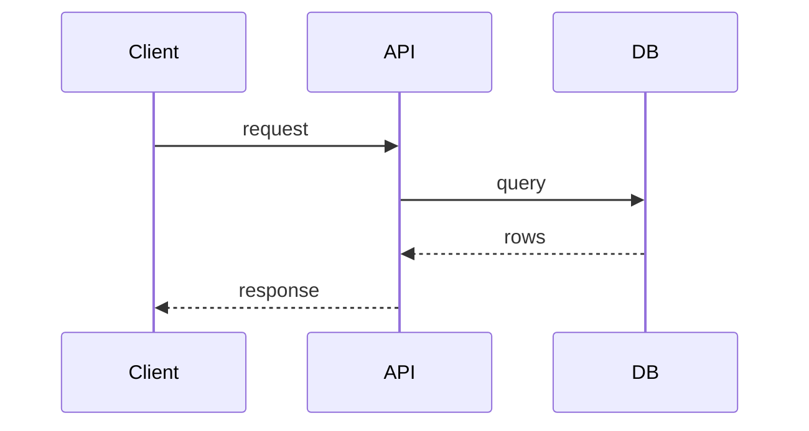
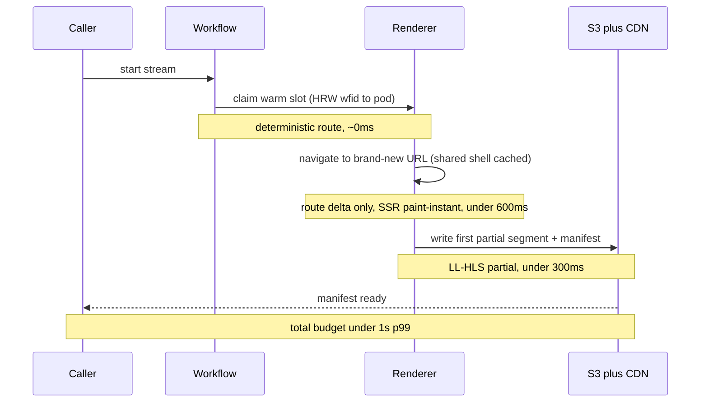
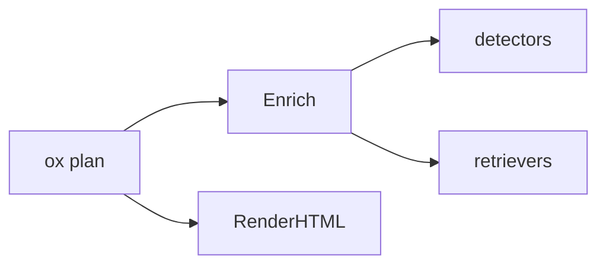
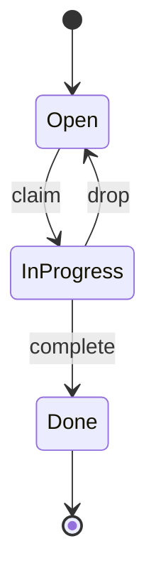
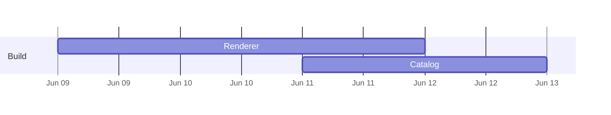
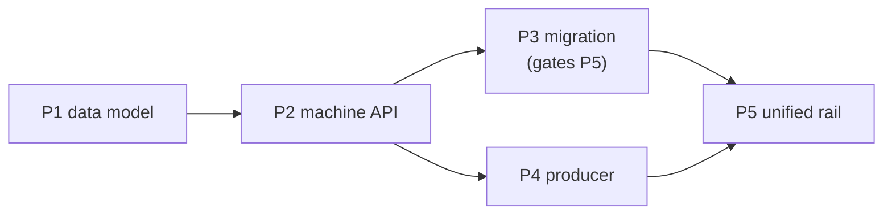
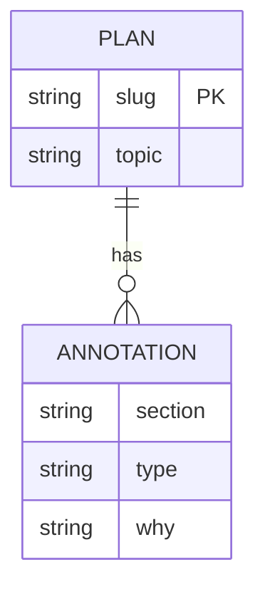

<!-- ox plan visualization catalog. One pattern per "## <id>" block.
     Each block: a `use:` line (when to reach for it), a `why:` line (the
     cognitive payoff — what it lets the reader grasp faster), then one or more
     copy-paste snippets. Snippets use the scaffold's CSS variables / classes
     (assets/scaffold.css) so they render design-faithfully and theme with the
     page. Surfaced progressively via `ox plan viz [id]` — the agent lists the
     catalog cheaply, then pulls only the patterns it needs. Goal: aid human
     understanding and cut cognitive load (Tufte: maximize data-ink, minimize
     chrome). Keep snippets minimal and self-contained — no external JS.
     Compose/extend freely: stack snippets in the plan markdown to frame a base
     widget — e.g. a heading above a `partition-map` and a `callout` below it. The
     renderers own the widget body; you own the surrounding layout, so the base
     components extend without any renderer change. -->

## sequence-diagram
use: an ordered call/response path that crosses components, services, or async boundaries — when "in what order, how many round-trips" is the question.
why: shows ordering and latency a flowchart can't; ≤4-5 participants keeps it legible.


## budget-sequence
use: a latency or cost budget across an ordered call path — show where each slice of the budget goes and the lever that buys it ("warm claim under 1s p99").
why: a bare sequence diagram shows order; budget bands (`Note over`) plus a paired stage/budget/lever table show WHERE the time goes and WHAT to pull — the reviewer approves the budget, not just the topology. Pair the diagram (the path) with the table (the levers); neither alone makes the budget reviewable.

```text
| stage                          | budget  | lever                                |
|--------------------------------|---------|--------------------------------------|
| route to warm pod              | ~0ms    | consistent-hash (ADR-040 #1)         |
| navigate to new URL (route Δ)  | <400ms  | generic warm pool + warm shell cache |
| first painted frame            | <300ms  | paint-instant pages                  |
| first partial segment+manifest | <300ms  | LL-HLS partials                      |
```

## dependency-graph
use: topology, not order — "what depends on / connects to what", to reveal coupling, a contended boundary, or blast radius.
why: a graph makes coupling visible at a glance; a list buries it.


## state-machine
use: a lifecycle, connection/session model, or retry/backoff — anything with modes and time-bounded transitions.
why: states + labeled transitions compress a paragraph of "if in X then Y after Zs" into one picture.


## swimlane-timeline
use: phases, rollout, or relative-effort sequencing across workstreams (NOT calendar dates) — a "build sequence" showing what's foundational, what unblocks the goal, and what's deferred to scale.
why: lanes + bars show what runs when and in parallel; the robust default for "when, in what order, how long". Add a labeled gate (◆) for the milestone that matters, a bottom axis of phase columns, and a one-line caption stating the unit — that's what turns a bar chart into an at-a-glance build plan.
```html
<div class="swim">
  <div class="lane"><span class="lane-name">Foundation</span><div class="track"><span class="bar" style="left:0;width:18%;background:var(--copper)">measure</span><span class="bar" style="left:20%;width:14%;background:var(--sage)">fix pool</span></div></div>
  <div class="lane"><span class="lane-name">Claim &lt;1s</span><div class="track"><span class="bar" style="left:38%;width:18%;background:var(--teal)">pre-warm</span><span class="bar" style="left:58%;width:16%;background:var(--teal)">paint</span><span class="bar" style="left:76%;width:18%;background:var(--teal)">partials</span></div></div>
  <div class="lane"><span class="lane-name">Scale</span><div class="track"><span class="bar" style="left:38%;width:18%;background:var(--copper)">cost dials</span><span class="bar" style="left:58%;width:16%;background:var(--copper)">deep pool</span><span class="bar" style="left:76%;width:18%;background:var(--copper)">multi-replica</span></div></div>
  <div class="lane axis"><span class="lane-name"></span><div class="track"><span class="tick" style="left:9%">measure</span><span class="tick" style="left:27%">pool fixed</span><span class="tick" style="left:47%">claim &lt;1s ◆</span><span class="tick" style="left:66%">deep pool</span><span class="tick" style="left:85%">100k scale</span></div></div>
</div>
<p class="dim">Relative effort, not calendar. ◆ = the gate where the goal becomes meetable.</p>
```

## gantt
use: a CALENDAR-ACCURATE schedule with real dates (only when real dates exist).
why: a date axis anchors commitments; never use numeric `dateFormat X` (renders a meaningless axis).


## sparkline
use: a trend inline in a sentence or a table cell — "p99 latency ▁▂▃▅▇ 240ms".
why: shows a whole series in the space of a word; maximum data-ink, zero chrome (Tufte's word-sized graphic).
```html
<svg class="spark" viewBox="0 0 80 20" preserveAspectRatio="none" aria-label="trend">
  <polyline points="0,18 16,14 32,15 48,8 64,9 80,2" fill="none" stroke="var(--sage)" stroke-width="1.5" vector-effect="non-scaling-stroke"/>
</svg>
```

## small-multiples
use: compare the same chart across many series/items — per-service error rates, per-core load.
why: one shape repeated lets the eye spot the outlier instantly; a single combined chart hides it.
```html
<div class="multiples">
  <figure><figcaption>api</figcaption><svg class="spark" viewBox="0 0 60 18" preserveAspectRatio="none"><polyline points="0,16 20,10 40,12 60,4" fill="none" stroke="var(--sage)" stroke-width="1.5" vector-effect="non-scaling-stroke"/></svg></figure>
  <figure><figcaption>web</figcaption><svg class="spark" viewBox="0 0 60 18" preserveAspectRatio="none"><polyline points="0,6 20,7 40,5 60,6" fill="none" stroke="var(--teal)" stroke-width="1.5" vector-effect="non-scaling-stroke"/></svg></figure>
  <figure><figcaption>db</figcaption><svg class="spark" viewBox="0 0 60 18" preserveAspectRatio="none"><polyline points="0,4 20,8 40,14 60,17" fill="none" stroke="var(--red)" stroke-width="1.5" vector-effect="non-scaling-stroke"/></svg></figure>
</div>
```

## before-after
use: a change to a structure, API, or shape — show the old and the new side by side.
why: adjacency makes the delta obvious; the reader diffs with their eyes, not by reading prose.
```html
<div class="ba">
  <div class="ba-col"><h4>Before</h4><pre><code>render: skill-only (Claude)</code></pre></div>
  <div class="ba-col"><h4>After</h4><pre><code>render: ox binary (any agent)</code></pre></div>
</div>
```

## decision-matrix
use: weigh options against criteria, or a verification/impact matrix.
why: a grid with colored verdict cells answers "which wins / what passes" in one scan. Verdict cells (yes/no/✓/✗) are auto-colored by the renderer.
```text
| Option        | Cross-agent | Tokens | Consistent |
|---------------|-------------|--------|------------|
| skill render  | no          | high   | no         |
| binary render | yes         | low    | yes        |
```

## heatmap-table
use: dense numeric comparison where magnitude matters — latency by endpoint × percentile.
why: shading encodes magnitude so the hot cell pops without the reader parsing every number (Tufte density).
```html
<table class="heat">
  <tr><th>endpoint</th><th>p50</th><th>p99</th></tr>
  <tr><td>/plan</td><td class="h1">12</td><td class="h2">40</td></tr>
  <tr><td>/render</td><td class="h2">38</td><td class="h4">210</td></tr>
</table>
```

## cost-telemetry-table
use: per-stage cost/telemetry where some stages are reducible — name the cost, the telemetry field it's measured by, and whether it can be cut, then pair the table with ONE callout stating the conclusion.
why: the table establishes the numbers (and where they come from, so the reviewer can verify against prod); a leading or trailing `TL;DR` callout states the load-bearing decision ("every reducible row is reduced by not doing it on the request path") so the reviewer gets the conclusion before parsing cells. Pair the table with the callout — the table is evidence, the callout is the read.
```html
<table class="heat">
  <tr><th>cold-spawn stage</th><th>~cost</th><th>telemetry field</th><th>reducible?</th></tr>
  <tr><td>new Chromium context</td><td>500-800ms</td><td>worker-pool</td><td>yes — pre-create</td></tr>
  <tr><td>load heavy cast page</td><td>800-1500ms</td><td>navigate_ms</td><td>yes — pre-warm + SSR</td></tr>
  <tr><td>paint handshake</td><td>300-600ms</td><td>paint_ms</td><td>yes — paint-instant</td></tr>
  <tr><td>ffmpeg init + first segment</td><td>300-500ms</td><td>first_frame_ms</td><td>yes — partials</td></tr>
  <tr><td><strong>cold total</strong></td><td class="h4"><strong>2.0-3.6s</strong></td><td></td><td></td></tr>
</table>
<div class="tldr"><span class="tldr-tag">TL;DR</span><p>Every reducible row is reduced by <em>not doing it on the request path</em> — i.e. pre-warming. Pre-warming is the mechanism, not an optimization.</p></div>
```

## device-mockup
use: the plan changes something the user sees — show the resulting UI state, don't describe it.
why: a faithful mockup conveys the experience instantly; annotate in user language, never implementation detail.
```html
<div class="device">
  <div class="device-screen">
    <div class="eyebrow">ox plan</div>
    <strong>Plan rendered ✓</strong>
    <p class="dim">Self-contained HTML · opened in your browser</p>
  </div>
</div>
```

## callout
use: the one thing the reader must not miss — the decision, the blocker, the biggest risk.
why: a single bordered lede answers "do I approve, what do I watch" before any scrolling. A leading `TL;DR` block and a `Risks` section are auto-styled by the renderer.
```html
<div class="tldr"><span class="tldr-tag">TL;DR</span><p>Ship the binary renderer; the only risk is Mermaid CDN availability at view time.</p></div>
```

## rollout-dag
use: a multi-phase rollout / PR sequence where order and blocking matter — "P3 gates P5, P4 ∥ P5". The single most common plan structure.
why: prose sequencing ("ship WS-1 first, then WS-2…") forces the reader to reconstruct the critical path; a DAG shows what blocks what and what runs in parallel in one glance. Mark the critical path.


## file-impact-map
use: the "files changed" section — show scope, change type (new/edit/delete), and which subsystem, not just a flat list.
why: a flat `| file | change |` table hides scope and blast radius; grouping by subsystem with color-coded change type lets the reviewer judge "are we touching auth AND db AND web — is that the right footprint?" in seconds.
param: {"files":[{"path":"internal/plan/render.go","change":"new|edit|delete|read","scope":"sm|md|lg","note":"…"}]}
```html
<!-- generate with: ox plan viz render file-impact-map --data files.json -->
<ul class="ftree">
  <li class="grp">internal/plan
    <ul><li><span class="chg new">new</span> render.go <span class="sc lg">lg</span></li>
        <li><span class="chg edit">edit</span> enrich.go <span class="sc sm">sm</span></li></ul></li>
</ul>
```

## risk-matrix
use: a Risks section — rank risks by severity with the mitigation, instead of an undifferentiated bullet list.
why: scattered "do NOT…" / "watch out…" prose buries the load-bearing unknown; a severity-sorted, color-coded matrix puts the blocker on top and pairs each risk with its mitigation so the reviewer knows what to watch.
param: {"risks":[{"title":"…","severity":"blocker|high|medium|low","category":"data|perf|security|ux","mitigation":"…"}]}
```html
<!-- generate with: ox plan viz render risk-matrix --data risks.json -->
<table class="riskm">
  <tr><th>Risk</th><th>Sev</th><th>Mitigation</th></tr>
  <tr class="sev-blocker"><td>CDN unreachable at view time</td><td>■ blocker</td><td>vendor mermaid locally</td></tr>
</table>
```

## stat-cards
use: headline metrics or before→after numbers — token budget, latency, size, counts.
why: a row of big-number cards with a delta and an up/down trend makes the impact land instantly; numbers buried in prose ("~60KB, down from 120KB") don't.
param: {"cards":[{"label":"render size","value":"44KB","delta":"-63%","trend":"down","intent":"good|bad|warn|neutral"}]}
```html
<!-- generate with: ox plan viz render stat-cards --data stats.json -->
<div class="statrow">
  <div class="stat good"><div class="sv">44KB</div><div class="sl">render size</div><div class="sd">▼ -63%</div></div>
</div>
```

## bar-chart
use: compare a handful of labeled magnitudes — cost per component, calls per minute, lines per file.
why: bars encode magnitude pre-attentively; a column of numbers does not. Use ONE color for the series — length is the channel; a rainbow fights the "which is biggest" read. Set a bar's `color` only to flag the outlier/over-budget one. Keep ≤8 bars.
param: {"title":"cost / hr","unit":"$","bars":[{"label":"topic detector","value":0.036},{"label":"refresher","value":0.012,"color":"red"}]}
```html
<!-- generate with: ox plan viz render bar-chart --data bars.json -->
<div class="barc"><div class="bar-row"><span class="bl">topic detector</span><span class="bt"><span class="bf" style="width:90%;background:var(--sage)"></span></span><span class="bv">$0.036</span></div></div>
```

## partition-bar
use: a memory / disk / flash layout with a FEW partitions (≤8) where the SHARE each takes is the story — "the two OTA slots are 75% of flash". Proportion-first.
why: a 100%-wide stacked bar encodes share pre-attentively — the dominant slices read instantly; a paired table carries the exact offsets/sizes the bar can't. Linear and honest about size. One color per category, not a rainbow. Segments grow in (staggered) and reveal a hover tooltip; for MANY partitions, or when offset-order / per-row annotation matters more than share, use `partition-map`.
param: {"title":"16 MB flash","total":16384,"unit":"KB","partitions":[{"label":"ota_0","size":6144,"offset":"0x20000","color":"sage","flag":"SIGNED"},{"label":"ota_1","size":6144,"offset":"0x620000","color":"sage"},{"label":"spiffs","size":2944,"offset":"0xD20000","color":"teal"},{"label":"model","size":1024,"offset":"0xC20000","color":"violet"},{"label":"system","size":128,"color":"slate"}]}
```html
<!-- prefer the param renderer: ox plan viz render partition-bar --data parts.json
     (--i staggers the grow-in; .pm-tip is the hover tooltip — both pure CSS) -->
<figure class="pbar-fig"><figcaption>16 MB flash</figcaption><div class="pbar"><span class="pseg" style="--i:0;width:37.5%;background:var(--sage)"><span class="pseg-lbl">ota_0</span><span class="pm-tip"><b>ota_0</b><span class="pm-tip-k">6144 KB · 37.5%</span><span class="pm-tip-flag">SIGNED</span></span></span><span class="pseg" style="--i:1;width:18%;background:var(--teal)"><span class="pseg-lbl">spiffs</span><span class="pm-tip"><b>spiffs</b><span class="pm-tip-k">2944 KB · 18%</span></span></span></div></figure>
```

## partition-map
use: a full memory / disk / flash layout with MANY partitions, or when OFFSET ORDER and per-row annotation (flags, notes) matter more than share — the vertical address-space view.
why: rows in offset order mirror the address space; a LOG-scaled size rail keeps 4 KB partitions visible next to 6 MB ones (true linear would render the small ones <1px — dishonest by omission) while the big ones still read as dominant. The rail is labeled "log" so no false linear proportion is implied — use `partition-bar` for true share. Per-row offset + flags + a one-line note annotate without crowding; hover reveals a tooltip with the full note + share; `"proposed":true` dashes/mutes an uncommitted row. Set a row's `"group"` to interleave a section divider (e.g. committed rows, then a "PROPOSED SECURE ADDITIONS" block). Frame the whole figure by stacking a heading above and a `callout` below — the renderer owns the rows, you compose the chrome.
param: {"title":"Rev B flash","unit":"KB","partitions":[{"label":"bootloader","size":32,"offset":"0x000000","color":"slate","flag":"SIGNED","note":"Secure Boot root"},{"label":"nvs","size":20,"offset":"0x009000","color":"slate","note":"WiFi creds, pairing"},{"label":"ota_0","size":6144,"offset":"0x020000","color":"sage","flag":"SIGNED","note":"firmware slot A · frozen at 0x20000"},{"label":"ota_1","size":6144,"offset":"0x620000","color":"sage","note":"rollback target"},{"label":"model","size":1024,"offset":"0xC20000","color":"teal","note":"wake-word model"},{"label":"spiffs","size":2944,"offset":"0xD20000","color":"teal"},{"label":"ds_key","size":4,"color":"violet","note":"encrypted device key","group":"PROPOSED SECURE ADDITIONS","proposed":true}]}
```html
<!-- prefer the param renderer: ox plan viz render partition-map --data parts.json
     (--i staggers the row fade-in + rail fill; .pm-tip is the hover tooltip — pure CSS) -->
<figure class="pmapv"><figcaption>Rev B flash <span class="pmapv-rk">size · log scale</span></figcaption><div class="pmapv-row" style="--i:0"><span class="pm-dot" style="background:var(--sage)"></span><span class="pmapv-off pm-mono">0x020000</span><span class="pmapv-nm"><b>ota_0</b><span class="pm-flag">SIGNED</span><small>firmware slot A</small></span><span class="pmapv-rail"><i style="width:100%;background:var(--sage)"></i></span><span class="pmapv-sz pm-mono">6144 KB</span><span class="pm-tip"><b>ota_0</b><span class="pm-tip-k">@ 0x20000</span><span class="pm-tip-k">6144 KB · 37.5%</span><span class="pm-tip-note">firmware slot A</span></span></div><div class="pmapv-group">PROPOSED SECURE ADDITIONS</div><div class="pmapv-row proposed" style="--i:1"><span class="pm-dot" style="background:var(--violet)"></span><span class="pmapv-off pm-mono">TBD</span><span class="pmapv-nm"><b>ds_key</b><small>encrypted device key</small></span><span class="pmapv-rail"><i style="width:10%;background:var(--violet)"></i></span><span class="pmapv-sz pm-mono">4 KB</span><span class="pm-tip"><b>ds_key</b><span class="pm-tip-flag prop">PROPOSED</span><span class="pm-tip-note">encrypted device key</span></span></div></figure>
```

## data-model
use: a schema or entity relationship — new tables/columns, foreign keys, cardinality.
why: an ER diagram shows where the FK points and which table owns the unique index — a column list in prose does not. Use Mermaid erDiagram.


## coverage-matrix
use: a test plan — show which seam is covered at which layer, and where the gaps are.
why: a list of `go test` commands doesn't reveal whether a risky seam is tested; a seam × layer grid with verdict cells exposes the gap (the empty cell) at a glance. Verdict cells auto-color in the render.
```text
| seam | unit | integration | e2e |
|---|---|---|---|
| decide logic | yes | — | — |
| opt-out gate | no | — | yes |
```

## flag-rollout-matrix
use: a feature-flag rollout — env × stage with the percentage at each step.
why: flag posture ("dev-on, test-100%, prod-0% until review") scattered in prose is error-prone; an env × stage grid shows the whole rollout arc and the gates in one view.
param: {"envs":["dev","test","prod"],"stages":["merge","dogfood","ramp"],"cells":{"prod":{"merge":"0%","dogfood":"0%","ramp":"10→100%"}}}
```html
<!-- generate with: ox plan viz render flag-rollout-matrix --data flags.json -->
<table class="heat"><tr><th>env</th><th>merge</th><th>ramp</th></tr><tr><td>prod</td><td class="h1">0%</td><td class="h3">10→100%</td></tr></table>
```

## cost-waterfall
use: a per-action cost/budget that accumulates — token spend, $/hr by component.
why: a stacked/segmented bar with a running total shows where the cost concentrates and which lever to pull, better than line-item arithmetic in prose.
param: {"unit":"$/hr","items":[{"name":"topic detector","value":0.036},{"name":"refresher","value":0.001}]}
```html
<!-- generate with: ox plan viz render cost-waterfall --data cost.json -->
<div class="barc"><div class="bar-row"><span class="bl">topic detector</span><span class="bt"><span class="bf" style="width:97%;background:var(--copper)"></span></span><span class="bv">$0.036</span></div></div>
```

## decision-grid
use: a multi-option / multi-expert review — options scored across review lenses.
why: long per-lens prose paragraphs hide the ranking; an option × lens grid with colored verdict cells shows where each option wins and where the lenses disagree, at a glance.
```text
| option | ops | security | code-reuse |
|---|---|---|---|
| native | yes | yes | no |
| hybrid | yes | yes | yes |
```

## ox-annotation
use: an inline reference (an ADR, decision, PR, prior session) you want to annotate with the team context behind it — the calm SageOx way to footnote a decision in-place.
why: a branded inline marker + hover beats inventing a circled-`i`/number glyph: it tells the reader "SageOx has context on this" without a verdict, and matches the OX marker ox already injects elsewhere — one consistent affordance instead of ad-hoc ones. Note: `ox plan render` already auto-injects this marker on references it surfaced team context for (e.g. an ADR in the bundle), so reach for this pattern only for references ox did NOT surface; never hand-author an "enriched by SageOx" credit — the render owns the footer credit.
```html
<span class="ox-annot" title="SageOx surfaced: ADR-051 Consent tooling — bundled voiceprint + recording consent; flagged the weaker BIPA position.">ADR-051 <svg class="ox-annot-mark" aria-hidden="true"><use href="#ox-ico-d" class="ico-d"></use><use href="#ox-ico-l" class="ico-l"></use></svg></span>
```
